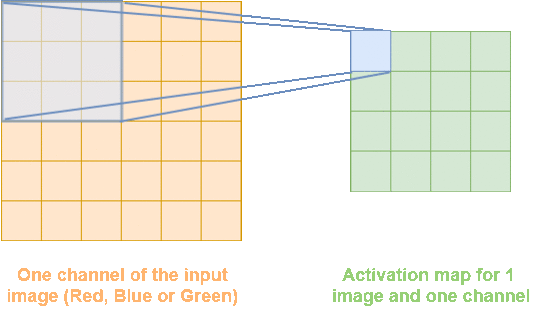

In this article, I will describe how to compute naively the forward and
the backward pass in a convolutional neural network. I based my work on the
2nd assignment of CS231n given at Stanford in 2016. In this assignment we are asked
to compute the forward and backward pass in a convolutional neural network. We're
also asked to compute the forward pass and backward pass of the Max-Pooling layer. I
won't detail how to implement it and how to compute it. it is actually straightforward
and looks like the ReLu activation layer. I will instead focus on the forward/backward
pass of the convolutional layer. I will also derive an intuition on how to compute easily
the forward pass and the backward pass of the spatial batch normalization.

## Convolutional Layer

### Forward pass
Although the forward of a convolutional layer pass isn't difficult I still think we need to take our time to understand precisely what happens. To understand this I made several pictures, but first of all let's define the problem.

#### Problem definition
I will use slighly different notations from the CS231n Stanford class. Here are the notations we will use throughout this article:


+ Input $x$ of shape ($N$, $C$, $H$, $W$)
+ Weights $w$ of shape ($F$, $C$, $H1$, $W1$)
+ Output $a$ ($N$, $F$, $H2$, $W2$)

Where :

+ $N$ corresponds to the number of images
	* ($H$, $W$) are respectively the height and the width of the images (they have same height and width)
	* $C$ is the number of channel (here we have $C=3$ channels corresponding to the RGB channels)
+ $F$ is the number of filters
	* ($H1$, $W1$) are respectively the height and the width of the filters (all filters have same height and width within the same convolutional layer)
	* $C$ is the number of channel (here we convolve across all the channels, so the sum (see after) will include all the channels)
+ ($H2$, $W2$) are the height and width of the activation map (see how $H2$ and $W2$ are computed later)


### Computing the forward pass
So now that we set our notations, let's foucs on the forward pass. For simplicity we will first consider only one input image and only one channel of the input image. In such case, during the forward pass of
the convolutional layer we have to overlap a filter over our input image (matrix $x$). Each time we overlap our filter over $x$ it gives us a number that will be put at the corresponding place in the activation
map. We repeat this process for all filters. If we have $f$ filters we will hence have $f$ activation maps. This procedure is detailed for one filter in Figure 1.1
<div class="centered-img"> 

<div class="legend">Figure 1.1: Forward pass in a Convolutional Layer for one image, one filter and one channel</div>
</div>

Now that we understand what will be computed during the forward pass let's extend it to $c$ channels and $f$ filters. If we have $c$ channels, we need to "overlap" a window (our window is our filter) over our input $x$ and we need to do this for **each channel**. we then compute the sum of the element-wise product of the $f^{th}$ filter with each of the $c$ layers. we write this newly computed quantity $a_{f,h,w}$ (this quantity doesn't depend on $c$ as we sum up over all $c_{th}$ channels). $a_{f,h,w}$ refers to one number of my activation maps (a little blue square in Figure 1.1). To better understand this principle you can refer to the Figure 1.2
<div class="centered-img">

<div class="legend">Figure 1.2: Forward pass in a Convolutional Layer</div>
</div>

According to Figure 1.2, with have:

\begin{equation}
a_{f,2,1}=\sum\limits_{c=1}^{C} \sum\limits_{i=1}^{H1} \sum\limits_{j=1}^{W1} w_{f,c,i,j}x_{c,2+(i-1),1+(j-1)} + b_f
\end{equation}

each of this newly computed number $a_{f,h,w}$, will be placed on what we call an "activation map". And we have $F$ (number of filters) activation map of size:

\begin{equation}
\begin{gathered}
H2 = (H-H1+2pad)/stride + 1 \newline
W2 = (W-W1+2pad)/stride + 1
\end{gathered}
\end{equation}

This formula comes from the [course](http://cs231n.github.io/convolutional-networks/ "convolutional neural network lecture"). I won't detail it as it is quite straightforward and intuitive. So actually at the end we will have a stack of $F$ activation maps having in each cell $a_{f,h,w}$. See Figure 1.3.

<div class="centered-img">

<div class="legend">Figure 1.3: Activation map obtains after convolution</div>
</div>

I omit to mention it but if we are using the formulas given by relation (2), that means that in relation (1.1) $x$ refers actually to the padded version of $x$ (see [course](http://cs231n.github.io/convolutional-networks/ "convolutional neural network lecture") to understand what is the padded version of $x$). That in mind we might think that the generalized formula for $a_{f,h,w}$ might look like:

\begin{equation}
a_{f,h,w}=\sum\limits_{c=1}^{C} \sum\limits_{i=1}^{H1} \sum\limits_{j=1}^{W1} w_{f,c,i,j}x^{pad}_{c,h+(i-1),w+(j-1)} + b_f
\end{equation}

Yet, there is a drawback in this formula. Indeed it works when we are using a stride $S$ of $1$ but what if we are using a stride $S$ of $2$, $3$, ...? If we are using such stride we will need to translate our window (filter matrix) by $S$ in vertical and horizontal position to get the next $a_{f,h,w}$, hence instead of having to convolve $w_{f,i,j}$ with $$x^{pad}_{c,h+(i-1),w+(j-1)}$$ we will have to convolve $w_{f,i,j}$  with $$x^{pad}_{c,hS+(i-1),wS+(j-1)}$$ and our general formula is just :

\begin{equation}
a_{f,h,w}=\sum\limits_{c=1}^{C} \sum\limits_{i=1}^{H1} \sum\limits_{j=1}^{W1} w_{f,c,i,j}x^{pad}_{c,hS+(i-1),wS+(j-1)} + b_f
\end{equation}

Nice ! So now we have our general formula to compute the forward pass. Well, not exactly. In the assignment they are dealing with $N$ images and so $x$ is a tensor of shape ($N$, $C$, $H$, $W$). In our formula $x$ has shape ($C$, $H$, $W$) so it doesn't fit. Actually our formula works just fine if we are dealing with 1 image. If we are dealing with n images we can still use our formula but we have to take care of our indexes. Indeed we need to convolve our $n^{th}$ image ($x$) with the same $w$ (filter matrix) and we will get $a_{n,f,h,w}$ (the activation map w.r.t to the image and to the filter) instead of just $a_{f,h,w}$, so finally the generalized formula is:

\begin{equation}
a_{n,f,h,w}=\sum\limits_{c=1}^{C} \sum\limits_{i=1}^{H1} \sum\limits_{j=1}^{W1} w_{f,c,i,j}x^{pad}_{n,c,hS+(i-1),wS+(j-1)} + b_f
\end{equation}

So at the end we will have $F$ activation maps for each image. See Figure 1.4 for a better understanding.

<div class="centered-img"> 

<div class="legend">Figure 1.4: Stack of activation maps for each image in a convolution layer</div>
</div>

So, now that we understand what quantity is computed during the forward pass, we can implement it in Python (see code in [*layers.py*](https://github.com/Twice22/CS231n-solutions/blob/master/assignment2/cs231n/layers.py)):
```python
stride, pad = conv_param['stride'], conv_param['pad']
  N, C, H, W = x.shape
  F, C, H1, W1 = w.shape

  H2 = 1 + (H + 2 * pad - H1) / stride
  W2 = 1 + (W + 2 * pad - W1) / stride

  out = np.zeros((N, F, H2, W2))

  # x padded along H and W with pad number of 0
  x_pad = np.pad(x, pad_width=[(0,),(0,),(pad,),(pad,)], mode='constant', constant_values=0)

  for n in xrange(N): # for all image
  	for f in xrange(F): # for all filter
  	  for hh in xrange(H2): # height of activation map
	    for ww in xrange(W2): # width of activation map
	  	 out[n, f, hh, ww] = np.sum(x_pad[n, :, hh*stride : hh*stride+H1, ww*stride : ww*stride+W1] * w[f,:,:,:]) + b[f]
```

## Backward pass
We detailed what quantity was computed during the forward pass but what we really want is to compute the backward pass. As we know it is always the difficult point. If we have some previous experiences on convolutional neural network we can do it quite intuitively, or we can used result share on the internet, but what if we really want to do it ourselves ? In this part I will use relation (5) to compute the backward pass in a convolutional layer.

### Problem
Our goal is to compute the backward pass. Supposing we already have access to the quantity $\frac{\partial \mathcal{L}}{\partial a}$ using backpropagation of the layers following the convolutional layer, we want to compute the **gradient** of the loss $\mathcal{L}$ w.r.t to the inputs of the convolutional layer. here the inputs are: $x$ (the images as a tensor), $b$ (the bias) and $w$ (the filtering tensor composed of our weights). **To make it simple** a tensor is a matrix in higher dimension (matrix is a 2-D array, tensor is a N-D array where N is an integer)

### Computing the backward pass
#### Gradient of $L$ w.r.t $b$
Let's start by computing the easiest quantity: $\frac{\partial \mathcal{L}}{\partial b}$.
As $b$ is a bias vector of shape ($F$, $1$), so do $\frac{\partial \mathcal{L}}{\partial b}$. To compute this quantity as we suppose we have access to $\frac{\partial \mathcal{L}}{\partial a}$, we will use the chain rule in higher dimension. Hence we have:

$$
\frac{d \mathcal{L}}{d b_u} = \sum\limits_{n,f,h,w} \frac{d \mathcal{L}}{d a_{n,f,h,w}}\frac{d a_{n,f,h,w}}{d b_u} \\
= \sum\limits_{n,f,h,w} \frac{d \mathcal{L}}{d a_{n,f,h,w}} \frac{d}{d b_u}\left(\sum\limits_{c=1}^{C} \sum\limits_{i=1}^{H1} \sum\limits_{j=1}^{W1} w_{f,c,i,j}x^{pad}_{n,c,hS+(i-1),wS+(j-1)} + b_f\right) \\
= \sum\limits_{n,f,h,w} \frac{d \mathcal{L}}{d a_{n,f,h,w}} \frac{d b_f}{d b_u}
= \sum\limits_{n,f,h,w} \frac{d \mathcal{L}}{d a_{n,f,h,w}} 1\{f=u\}
= \sum\limits_{n,h,w} \frac{d \mathcal{L}}{d a_{n,u,h,w}}
$$

Hence the column vector $\frac{\partial \mathcal{L}}{\partial b}$ ($db$ in python notation) is the sum of $\frac{\partial \mathcal{L}}{\partial a}$ over all axes beside the second axis ($f$ here). See code in [*layers.py*](https://github.com/Twice22/CS231n-solutions/blob/master/assignment2/cs231n/layers.py)

```python
db = np.sum(dout, axis=(0,2,3))
```

#### Gradient of $L$ w.r.t $w$
The second easiest quantity to compute is $\frac{\partial \mathcal{L}}{\partial w}$. As before we will compute it using the chain rule. But here we know that $w$ is a ($F$,$C$,$H1$,$W1$) tensor so we will have:

$$
\frac{d \mathcal{L}}{d w_{f1,c1,h1,w1}} = \sum\limits_{n,f,h,w} \frac{d \mathcal{L}}{d a_{n,f,h,w}}\frac{d a_{n,f,h,w}}{d w_{f1,c1,h1,w1}} \\
= \sum\limits_{n,f,h,w} \frac{d \mathcal{L}}{d a_{n,f,h,w}} \sum\limits_{c=1}^{C} \sum\limits_{i=1}^{H1} \sum\limits_{j=1}^{W1} \frac{d w_{f,c,i,j}}{d w_{f1,c1,h1,w1}}x^{pad}_{n,c,hS+(i-1),wS+(j-1)}\\
= \sum\limits_{n,f,h,w} \frac{d \mathcal{L}}{d a_{n,f,h,w}} \sum\limits_{c=1}^{C} \sum\limits_{i=1}^{H1} \sum\limits_{j=1}^{W1} 1\{f=f1\}1\{c=c1\}1\{i=h1\}1\{j=w1\}x^{pad}_{n,c,hS+(i-1),wS+(j-1)} \\
= \sum\limits_{n,f,h,w} \frac{d \mathcal{L}}{d a_{n,f,h,w}} 1\{f=f1\}x^{pad}_{n,c1,hS+(h1-1),wS+(w1-1)} \\
= \sum\limits_{n,h,w} \frac{d \mathcal{L}}{d a_{n,f1,h,w}} x^{pad}_{n,c1,hS+(h1-1),wS+(w1-1)}
$$

Here we computed $\frac{d \mathcal{L}}{d w_{f1,c1,h1,w1}}$. So naively to implement the code in Python we will have to compute this quantity for each $f1$, $c1$, $h1$, $w1$, so the **naive implementation** will have **at least** 4 loops. The naive implementation might have more loops if the quantity we need to compute, that is to say $\sum\limits_{n,h,w} \frac{d \mathcal{L}}{d a_{n,f1,h,w}} x^{pad}_{n,c1,hS+(h1-1),wS+(w1-1)}$ here, need inner loops. The naive implementation of the code is in layers.py
```python
  for f in xrange(F):
    for c in xrange(C):
      for h1 in xrange(H1): 
        for w1 in xrange(W1):
          x_pad_tmp = x_pad[:, c, h1:h1 + H2 * stride:stride, w1:w1 + H2 * stride:stride]
          dw[f, c, h1, w1] = np.sum(dout[:, f, :, :] * x_pad_tmp)
```

#### Gradient of $L$ w.r.t $x$
Finally we will deal with the computation of $\frac{\partial \mathcal{L}}{\partial x}$. As before we will compute it using the chain rule. We will have to compute:

$$
\frac{d \mathcal{L}}{d x_{n1,c1,h1,w1}} = \sum\limits_{n,f,h,w} \frac{d \mathcal{L}}{d a_{n,f,h,w}}\frac{d a_{n,f,h,w}}{d x_{n1,c1,h1,w1}} \\
= \sum\limits_{n,f,h,w} \frac{d \mathcal{L}}{d a_{n,f,h,w}} \frac{d}{d x_{n1,c1,h1,w1}}\left(\sum\limits_{c=1}^{C} \sum\limits_{i=1}^{H1} \sum\limits_{j=1}^{W1} w_{f,c,i,j}x^{pad}_{n,c,hS+(i-1),wS+(j-1)} + b_f\right)\tag{6}
$$

Here we see that the previous relation use both $x^{pad}$ and $x$, so to compute the derivative of $x^{pad}$ w.r.t $x$ we will have to find the relationship between $x^{pad}$ and $x$. You can refer to Figure 1.5 to see this how one can determine this relationship.

<div class="centered-img">

<div class="legend">Figure 1.5: Relationship between $x_{pad}$ and $x$</div>
</div>

So now we can easily see that:

$$
\frac{d x^{pad}_{n,c,h,w}}{x_{n1,c1,h1,w1}} = 1\{n=n1\}1\{c=c1\}1\{h-pad=h1\}1\{w-pad=w1\}\tag{7}
$$

Using (6) in (7) we finally have:

$$
\frac{d \mathcal{L}}{d x_{n1,c1,h1,w1}} = \sum\limits_{n,f,h,w} \frac{d \mathcal{L}}{d a_{n,f,h,w}}\frac{d a_{n,f,h,w}}{d x_{n1,c1,h1,w1}} \\
= \sum\limits_{n,f,h,w} \frac{d \mathcal{L}}{d a_{n,f,h,w}} \left(\sum\limits_{c=1}^{C} \sum\limits_{i=1}^{H1} \sum\limits_{j=1}^{W1} w_{f,c,i,j}\frac{d x^{pad}_{n,c,hS+(i-1),wS+(j-1)}}{d x_{n1,c1,h1,w1}}\right) \\
= \sum\limits_{n,f,h,w} \frac{d \mathcal{L}}{d a_{n,f,h,w}} \left(\sum\limits_{c=1}^{C} \sum\limits_{i=1}^{H1} \sum\limits_{j=1}^{W1} w_{f,c,i,j}1\{n=n1\}1\{c=c1\}1\{hS+(i-1)-pad=h1\}1\{wS+(j-1)-pad=w1\}\right) \\
= \sum\limits_{f,h,w} \frac{d \mathcal{L}}{d a_{n1,f,h,w}} \left(\sum\limits_{i=1}^{H1} \sum\limits_{j=1}^{W1} w_{f,c1,i,j}1\{hS+(i-1)-pad=h1\}1\{wS+(j-1)-pad=w1\}\right) \\
= \sum\limits_{f,h,w} \frac{d \mathcal{L}}{d a_{n1,f,h,w}} w_{f,c1,pad+h1-hS+1,pad+w1-wS+1}1\{1 \leq pad+h1-hS+1 \leq H1\}1\{1 \leq pad+w1-wS+1 \leq W1\}\nonumber
$$

I implemented this in python using the second to last relation in the previous formula. The last formula is a bit trickier to implement. Finally 2 things I'd like to emphasize. Firstly we have $$1\{1 \leq pad+h1-hS+1 \leq H1\}$$ that appears in the last formula because we replace $i$ by $pad+h1-hS+1$ but $i \in [1, H1]$ (see the sum over $i$). It is the same thing for $j$. Secondly I like to point out the fact that I'm using 1 indexing in my math while in python the index start at 0. That is why in my implementation of $dx$ in python you don't see the $-1$ in $hS+(i-1)-pad=h1$.

```python
  for n1 in xrange(N):
    for c1 in xrange(C):
      for h1 in xrange(H):
        for w1 in xrange(W):
          for i in xrange(H1):
            for j in xrange(W1):
              for h2 in xrange(H2):
                for w2 in xrange(W2):
                  if (h2 * stride + i - pad == h1 ) and (w2 * stride + j - pad == w1):
                    dx[n1, c1, h1, w1] += np.sum(dout[n1, :, h2, w2] * w[:,c1,i,j])
```


## Spatial Batch Normalization
### Forward Pass
As it is stated in the assignment : "If the feature map was produced using convolutions, then we expect the statistics of each feature channel to be relatively consistent both between different images and different locations within the same image. Therefore spatial batch normalization computes a mean and variance for each of the $C$ feature channels by computing statistics over both the minibatch dimension $N$ and the spatial dimensions {H} and $W$".

That means that for the forward pass if we want to reuse our batch norm implementation that takes an input of size ($N$, $D$) with $N$ being the minibatch dimension
we will need to pass an input of size ($N \times H \times W$, $C$). Having that in mind the forward implementation is straightforward:

```python
# wrong code
N, C, H, W = x.shape

# -1 is use to complete with the right dimension
# I could have used x.reshape(N*H*W, C) 
x_tmp = x.reshape(N*H*W, -1) 
gamma_c = np.resize(gamma, (C, 1))
beta_c = np.resize(beta, (C, 1))
out, cache = batchnorm_forward(x_tmp, gamma_c, beta_c, bn_param)
out = out.reshape((N, C, H, W))
```

Well actually the previous code **doesn't work** ! I decided to put it here because I made the mistake myself. What's wrong with this code ? It's quite simple. Of course we reshaped $x$ so that it has shape ($N \times H \times W$, $C$), but the thing is that $x$ has shape ($N$,$C$,$H$,$W$), so if we apply reshape() on our data without swaping our axis such that we have $x$ of shape ($N$, $H$, $W$, $C$), the reshape function will reshape our input $x$ with the wrong data. We need to swap the axes before reshaping the data (at the end we need to reshape our data and then re-swap the axes) so $out$ is of the same shape as $x$ was in the beginning, that is to say: ($N$,$C$,$H$,$W$). So actually we can come up with the following code (I used **swapaxes** but they are better ways to do it !):

```python
  N, C, H, W = x.shape

  # (N, W, H, C) size after swaping axes C and W
  x_tmp = np.swapaxes(x, 1, 3)

  # then we can reshape correctly
  x_tmp = x_tmp.reshape(N*W*H, -1)

  out_tmp, cache = batchnorm_forward(x_tmp, gamma, beta, bn_param)

  # we do the reverse to have the right shape
  out = out_tmp.reshape((N, W, H, C))
  out = np.swapaxes(out, 1, 3)
```

### Backward pass
I won't detail the backward pass, if you didn't do the same mistake that I made during the forward pass then the backward pass is straightforward. I won't put the code here. You can see it in layers.py

## Conclusion
Here we've learned a lot. We actually saw how a Convolutional Layer works. We apply forward and backward pass and we saw how we can easily reuse previous function to implement new function in higher dimension.
<br><br>