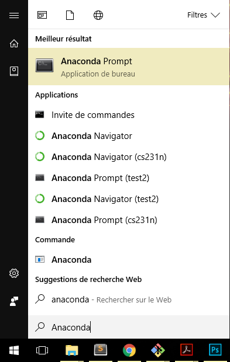
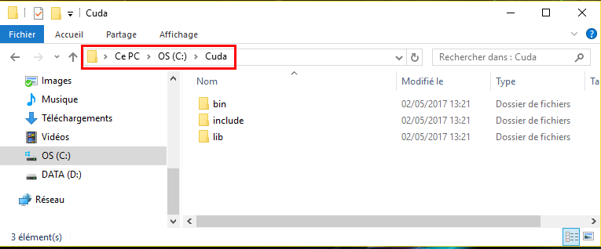

TensorFlow is an open-source software library for machine learning developed by researchers and engineers working on the Google Brain Team. The first publicly available version was released in Novembre 2015. TensorFlow quickly became popular in the deep learning community for several reasons. The main reason might be that TensorFlow is maintained by a professional developer team (whereas Caffe, Theano, ... are developed by academic researchers). I won't discuss the pros and the cons of the different machine learning frameworks here. It is not the point! A good rule of thumb is to check how many stars/fork TensorFlow got on [Github](https://github.com/tensorflow/tensorflow "TensorFlow repo"). According to the number of Stars/Forks of GitHub we can guess that TensorFlow has the biggest community!

## Installing Tensor on Windows
When Google decided to release its library under the Apache 2.0 open source license, TensorFlow was primarily available on Mac and Linux. After several months, TensorFlow was finally available on Windows. However, it is much easier to use TensorFlow on Linux Operating System then on Windows. That is why I will only focus on how to install TensorFlow on Windows Operating System.
Firstly, We should notice that, at the time I'm writing this article, TensorFlow is only available for Python 3.5 on Windows (while on Linux and Mac You can use TensorFlow with Python 2.7 for example).

### Installing the CPU version
To install TensorFlow on Windows the easiest way is to install Anaconda. The steps are:
1. Download [Anaconda](https://www.continuum.io/downloads "Anaconda Website") for Windows. Install Python 3.X version (at the time I'm writing the tutorial the version is Python 3.6)
2. Launch the installer and install Anaconda
3. Once the installation is finished go to Windows and type **Anaconda**. Finally, click on **Anaconda Prompt**.
    <div class="centered-img">
    
    <div class="legend">Anaconda Prompt under Windows 10</div>
    </div>
4. Once the Prompt is open we will need to create an environment for Python 3.5 (because TensorFlow is not available on Python 3.6 yet). To create an environment, simply type:
```shell
conda create --name tensorflow python=3.5 anaconda
```
This command will create a Python 3.5 environment named **tensorflow**.
5. We then activate the environment we've just created using:
```shell
activate tensorflow
```
On Linux, Mac, and Git for Windows we need to write `source activate tensorflow`.
6. We then install common package like jupyter and scipy (scipy will install numpy) and tensorflow using:
```shell
conda install jupyter
conda install scipy
pip install tensorflow
```

So now we can use TensorFlow on Windows. Yet if you have a good Nvidia GPU, you might want to use it with TensorFlow. Indeed TensorFlow supports CUDA Drivers and using TensorFlow on GPU might increase the speed of your training phase by 10 or more.

### Installing the GPU version
To install the GPU version of Windows you will firstly need to install:
+ [CUDA Drivers](http://docs.nvidia.com/cuda/cuda-installation-guide-microsoft-windows/#axzz4g2dyu59Q, "Nvidia CUDA Website")
+ [cuDNN](https://developer.nvidia.com/cudnn "Download cuDNN")

The steps are:
1. Download [CUDA](https://developer.nvidia.com/cuda-downloads "Download CUDA") for your operating system
2. Launch the installer and install CUDA
3. Then download [cuDNN](https://developer.nvidia.com/cudnn "Download cuDNN")[^1]. You might need to create an nvidia account before downloading cuDNN.
4. Unzip the archive. You should get a folder containing 3 other folders:
    + bin
    + include
    + lib
5. Go to `C:\` and create a folder named `Cuda`, then copy and paste the folders `bin`, `include`, `lib` inside your `Cuda` folder. You should have something like this:
    <div class="centered-img">
    
    <div class="legend">folders bin, include, lib are under C:\Cuda</div>
    </div>
6. Now add `C:\Cuda` to your `Path` environment variable. To do so:
    + Right Clikc on `Windows` -> `System` -> `Advanced system settings` (on the left) -> `Environment Variables`
    + Click on `Path` Variable under `System Variables` and then click `Edit...` and Add `;C:\Cuda` at the end of the `Path` variable. (On windows 10 you will just have to add `C:\Cuda` on a new line). here is a screenshot:
    <div class="centered-img">
    
    <div class="legend">Adding C:\Cuda to Path variable</div>
    </div>
7. Launch Anaconda Prompt: `Windows` -> type **Anaconda** -> Click on `Anaconda Prompt`
8. create a GPU TensorFlow environment, using:
```shell
conda create --name tensorflow-gpu python=3.5 anaconda
```
9. activate the environment named **tensorflow-gpu**
```shell
activate tensorflow-gpu
```
10. Install jupyter and scipy and other package if you want
11. Install tensorflow for GPU using:
```shell
pip install --ignore-installed --upgrade https://storage.googleapis.com/tensorflow/windows/gpu/tensorflow_gpu-1.1.0-cp35-cp35m-win_amd64.whl
```

**Note**: if you tried to install TensorFlow using `pip install tensorflow-gpu` you might encounter an error. To solve this issue you need to download _Microsoft Visual C++ 2015 Redistributable_

### Should I use my CPU or my GPU?
Now that we sucessfully installed both the CPU and GPU versions of TensorFlow, we might wonder which version you should use. The easy answer is: *use the GPU version*

To understand why you should use your GPU over your CPU, you should first understand what is the difference between a *GPU* and a *CPU*.

+ **CPU** stands for _Central Processing Unit_ and **CPU**s are optimized for Serial Tasks. We will prefer to use **CPU**s over **GPU**s for any sequence of task that are not easily parallelisable. For example we will prefer to use a *CPU* when we are dealing with *non trivial* recusive tasks. Hence, we will prefer to use *CPU*s for RNN because RNN are made of Recursive Task: We cannot compute the next term before having computed the previous term (see figure below).

<div class="centered-img">

<div class="legend">Figure 1: Architecture of a RNN. We can see that to compute $h_{n+1}$ <br>
                    we need to have computed $h_{n}$. Hence this task is somehow recursive</div>
</div>

+ **GPU** stands for _Graphics Processing Unit_ and **GPU**s are optimized for Parallel Tasks. We will prefer to use **GPU**s over **CPU**s when we can divide the main task into several tasks that we can compute in parallel. We will therefore prefer to use *GPU*s for CNN because CNN are made of several subtasks that we can compute independaly from each others (see figure below).

<div class="centered-img">

<div class="legend">The source image is split into 3 images. One for each RGB layer. Then we convolve each Red, Blue, Green layer<
                    with a filter and we obtain 3 activation maps (red, blue, green parallelepipeds in the image). One for the blue
                    layer, one for the red layer and one for the green layer. The convolution of each layer can be made in parallel.
                    Moreover the convolution of each part of the image with a filter can also be made in parallel.</div>
</div>

So, according to what I've just said you might think that it is better to use a *CPU* for RNN and a *GPU* for CNN. Well, actually it is not that simple. Indeed we can parallelize tasks in a RNN with a certain trade-off. I won't enter into any detail but there are many ways (other than just by increasing parallelism) we can improve the performance of RNN on GPUs. We can for example:
- Reduce the memory traffic
- Reduce overheads
- Increase the parallelism


**So in general, whether you are dealing with *CNN* or *RNN* or any other types of Neural Network, it will be preferable to use your *GPU* (supposing you have a good Nvidia GPU of course!)**

## Introducing TensorFlow Concepts
To better understand how TensorFlow works, we can represent any operation as a Flow Graph where each node of the graph represents mathematical operations and each edge represents the tensor communicated between them. You can think of a Tensor as a list, an array or a multidimensional array.

<div class="centered-img">

<div class="legend">Example of a simple Flow Graph that we can compute using TensorFlow. The Red circle represents the data
                    we feed to the Neural Network (Placeholder in TensorFlow). The Blue circles represent the parameters we want
                    to update during training (Variables in TensorFlow). The gray circles represent the mathematical operations
                    we can perform between tensors. The edges represent the tensors flowing through the graph.</div>
</div>

### Variables, Placeholders, Mathematical Operations
+ **Variables** are stateful nodes. Each time we need to create a parameter (Weight matrix, bias term, ...) we will create a `Variable` in TensorFlow. For example, we can create a matrix of weights $ W \in \mathbb{R}^{784 \times 100}$ and a bias term $b \in \mathbb{R}^{100}$ with:

```python
import tensorflow as tf

W = tf.Variable( tf.random_uniform((784, 100), -1, 1) )
b = tf.Variable( tf.zeros((100,)) )
```

+ **Placeholders** are nodes whose value is fed in at execution time. Hence we will create a placeholder for any data that our model take as inputs or ouputs: inputs, labels,... For example, assuming we have a input vector of length **784** and that we are working with a mini-batch of size **100**, we will create our input $x \in \mathbb{R}^{100 \times 784}$ using:

```python
x = tf.placeholder(tf.float32, (100, 784))
```

+ **Mathematical Operations**. Any Mathematical operations are implemented using built-in functions from TensorFlow. For example to multiply two matrices we can use `matmul()`. If we want to use a `ReLu` activation function we can use the `relu()` function. Hence to compute $h = ReLu(Wx + b)$ we can write:

```python
h = tf.nn.relu( tf.matmul(x, W) + b )
```

Here is the final code snippet:

```python
import tensorflow as tf

W = tf.Variable( tf.random_uniform((784, 100), -1, 1) )
b = tf.Variable( tf.zeros((100,)) )

x = tf.placeholder(tf.float32, (100, 784))

h = tf.nn.relu( tf.matmul(x, W) + b )
```

### Fetch, Feed
Now that we've built our skeleton, we will now need to run a session to get our outputs. A session is a binding to a particular execution context (CPU, GPU, ...). To initialize a session we can simply use:

```python
session = tf.Session()
```

To initialize the Variables, we can then use the built-in function `tf.initialize_all_variables()`:
```python
session.run(tf.initialize_all_variables())
```

So now we have initialized our session and our variables (Weight matrix and bias here), but we still didn't initialize our data (inputs, labels, ...). We created a placeholder that can accept a data of shape $(100, 784)$ but we still didn't feed this data and we still didn't specify which outputs we want to retrieve. To do so we will use the `session.run(fetches, feeds)` function where:
+ **Fetches** is a list of graph nodes that we want to retrieve.
+ **Feeds** is a dictionary mapping from graph nodes to concrete values. Hence Feeds can be seen as a dictionary mapping each placeholder to their values.

As we want to retrieve our output **h** and as we only have one placeholder **x** we can finally run our session using:
```python
session.run(h, {x: np.random.random(100, 784)})
```

and the full code snippet is:
```python
import tensorflow as tf

W = tf.Variable( tf.random_uniform((784, 100), -1, 1) )
b = tf.Variable( tf.zeros((100,)) )

x = tf.placeholder(tf.float32, (100, 784))

h = tf.nn.relu( tf.matmul(x, W) + b )

session = tf.Session()
session.run(tf.initialize_all_variables())
session.run(h, {x: np.random.random(100, 784)})
```

### Adding the loss
In order for the model to compute the loss and update the weight matrix and bias term accordingly, we will just need to specify a loss function and which optimizer we want to use. I will keep things simple and only use the basic cross_entropy loss function and the simple stochastic gradient descent. To train our model we then define our cross_entropy loss using:

```python
cross_entropy = -tf.reduce_sum(label * tf.log(prediction), axis=1)
```

we then create an optimizer using `tf.train.GradientDescentOptimizer(learning_rate)` and we pass our loss (here `cross_entropy`) to the `minimize` method of our optimizer. In python we have finally:

```python
optimizer = tf.train.GradientDescentOptimizer(0.1) # 0.1 is the learning rate
train_step = optimize.minimize(cross_entropy)
```

### Training the Model
Finally to train the model we can simply iterate over each batch of our data and pass `train_step` as our fetch and initialize our feed dictionary. In Python, assuming we have created a function that gives use the next batch of data we can write:

```python
for i in range(200):
	batch_x, batch_label = data.next_batch()
	session.run(train_step, feed_dict={x: batch_x, label: batch_label} )
```

[^1]: You need to install cuDNN 5.1. At the time I'm writing this tutorial TensorFlow still doesn't support cuDNN 6

<br><br>