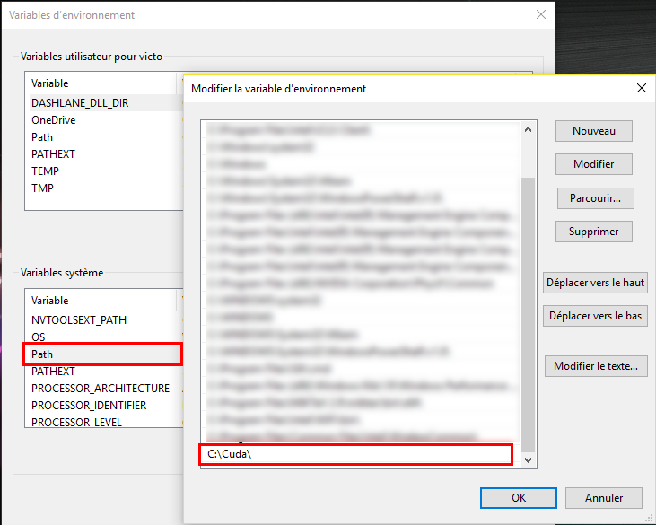

TensorFlow is an open-source library for machine learning developed by Google and released since Novembre 2015. TensorFlow quickly became popular in the deep learning community for several reasons. Not only is TensorFlow a library
developed by a professional developer team (whereas Caffe, Theano, ... are developed by academic researchers), but also TensorFlow allows to parallelize easily the computations on several chips.

## Installing Tensor on Windows
When Google decided to release its library under the Apache 2.0 open source license, TensorFlow was primarily available on Mac and Linux. After several months, TensorFlow was finally available on Windows. However, it is much easier to use TensorFlow on Linux Operating System then on Windows. That is why I will only focus on how to install TensorFlow on Windows Operating System.
Firstly, We should notice that TensorFlow is only available for Python 3.5 on Windows (while on Linux and Mac You can use TensorFlow with Python 2.7 for example).

### Installing the CPU version
To install TensorFlow on Windows the easiest way is to install Anaconda. The steps are:
1. Download [Anaconda](https://www.continuum.io/downloads "Anaconda Website") for Windows. Install Python 3.X version (at the time I'm writing the tutorial the version is Python 3.6)
2. Launch the installer and install Anaconda
3. Once the installation is finished go to Windows and type **Anaconda**. Finally, click on **Anaconda Prompt**.
    <div class="centered-img">
    
    <div class="legend">Anaconda Prompt under Windows 10</div>
    </div>
4. Once the Prompt is open we will need to create an environment for Python 3.5 (because TensorFlow is not available on Python 3.6 yet). To create an environment, simply type:
```shell
conda create --name tensorflow python=3.5 anaconda
```
This command will create a Python 3.5 environment named **tensorflow**.
5. We then activate the environment we've just created using:
```shell
activate tensorflow
```
On Linux, Mac, and Git for Windows we need to write `source activate tensorflow`.
6. We then install common package like jupyter and scipy (scipy will install numpy) and tensorflow using:
```shell
conda install jupyter
conda install scipy
pip install tensorflow
```

So now we can use TensorFlow on Windows. Yet if you have a good Nvidia GPU, you might want to use it with TensorFlow. Indeed TensorFlow supports CUDA Drivers and using TensorFlow on GPU might increase the speed of your training phase by 10 or more.

### Installing the GPU version
To install the GPU version of Windows you will firstly need to install:
+ [CUDA Drivers](http://docs.nvidia.com/cuda/cuda-installation-guide-microsoft-windows/#axzz4g2dyu59Q, "Nvidia CUDA Website")
+ [cuDNN](https://developer.nvidia.com/cudnn "Download cuDNN")

The steps are:
1. Download [CUDA](https://developer.nvidia.com/cuda-downloads "Download CUDA") for your operating system
2. Launch the installer and install CUDA
3. Then download [cuDNN](https://developer.nvidia.com/cudnn "Download cuDNN"). You might need to create an nvidia account before downloading cuDNN.
4. Unzip the archive. You should get a folder containing 3 other folders:
    + bin
    + include
    + lib
5. Go to `C:\` and create a folder named `Cuda`, then copy and paste the folders `bin`, `include`, `lib` inside your `Cuda` folder. You should have something like this:
    <div class="centered-img">
    
    <div class="legend">folders bin, include, lib are under C:\Cuda</div>
    </div>
6. Now add `C:\Cuda` to your `Path` environment variable. To do so:
    + Right Clikc on `Windows` -> `System` -> `Advanced system settings` (on the left) -> `Environment Variables`
    + Click on `Path` Variable under `System Variables` and then click `Edit...` and Add `;C:\Cuda` at the end of the `Path` variable. (On windows 10 you will just have to add `C:\Cuda` on a new line). here is a screenshot:
    <div class="centered-img">
    
    <div class="legend">Adding C:\Cuda to Path variable</div>
    </div>
7. Launch Anaconda Prompt: `Windows` -> type **Anaconda** -> Click on `Anaconda Prompt`
8. create a GPU TensorFlow environment, using:
```shell
conda create --name tensorflow-gpu python=3.5 anaconda
```
9. activate the environment named **tensorflow-gpu**
```shell
activate tensorflow-gpu
```
10. Install jupyter and scipy and other package if you want
11. Install tensorflow for GPU using:
```shell
pip install --ignore-installed --upgrade https://storage.googleapis.com/tensorflow/windows/gpu/tensorflow_gpu-1.1.0-cp35-cp35m-win_amd64.whl
```

**Note**: if you tried to install TensorFlow using `pip install tensorflow-gpu` you might encounter an error. To solve this issue you need to download _Microsoft Visual C++ 2015 Redistributable_

If you have a good Nvidia GPU, I encourage you to use it for your deep learning project (Even if you are using an RNN).

### Tutorial
I will add a tutorial on TensorFlow here in a few days.


<br><br>