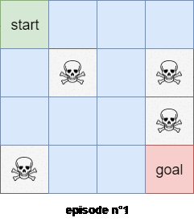

In this article we will start to deal with a more interesting environment. We will actually use **Monte-Carlo**
algorithms to find a near optimal policy to the game of **Blackjack**. I will briefly resume the rules of the blackjack
card game before presenting you the idea behind **Monte-Carlo** techniques. Finally we will develop different variants of  **Monte-Carlo** strategies. This article is based on the 5th chapter of the [Reinforcement Learning: An Introduction](http://incompleteideas.net/book/bookdraft2018mar21.pdf) by Sutton & Barto.
It is going to be a lengthy article, so go get your favorite coffee mug. Let's go! As usual, the code for this article is available on my [github](https://github.com/Twice22/HandsOnRL/tree/master/chapter3).

## Blackjack
In this article we will consider a variant of **Blackjack** where we assume that the cards are drown
with replacement (it is not the case in reality). The goal of Blackjack is to obtain a score as near
as possible to $21$ without going over. The score is computed as the sum of the values of the cards
you have drawn from the deck. Jack, Queen and King are worth $10$ points. Ace can either be worth $11$,
(in this case we say that the ace is **usable**) or $1$.
The player has two options: either **stick** (he stops drawing additional cards) or **hit** (he requests
to draw an additional card).
The game starts with the player having 2 face up cards (because we know for sure that with only two
cards the player's score cannot be greater than $21$. In the worst case scenario the players starts with two aces but
aces can either be worth $11$ or $1$) and the dealer having one face up card
- if the player sticks and the sum of its cards is over $21$ he loses the game
- if the player stops with a score below or equal to $21$, the dealer starts to draw cards until
its sum is greater or equal to $17$.
- the person whose score is the nearest to $21$ without being above, win the game. If both the player
and the dealer have the same score or if both have a score strictly greater than $21$, we call it a draw

<div class="centered-img framed">
	
	<div class="legend">Figure 1: 4 examples of Blackjack party
	</div>
</div>

We can load the game of Blackjack directly from the OpenAI environment using:
```python
import gym
env = gym.make('Blackjack-v0')
```

the **HIT** action is mapped to the integer $1$ while the **STICK** action is mapped to $0$. For example to
execute the **HIT** action we can write:
```python
next_state, reward, terminate, info = env.step(1)
```

To play 4 games of Blackjack using a random policy, we can write:
```python
for _ in range(4):
    state = env.reset()
    while True:
        print(state)
        a = env.action_space.sample() # sample an action at random

        # retrieve information from the env after executing action a
        state, reward, terminate, _ = env.step(a)
        if terminate:
            print("win" if reward > 0 else "lose" + "\n")
            break
```

Let's analyze how a state is represented in this game using:
```python
print(env.observation_space) # Tuple(Discrete(32), Discrete(11), Discrete(2))
```

**Note**: to actually recover a real python **tuple**, you can add `.spaces` as follow:
```python
print(env.observation_space.spaces) # (Discrete(32), Discrete(11), Discrete(2))
```

A state is represented as a 3-tuple of:
- the current player's sum $\in$ {$0, 1, \dots, 31$}
- the dealer's face up card $\in$ {$1, \dots, 10$}
- whether or not the plays has an usable ace $\in$ {$0,1$} (0 $\rightarrow$ no, 1 $\rightarrow$ yes)


## Monte-Carlo
Here I will present you the idea behind the Monte-Carlo algorithm. You will see, it is actually very intuitive. Let's start with the easiest example: the dice

A regular dice have 6 faces with number ranging from $1$ to $6$. The dice being supposed perfect, we have $1/6$ chance
to get any digit. Mathematically we can write:

$$p(X = i) = 1/6$$

which means that the probability that the event {$X = i$}, $\forall i \in$ {$1, \dots, 6$} is equal to $1/6$. Now, on average, if we throw the dice an infinite number of time we will get the expectation, which is defined by:

$$\mathbb{E}[X] = \sum\limits_{i=1}^{6} i \times P(X=i)$$

So $\mathbb{E}[X] = 1/6 + 2/6 + 3/6 + 4/6 + 5/6 + 6/6 = 21/6$. That is to say that, on average, if I throw the dice
I will get a reward of $3.5$. The thing is that the expectation is the reward we should get on **average** that means
that it is the average reward we get if we throw the dice **an infinite number of times**. I practise we cannot throw
the dice an infinite number of time, so we will just throw the dice maybe $100$ or $1000$ times and we will compute
the expectation $\mathbb{E}$ based on the experiment.

For example if we throw the dice $100$ times and we see $24$ times the digit $1$ we will say that $P(X=1) = 24/100$. We can
simulate this behavior in python with the following snippet:
```python
import random

n_throws = 100

dice_values = [0] * 6
for _ in range(n_throws):
    dice_values[random.randint(1,6)-1] += 1

avg_reward = sum([i*v/n_throws for i, v in enumerate(dice_values, 1)])
print(avg_reward)
```

For example we will obtain an average reward of $3.34 \approx 3.5$. The Monte-Carlo algorithm is based on this simple
idea that we can get a good estimation of the average reward by averaging all the rewards we get **experimentally**.
So now what does that means for a more complex game? As it is easier to explain it to you using the `FrozenLake-v0`
environment instead of the `Blackjack-v0` environment, I will based my explanation on the `FrozenLake-v0` environment.

Let's assume that we have a policy $\pi$ that specifies deterministically which action our agent should take in each
step. How can I evaluate this policy? To put it differently: what average reward will our agent receive in each state
of the game? We simply need to use the same approach as the one we used for the dice. For each state $s$ of the
game, I sample, for example, $100$ trajectories according to the policy $\pi$ and then I average the rewards I get from all the trajectories. This number will represent the reward my agent can expect in each state $s$.

Let's work on an exmaple to understand. Let's suppose that my agent is in state $s=0$ (start state). Let's assume that
my agent is following the policy $\pi$, where $\pi$ is defined by $\pi(a|s) = right$, $\forall a \in A$. That is to
say that our agent will always choose to go **right** independently of the state he is currently in. Moreover, let's
recall that in the **stochastic** `FrozenLake-v0` environment, if tell my agent to go **right**, he will actually
go **right** with probability $1/3$, go **up** with probability $1/3$ and go **down** with probability $1/3$. If we
sample $100$ trajectories (a trajectory is the path followed by our agent until he ends in a terminate state: an hole or the goal state), we might have something like this:

+ $1$: $0 \rightarrow 1 \rightarrow 2 \rightarrow 6 \rightarrow 7$
+ $2$: $0 \rightarrow 4 \rightarrow 5$
+ $3$: $0 \rightarrow 4 \rightarrow 8 \rightarrow 9 \rightarrow 13 \rightarrow 14 \rightarrow 15$
+ ...
+ $100$: $0 \rightarrow 1 \rightarrow 0 \rightarrow 4 \rightarrow 5$

<div class="centered-img framed">
	
	<div class="legend">Figure 2: FrozenLake environment
	</div>
</div>

Each trajectory followed by our agent will give us a reward, and so if we average all the rewards of all the trajectories we will actually get an approximation of the reward my agent can expect if it starts in state $s=0$ and
follows the policy $\pi$. That's it. Monte-Carlo method is very easy and intuitive to understand. Know It would be
very unefficient to sample $N$ trajectories for each state $s$. Actually the first trajectory go through states $0, 1, 2, 6$ and $7$ so, for the first trajectory, not only we have access to the reward of $0 \rightarrow 1 \rightarrow 2 \rightarrow 6 \rightarrow 7$, but we also know the reward of all the following subtrajectories:
- $1 \rightarrow 2 \rightarrow 6 \rightarrow 7$
- $2 \rightarrow 6 \rightarrow 7$
- $6 \rightarrow 7$

So instead of sampling $N$ trajectories for each state, we can just sample $N$ trajectories **in total** and update each state $s$ with the average rewards of all the trajectories and subtrajectories starting from that state $s$.

There are actually 2 different implementations of **Monte-Carlo** methods to estimate a policy $\pi$:
- first-visit **Monte-Carlo**
- every-visits **Monte-Carlo**

The first visit **Monte-Carlo** method only use the smallest subtrajectory starting from a state $s$. For example
the $100^{th}$ trajectory was: $0 \rightarrow 1 \rightarrow 0 \rightarrow 4 \rightarrow 5$. So the subtrajectories (+ the original trajectory) are:
+ $1$: $4 \rightarrow 5$
+ $2$: $0 \rightarrow 4 \rightarrow 5$
+ $3$: $1 \rightarrow 0 \rightarrow 4 \rightarrow 5$
+ $4$: $0 \rightarrow 1 \rightarrow 0 \rightarrow 4 \rightarrow 5$

We will use the first subtrajectory to compute the expected reward of state $4$. We will use the second subtrajectory in the calculation of the expected reward of state $0$. The thrid trajectory will be used to compute the expected reward of the state $1$, **BUT** the last trajectory **WON'T** be used to compute the expected reward of state $0$ because we've already encountered a subtrajectory that started from state $0$! Figure $3$ shows an example of the **first visit Monte-Carlo** method with 2 trajectories starting from the state $s=0$.

<div class="centered-img framed">
	
	<div class="legend">Figure 3: First visit Monte-Carlo with 2 different episodes. All states encountered
		along the first epsiode are all uniques, while during episode $2$ our agent go through the state $2$ two
		times, so we will only use the smallest subtrajectory starting from the state $s=2$
	</div>
</div>

In the **every-visits Monte-Carlo** method we use all the trajectories and subtrajectories.

**Note**: According to the law of large numbers, both methods are guaranteed to converge to the true expected reward.

## Monte-Carlo to estimate $\pi$
In the previous part we have explained how we can evaluate a policy $\pi$ using the **Monte-Carlo** method. In this section
we will implement the **first-visit Monte-Carlo** method in python.

First thing first, as we want to evaluate a certain policy $\pi$, we need to define a policy $\pi$. In this article the policy
$\pi$ is defined by:
- if the player's current value is lower or equal to 18: **HIT** (action = 1)
- otherwise **STICK** (action = 0)

in Python we can write:
```python
# recall that state = (current player's sum, dealer face up card, is ace usable)
# so state[0] = current player's sum
action = int(state[0] <= 18)
```

Once we have defined our policy, we need to collect $N$ episodes (or trajectories) based on this policy, so we need to define a function that
will create a trajectory as a list of 3-tuples containing the current state $s$, the action selected $a$ and the reward we get from selecting $a$
in state $s$. The implementation is straightforward:
```python
def generate_episode_deterministic(env):
    state = env.reset()
    episode = []
    while True:
        action = int(state[0] <= 18) # our policy
        next_state, reward, terminate, _ = env.step(action)
        episode.append((state, action, reward))
        state = next_state
        if terminate:
            break
            
    return episode
```

We have defined $\pi$, the policy we want to evaluate and we have created a function that builds a trajectory following our policy $\pi$ and
starting from a random state $s$. We just need to create a function that samples $N$ trajectories using the **first-visit** method. We create
a function named `MCV` for Monte-Carlo Value that takes as parameters:
- `env`: the environment
- `generate_episode`: a function that generates an epsiode using a well-defined policy $\pi$
- `gamma`: the discount factor ($0 \leq \gamma \leq 1)
- `episodes`: the number of episodes or trajectories to sample

Here is a commented python implementation of the first-visit Monte-Carlo Value estimation:
```python
def MCV(env, generate_episode, gamma, episodes):
    
    # initialize arbitrary V and returns
    V, returns = {}, {}
    
    # sample several episodes (= trajectories)
    for episode in range(episodes):
        trajectory = generate_episode(env)
        G, T = 0, len(trajectory)
        visited_state = set()
        
        # start with the smallest subtrajectory.
        # Add the reward to the 'returns' dictionary
        # only if the starting state of the subjectory
        # hadn't been encounter in a smaller subtrajectory
        for i in range(T-1, -1, -1):
            state, action, reward = trajectory[i]
            
            # sum of reward with discount factor gamma
            G += gamma**i * reward
            
            if state not in visited_state:
                reward, visits = returns.get(state, [0, 0])
                returns[state] = [reward + G, visits + 1]             
                visited_state.add(state)
    
    # get the average reward for each state. It is computed
    # as the sum of reward starting in state s divided
    # by the number of trajectories and subtrajectories
    # starting in state s
    for state, (sum_reward, n_visits) in returns.items():
        V[state] = sum_reward / n_visits
    
    return V
```

We can define an helper function to plot the $Value$ that depends on the dealers face-up card and on the current player's sum. After $500000$ episodes.
The closest to $1$ the value is, the more likely the player will win the game (as the value is computed as the average discounted reward, and the reward
obtained is either -1, 0 or +1, the value is naturally within the range [-1, 1]). Figure $4$ shows both the Value function for an usable and a non usable ace.


<div class="centered-img framed">
	
	<div class="legend">Figure 4: Value function obtained if the agent follows our previously defined policy $\pi$
	</div>
</div>

Here our function returns only the **state value function**. We can also implement the **first-visit Monte-Carlo** method for the **state-value** function.
The code is very similar and is available on my [github](https://github.com/Twice22/HandsOnRL/blob/master/chapter3/MonteCarloEstimations.ipynb).


## Monte-Carlo With and Without Exploring Starts
We know how to evaluate a policy $\pi$ using the **Monte-Carlo** method, but what really interested us is to find the best policy! So we need to figure
out a way of finding the best policy. One natural idea (based on the previous article) would be to improve the policy at each iteration. In this part
I will proove that this technique permits to get a policy that is at least better than the policy at the previous iteration. We would then enlight
a major flaw of this technique before amending it.

To get a better policy $\pi$ at each iteration, the idea is to act greedily, that is to say to choose the action that maximizes the current value function.
Let $\pi_k$ be the policy at the $k^{th}$ iteration and let's proove that, if we act greedily, $\pi_{k+1}$ is a better policy. It suffices to proove that
$Q_{\pi_k}(s, \pi_{k+1}(s)) \geq Q_{\pi_k}(s, \pi_k(s))$ because it means that, for all states $s$, the actions taken under the policy $\pi_{k+1}$
are guaranteed to get a higher state-value function than the actions taken under the policy $\pi_{k}$. By definition, as $\pi_{k+1}$ is obtained
by acting greedily, we have: $\pi(s) \triangleq \arg\max\limits_{a} Q(s,a)$, so, we have:

$$
\begin{align*}
Q_{\pi_k}(s, \pi_{k+1}(s)) &= Q_{\pi_k}(s, \arg\max\limits_{a} Q_{\pi_k}(s,a)) \\\\
						   &= \max\limits_{a} Q_{\pi_k}(s,a) \\\\
						   &\geq Q_{\pi_k}(s, \pi_k(s))
\end{align*}
$$

At each iteration, if we update our policy by acting greedily, we are sure to obtain a better policy. Yet, it doesn't necessarily means that our method
will converge towards the optimal policy as we will see soon. But first of all, let's review how to implement this strategy in python. Fortunately, the
code won't differ a lot from the previous code.

First of all, as we are improving the policy $\pi$ at each iteration, our function to generate an episode will now take the policy $\pi_k$ for the current
iteration $k$ as an argument. Moreover, this function will deterministically choose the action $a$ given by $a = \pi(s)$. If we haven't updated the state
$s$ yet (that is to say that `pi[s]` is not defined) then we return either $0$ or $1$ (depending on how we have initialized our arbitray policy  $\pi_0$).

The code to generate an episode is as follow:
```python
def generate_episode_from_policy(env, pi):
    state = env.reset()
    episode = []
    while True:
        # select the best action according to the policy pi if it exists
        # otherwise choose 0 (arbitrary policy not changed so far)
        action = pi[state] if state in pi else 0
        next_state, reward, terminate, _ = env.step(action)
        episode.append((state, action, reward))
        state = next_state
        if terminate:
            break
        
    return episode
```

The function `MCES` (for Monte Carlo Exploring Start) is also straightforward. We just need to add a line to update the policy $\pi$ for each episode:
```python
def MCES(env, generate_episode, gamma, episodes):
    n_actions = env.action_space.n
    
    # initialize arbitrarily pi, Q, returns
    pi = {}
    Q = defaultdict(lambda: np.zeros(n_actions))
    returns = {}
    
    for episode in range(episodes):
        trajectory = generate_episode(env, pi)
        G, T = 0, len(trajectory)
        
        for i in range(T-1, -1, -1):
            state, action, reward = trajectory[i]
            G += gamma**i * reward
            
            visited_state = set()
            if (state, action) not in visited_state:
                # append G to returns (s_t, a_t)
                reward, visits = returns.get((state, action), [0, 0])
                returns[(state, action)] = [reward + G, visits + 1]
                
                Q[state][action] = (reward + G) / (visits + 1)
                pi[state] = np.argmax(Q[state]) # update our policy greedily
                
                visited_state.add((state, action))
    
    return Q, pi
```

To draw the Value function we need to convert $Q$ into $V$. It is straightforward. As we are acting greedily we have $v(s) = \max_{a} q(s,a)$:
```python
# transform Q state-value function to V value function
def QtoV(Q):
    return {state: np.max(values) for state, values in Q.items()}
```

We can then plot the Value function. What is interesting, however, is the policy $\pi$. So we can define an helper function to plot the policy $\pi$. Quite
weirdly, here is the supposedly optimal policy we obtain for the game of `Blackjack`:

<div class="centered-img framed">
	
	<div class="legend">Figure 5: Weird unoptimal policy obtained using Monte-Carlo with exploring starts
	</div>
</div>

The policy looks weird, and is nothing compare to the optimal policy reported in the Sutton & Barto book:

<div class="centered-img framed">
	
	<div class="legend">Figure 6: Optimal policy from the Sutton & Barto book for the game of Blackjack
	</div>
</div>

So what's wrong with the previous implementation? The problem comes from the exploration/exploitation dilemma. Here, as we are always acting greedily, we
don't let our agent explore new possibilities and hence we converge towards a suboptimal weird policy. Let's work on an example to understand why this
algorithm doesn't explore.

Let's start in state `(13, 2, False)`. Our function starts by sampling a trajectory according
to our arbitrary policy $\pi_0$ that we initialized with $0$ (`action = pi[state] if state in pi else 0`). Which means that, in state `(13, 2, False)` we will
actually choose action $0$, that is to say that we will **STICK**. So we will update `Q[state][action]` as follow:
```python
Q[state][action] = Q[(13,2,False)][0] = reward + G
```

then we do:
```python
pi[state] = np.argmax(Q[state])
```

but, as Q[state] is initialized to `[0, 0]`, `pi[state] = STICK if Q[state][action] < 0 else HIT`.
let's imagine that `Q[state][action] = Q[(13,2,False)][0] = -0.2 < 0`, so we have `Q[state] = [-0.2, 0]` and at the next iteration, when our agent will encounter the state `(13, 2, False)` it will **HIT**.
let's suppose, for the sake of the argument, that at the next iteration we have `Q[state][action] = -1` that is to say that, now, `Q[(13,2,False)] = [-0.2, -1]`, so our agent
will choose action $0$ (**STICK**) at the next iteration. We can even say, that, our agent will **ALWAYS** choose action $0$ for all the next iterations when it is
in state `(13, 2, False)`. Why? because as the reward is either $+1$, $-1$ or $0$ and the value in `Q[state][action]` is the average reward, we are sure that `-1 <= Q[state][action] <= 1`.
The problem is that, maybe, in reality, on expectation, `Q[(13,2,False)][1] = 0.2`, but as we have a bad luck and get the smallest reward possible the first time we encountered
the state `(13, 2, False)`, our agent won't ever choose action $1$ in the subsequent steps. We can mitigate this problem by using bounds as it is done for multi-arm bandits. Another idea
consists in:
+ choosing $\arg\max_{a} q(s,a)$ with probability $1 - \epsilon + \frac{\epsilon}{nA}$
+ choosing a random action $a' \neq \arg\max_{a}$ with probability $\frac{\epsilon}{nA}$

where $nA$ is the number of available actions.

By letting our agent exploring, our policy is guaranteed to converge towards the optimal policy $\pi^{\star}$. The previous code can be adapted to take advantage of the epsilon-greedy policy. The code is available on my [github](https://github.com/Twice22/HandsOnRL/blob/master/chapter3/MonteCarloExploringStart.ipynb). We can, now, plot the policy to see if we have something that looks like the policy reported in the Sutton & Barto book. Figure $7$ shows the policy obtained with our code.


<div class="centered-img framed">
	
	<div class="legend">Figure 7: Nearly Optimal policy obtained why our python implementation of Monte-Carlo without Exploring Starts
	</div>
</div>

As we can see on figure 7, the policy we obtained, looks very much like the one reported in the Sutton & Barto book.

## Off-policy Monte-Carlo
So far we have seen how we can evaluate a certain policy $\pi$ and how we can implement a Monte-Carlo algorithm that uses an epsilon-greedy policy to find a
near optimal policy $\pi^{\star}$, so isn't the only thing we need to know about Monte-Carlo? Well, if there is another section in this article, you already know that the
answer is **no**. So what should we talk about? As we have seen, to ensure that our policy converges towards the optimal policy we still need to act
sub-optimally by letting our agent explores some states. The problem is that we update our policy at each iteration based on an suboptimal policy (because our policy
always explore). To avoid this problem, one idea is to use 2 policies.
+ a _target policy_ $\pi$ that is learned and that will converge towards the optimal policy
+ a _behavior policy_ $b$ that is used for exploration

While, on-policy methods update the same policy at each iteration in order to obtain a policy that converges towards the optimal policy, off-policy methods use 2 policies.
One called __target policy__ that is updated at each iteration based on a __behavior policy__ that is used for exploration.

Let's see how we can use off-policy methods to estimate $V_{\pi}$ or $Q_{\pi}$. We assume that we have _trajectories_ obtained from following a policy $b \neq \pi$. How can we recover
the **state value function** $V_{\pi}$? To ensure that we can evaluate $V_{\pi}$ we first need to ensure that if $\pi(a|s) > 0$ then $b(a|s) > 0$. This condition ensures that all actions
taken by the policy $\pi$ can also be taken by our _behavior policy_ $b$. We call it the assumption of _coverage_.

Let's see how we can compute $V_{\pi}$ if we only have trajectories from the behavior policy $b$. Let's first recall what **Monte-Carlo** methods seek to compute. For the sake of
readability, I will use non conventional notations. Let $t_s$ be a certain trajectory starting in state $s$ and let $\mathcal{T}\_s$ be all the available trajectories starting in state $s$.
Let also $r[t_s]$ be the total reward obtained from the trajectory $t_s$ and $\mathbb{P}\_{\pi}[t_s]$ be the probability that our agent follows the trajectory $t_s$ amongst all the available trajectories in $\mathcal{T}\_s$
if our agent acts according to the policy $\pi$. **Monte-Carlo** methods seek to approximate $\forall s \in \mathcal{S}$:

\begin{equation}
V_{\pi}(s) = \mathbb{E}\_{\pi}[s] = \sum\limits_{t_s \in \mathcal{T}\_s} r[t_s] \mathbb{P}\_{\pi}[t_s]
\end{equation}

To do that, **Monte-Carlo** methods sample a large number of trajectories and they approximate $\mathbb{E}[s]$ by:

\begin{equation}
V_{\pi}(s) = \mathbb{E}\_{\pi}[s] \approx \frac{1}{card(\mathcal{T'}\_s)} \sum\limits_{t_s \in \mathcal{T'}\_s} r[t_s]
\end{equation}

where $\mathcal{T'}\_s \subseteq \mathcal{T}\_s$, $card(\mathcal{T'}\_s) =$ {number of trajectories starting with state $s$}
If we have access to $\pi(a|s)$ (which is the case by hypothese), we can actually compute $\mathbb{P}\_{\pi}[t_s]$ exactly:

$$
\begin{align*}
\mathbb{P}_{\pi}[t_s] &= \mathbb{P}[a_0, s_1, a_1, \dots, s_T | s_0 = s; \pi] \\\\
					   &= \prod\limits_{k = 0}^{T-1} \pi(a_k | s_k) \mathbb{P}[s_{k+1} | s_k, a_k] \\\\
\end{align*}
$$

where $\mathbb{P}[s_{k+1} \| s_k, a_k]$ is the probability that our agent ends in state $s_{k+1}$ if our agent is in state $s_k$ and chooses action $a_k$. As we can compute this quantity for both
$b(a\|s)$ and $\pi(a\|s)$, we can then compute the _importance sampling_ ratio as:

\begin{equation}
\rho_{0:T-1} = \frac{\mathbb{P}\_{\pi}[t_s]}{\mathbb{P}\_{b}[t_s]} = \prod\limits_{k=0}^{T-1} \frac{\pi(a_k\|s_k)}{b(a_k\|s_k)}
\end{equation}

So we can directly see that we can compute $V_{\pi}(s)$ using $\rho_{0:T-1}$ and $V_{b}$ as follow:

\begin{equation}
V_{\pi}(s) \triangleq \mathbb{E}\_{\pi}[s] = \sum\limits_{t_s \in \mathcal{T}\_s} r[t_s] \mathbb{P}\_{\pi}[t_s] = \rho_{0:T-1} V_{b}(s)
\end{equation}

and so we can approximate equation (2) with:

\begin{equation}
V_{\pi}(s) \approx \frac{1}{card(\mathcal{T'}\_s)} \sum\limits_{t_s \in \mathcal{T'}\_s} \rho_{0:T-1} r[t_s]
\end{equation}

where in this last equality the trajectory are sampled according to the behavior policy $b$! That's it. We have a formula to evaluate the policy $\pi$ using trajectories
sampled from the behavior policy $b$. Actually, in practice this formula is rarely used because the variance of the estimate can be infinite. Indeed, if the ratio $\rho_{0:T-1}$
is big in equation 5 then the estimated value $V_{\pi}(s)$ would become very large w.r.t to retuned value $V_b(s)$. To tackle this problem, we can define use a weighted importance
sampling, defined by:

\begin{equation}
V_{\pi}(s) \approx \dfrac{\sum\limits_{t_s \in \mathcal{T'}\_s} \rho_{0:T-1} r[t_s]}{\sum\limits_{t_s \in \mathcal{T'}\_s} \rho_{0:T-1}}
\end{equation}

Waouh waouh waouh? Where does this formula comes from dude?! Glad you ask. Actually we need to show that, the expectation of the right hand side of equation 6
is $V_{\pi}(s)$. To do that, let's compute the expectation of the numerator and the denominator.

For the numerator, we have:

$$
\begin{align*}
\mathbb{E}_{b}[\rho_{0:T-1} r[t_s]] &= \mathbb{E}_{b}[\dfrac{\mathbb{P}_{\pi}[t_s]}{\mathbb{P}_{b}} r[t_s]] \\\\
                                    &= \sum\limits_{t_s \in \mathcal{T_s}} \dfrac{\mathbb{P}_{\pi}[t_s]}{\mathbb{P}_{b}[t_s]} r[t_s] \mathbb{P}_{b}[t_s] \\\\
                                    &= V_{\pi}(s)
\end{align*}
$$

for the denominator, we have:

$$
\mathbb{E}_{b}[\rho_{0:T-1}] = \mathbb{E}_{b} \left[ \dfrac{\mathbb{P}_{\pi}[t_s]}{\mathbb{P}_{b}[t_s]} \right] =
                \sum\limits_{t_s \in \mathcal{T}_s} \dfrac{\mathbb{P}_{\pi}[t_s]}{\mathbb{P}_{b}[t_s]} \mathbb{P}_{b}[t_s]
                = 1
$$

Hence the weighted importance sampling converges towards the right estimate $V_{\pi}(s)$.

To implement the off-policy Monte-Carlo method to estimate $Q \approx q_{\pi}$ we can hence implement the algorithm page 109 of the [Sutton & Barto book](http://incompleteideas.net/book/bookdraft2018mar21.pdf).

What is really interesting is: how can we use the off-policy Monte-Carlo method to approximate $\pi^{\star}$?
Well, actually it is really simple. We have said earlier that off-policy methods take advantage of 2 different policies. One called the _behavior policy_ that is
used to improve the _target policy_ $\pi$. As we want $\pi$ to converge towards the best policy, we can just **greedily** update the target policy $\pi$ at each iteration.  We don't need
an epsilon-greedy update here as the trajectories are always sampled according to the behavior policy $b$ that is not updated (hence the agent always explores).
Moreover the coverage assumption ensures that the algorithm can converge towards the optimal policy $\pi^{\star}$.

The algorithm is identical to the algorithm p.109 except that this time we update $\pi$ greedily at each iteration:

$$
\pi(s_t) \leftarrow \arg\max_{a} Q(s_t, a)
$$

The python implementation is available [here](https://github.com/Twice22/HandsOnRL/blob/master/chapter3/OffPolicyMonteCarlo.ipynb).

## GLIE Monte-Carlo Control
GLIE Monte-Carlo Control is another on-policy Monte-Carlo method that uses an epsilon-greedy policy to update the policy $\pi$ at each iteration. I won't
detail the algorithm as it is exactly the same algorithm as the Monte-Carlo without Exploring Starts. The thing is that, here, the **GLIE Monte-Carlo Control**
algorithm updates the average reward at each iteration instead of updating it at the end. Indeed we have:

$$
\begin{align*}
S_N &= \dfrac{1}{N} \sum\limits_{i=1}^N v_i \\\\
    &= \dfrac{1}{N}(\sum\limits_{i=1}^{N-1} v_i + v_N) \\\\
    &= \dfrac{N-1}{N}(\dfrac{1}{N-1} \sum\limits_{i=1}^{N-1} v_i + \dfrac{v_N}{N-1}) \\\\
    &= \dfrac{N-1}{N}(S_{N-1} + \dfrac{v_N}{N-1}) \\\\
    &= \dfrac{1}{N} \left[ (N-1) S_{N-1} + S_{N-1} + v_N - S_{N-1}) \right] \\\\
    &= S_{N-1} + \dfrac{v_N - S_{N-1}}{N}
\end{align*}
$$

So, naturally, instead of doing, for each state-action pair $(s_t, a_t)$:

$$
\begin{align*}
N(s_t, a_t) &\leftarrow N(s_t, a_t) + 1 \\\\
Q(s_t, a_t) &\leftarrow Q(s_t, a_t) + G_t
\end{align*}
$$

and then:

$$
Q(s_t, a_t) \leftarrow \dfrac{Q(s_t, a_t)}{N(s_t, a_t)}
$$

we can just, directly update $Q(s_t, a_t)$ at each iteration as follow:

$$
\begin{align*}
N(s_t, a_t) &\leftarrow N(s_t, a_t) + 1 \\\\
Q(s_t, a_t) &\leftarrow Q(s_t, a_t) + \dfrac{1}{N(s_t, a_t)}(G_t - Q(s_t, a_t))
\end{align*}
$$

The python implementation is available [here](https://github.com/Twice22/HandsOnRL/blob/master/chapter3/GLIEMonteCarloControl.ipynb).

## Conclusion
In this article we have seen how **Monte-Carlo** methods work. The idea is really simple. **Monte-Carlo** methods approximate the
**state value function** $V_{\pi}$ or the **state-action value function** $Q_{\pi}$ by sampling a lot's of episodes (trajectories).
We have seen that, here again, to build an algorithm that converges towards the optimal policy $\pi^{\star}$ we needed to use
an epsilon-greedy policy. Indeed, if we do not use an epsilon-greedy policy, our agent won't explore and hence will eventually
miss to find a better strategy. The methods that update the policy from which we sample the trajectories are called **on-policy**
methods. The problem with these methods is that we always need to let our agent explores the environment to ensure that the policy
converges towards the optimal policy $\pi^{\star}$. Yet, because we still make some room for our agent to explore, at each iteration,
when we update our policy, we are acting suboptimally. To avoid this problem we can use **off-policy** methods that uses 2 different
policies. A _target policy_ that we update greedily at each iteration and a _behavior policy_ from which we sample the trajectories.
In the next article we will talk about **Temporal-Difference Learning**, but before that, I have a surprise in store for you!