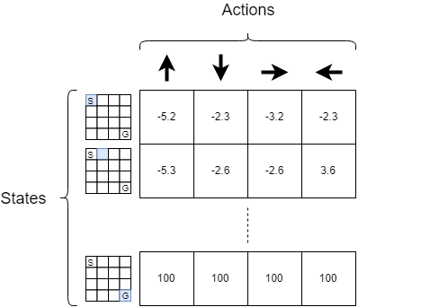

In the first article, I presented what is **OpenAI Gym** and how we can interact with the `FrozenLake-v0` environment. In this article we will load this environment and we will
implement 2 reinforcement learning algorithms: **Q-learning** and **Q-network**. The code associated to this
article is available [here](https://github.com/Twice22/HandsOnRL/blob/master/chapter1/Qlearning.ipynb)


## Creating our agent
There are several ways to solve this tiny game. In this section we will use the **Q-learning** algorithm. We will then explain the limitations of that model and we will pursue with the use of a neural network to approximate our **Q-table**.

## Q-Learning
Q-learning is a a **reinforcement learning** technique that uses a __Q-table__ to tell the agent what
action it should take in each situation. A __Q-table__ is a matrix of size `number of states` $\times$ `number of actions`. The figure 1 represents an example of a __Q-table__ for the `FrozenLake-v0` environment.

<div class="centered-img framed">

<div class="legend">Figure 1: Q-table: The blue tiles represent the states where the agent is.
							  The tile with a <i>G</i> represents the Goal state. The tile with an <i>S</i>
							  represents the Start case. The value in each tile represents the reward
							  the agent can expect to receive if it executes a particular action in a
							  particular state</div>
</div>

According to the previous figure, for each state, the agent will take the action that maximizes its **Q** value. If we note $\mathcal{S}$ the set of states and $\mathcal{A}$ the set of actions, once we have trained our agent, our agent will choose: $\forall s \in \mathcal{S}$, $a' \in \mathcal{A}$ s.t  $a' = \arg\max_{a \in \mathcal{A}} \; Q(s,a)$. The question is now: how can I construct such a table?

The Q-learning algorithm can be broken down into 2 steps:
1. Initialize the Q-table with $\mathbf{0}$
2. Each time the agent takes an action $a$ in a state $s$, update the $Q(s,a)$ value using:

$$Q(s,a) \leftarrow Q(s,a) + \alpha \Big[r + \gamma \max_{a'} Q(s',a') - Q(s,a) \Big]$$

Where:
+ $s$: current state
+ $a$: current action
+ $s'$: next state
+ $a'$: actions in the next state
+ $r$: immediate reward received from taking action $a$
+ $\alpha$: learning rate
+ $\gamma$: dicsount factor ($0 \leq \gamma \leq 1$)

Where does this formula comes from? We need to recall that if our agent is in a certain state $s$, it will choose the action $a'$ s.t
$a' = \arg\max_{a \in \mathcal{A}} \; Q(s,a)$. So our agent will receive the **Q-value** $\max_{a} Q(s, a)$. But as our agent would
need to make $1$ step to achieve this *Q-value* and as we want our agent to reach the goal in as fewest step as possible we multiple
$\max_{a'} Q(s', a')$ by $\gamma$ with ($0 \leq \gamma \leq 1$). It makes sense because, by recurrence if we have 2 paths: one that
reaches the goal state in 3 steps and another one in 2 steps then for the first path, a $\gamma^3$ coefficient would appear and for the second
path we would only have a $\gamma^2$ and as $0 \leq \gamma \leq 1$, we would have $\gamma^3 < \gamma^2$ so our agent will choose (all
other things being equal) the second path. We add $r$ to the **Q-value** because r corresponds to the immediate reward we get from choosing
the action $a$. Why do we subtract $Q(s,a)$? To understand why we subtract $Q(s,a)$, we can rewrite the update rule as follow:

$$Q(s,a) \leftarrow (1-\alpha)Q(s,a) + \alpha(r + \gamma \max_{a'} Q(s',a'))$$

In other word $Q(s,a)$ will be the **weighted** average between the current Q-value and the best Q-value obtained by choosing the best action
in the **next** state. But the current value of $Q(s,a)$ was updated using the same rule, so it makes sense to use a weighted average between
the previously learned **Q-value** and the best **Q-value** in the next state-action pair.


All that is good but how do we choose the action $a$ at each step? Do we choose it randomly among all the set of
actions possibles? Actually no, there is a better way to choose an action at each step. This method is called
**epsilon-greedy** and can be summarized as follow:

```python
import numpy as np

epsilon = 0.1 # set epsilon to any value between 0 and 1
p = np.random.uniform() # draw a random number in [0,1]

if p < epsilon:
	# draw a random action from the set of actions A
else:
	# draw the best action so far
	# that is to say, a' = argmax_a [Q(s,a)]
```

Put it differently the **espilon-greedy** strategy chooses:
+ a random action with probability $\epsilon$
+ the best action in the state $s$ based on the **Q-table** with probability $1-\epsilon$.

The goal of the **epsilon-greedy** strategy is to balance between the **exploitation** and **exploration**. What does that mean?
When your agent is in a particular state and it chooses the best action so far based on the **Q-value** it could
get from selecting that action, we say that our agent is **exploitating** the knowledge of the environment it already
acquired. On the contrary, when our agent chooses an action uniformly at random we say that it is **exploring** the
environment. We need to find a balance between **exploitation** and **exploration** because if we do not explore enough we might not
find a better path/strategy to win the game (maybe there is a better path that can reach the goal). On the contrary,
if we do not exploit much of the knowledge we have acquired at each game play, then our algorithm won't converge very quickly.

One basic idea is to decay the epsilon parameter after each game play (= episode). Intuitively it means that our
agent will explore its environment more for the few first game plays. It makes sense because originally the agent
didn't have any knowledge about its environment. On the contrary, after a few game plays, the agent have a thorough
understanding of its environment (because he explored a lot in the previous episodes) and so it doesn't need to explore
as much as it used to do.

## Implementation
We know how to use the `FrozenLake-v0` environment. We know how the **Q-learning** algorithm works. So we just have
to compile all our knowledge so far to come up with the code. The notebook for this article is available [here](https://github.com/Twice22/HandsOnRL/blob/master/chapter1/Qlearning.ipynb)

We will first load the required libraries:
```python
import gym 
import numpy as np
import time
```

We then load the FrozenLake-v0 environment and display some informations about it:
```python
env = gym.make('FrozenLake-v0')
```

We know that our matrix will be of size $16 \times 4$ (16 states, 4 actions per state). Now, to train our agent
we will actually sample several **episodes**. An **episode** corresponds to a game play. Hence an **episode**
ends when either of these conditions is met:
+ the agent falls in an hole
+ the agent reaches the goal state

We can implement the **Q-learning** strategy as follow:
```python
def Q_learning(env, epsilon, lr, gamma, episodes):
    # initialize our Q-table: matrix of size [n_states, n_actions] with zeros
    n_states, n_actions = env.observation_space.n, env.action_space.n
    Q = np.zeros((n_states, n_actions))
    
    for episode in range(episodes):
        state = env.reset()
        terminate = False # did the game end ?
        while True:
            # choose an action using the epsilon greedy strategy
            action = epsilon_greedy(Q, state, epsilon)

            next_state, reward, terminate, _ = env.step(action)

            if reward == 0: # if we didn't reach the goal state
                if terminate: # it means we fall in an hole
                    r = -5 # then give them a big negative reward

                    # the Q-value of the terminal state equals the reward
                    Q[next_state, :] = np.ones(n_actions) * r
                else: # the agent is in a frozen tile
                    r = -1 # give the agent a little negative reward to avoid long episode
            if reward == 1: # the agent reach the goal state
                r = 100 # give him a big reward

                # the Q-value of the terminal state equals the reward
                Q[next_state, :] = np.ones(n_actions) * r

            # Q-learning update
            Q[state,action] = Q[state,action] + lr * (r + gamma * np.max(Q[next_state, :]) - Q[state, action])

            # move the agent to the new state before executing the next iteration
            state = next_state

            # if we reach the goal state or fall in an hole
            # end the current episode
            if terminate:
                break
    return Q
```

I've tried to detail as much as I could each step of the algorithm. Now we still need to
implement the `epsilon_greedy` function:
```python
def epsilon_greedy(Q, s, epsilon):
    p = np.random.uniform()
    if p < epsilon:
    	# sample a random action
        return env.action_space.sample()
    else:
        # act greedily by selecting the best action possible in the current state
        return np.argmax(Q[s, :])
```

Train our agent and examine the table:
```python
# set the hyperparameters
epsilon = 0.1 # epsilon value for the epsilon greedy strategy
lr = 0.8 # learning rate
gamma = 0.95 # discount factor
episodes = 10000 # number of episode

Q = Q_learning(env, epsilon, lr, gamma, episodes)
print(Q)
```

and we can also see how much our agent has learned by plotting the
trajectory of our agent in the FrozenLake-v0 environment:
```python
def Qlearning_trajectory(env, Q, max_steps=100):
    state = env.reset() # reinitialize the environment
    i = 0
    while i < max_steps:
        # once the agent has been trained, it
        # will take the best action in each state
        action = np.argmax(Q[state,:])

        # execute the action and recover a tuple of values
        next_state, reward, terminate, _ = env.step(action)
        print("####################")
        env.render() # display the new state of the game

        # move the agent to the new state before executing the next iteration
        state = next_state

        i += 1
        
        # if the agent falls in an gole or ends in the goal state
        if terminate:
            break # break out of the loop

Qlearning_trajectory(env, Q)
```


## Analyze
When we analyze the trajectory of our agent we see that it often falls... in an hole! The problem comes from the fact
that each time the agent executes an action {**Up**, **Bottom**, **Right**, **Left**}, the real action executed is not
the one the agent chooses due to the ice on the tile. Recall that, in the **stochastic** environment (slippery tiles),
when the agent chooses the **Up** action, the agent will actually go **Up** with probability $1/3$, go **Left** with probability $1/3$
and go **Right** with probability $1/3$. So to assess the correctness of our implementation we can just deactivate the
slippery option by customizing the `FrozenLake-v0` environment. If you have read the first article, you know you can
do that with the following piece of code:
```python
from gym.envs.registration import register
register(
    id='Deterministic-4x4-FrozenLake-v0',
    entry_point='gym.envs.toy_text.frozen_lake:FrozenLakeEnv',
    kwargs={'map_name': '4x4', 'is_slippery': False}
)
```

and then we just have to load our new `Deterministic-4x4-FrozenLake-v0` environment instead of the usual `FrozenLake-v0`
environment simply by doing:
```python
env = gym.make('Deterministic-4x4-FrozenLake-v0')
```

If, we do so, we can see that after $10000$ episodes of training, our agent always ends up
in the goal state with the less steps possibles. We are somewhat happy because our agent
can reach the goal in the **deterministic** environment but very often fall in an hole when the
environment is **stochastic**. Before dealing with this issue, I will firstly point out 2 shortcomings
that come from using a **Q-table**:
+ We cannot use a **Q-table** if the state-action space is continuous
+ When we have lot's of states/actions, the **Q-table** can be very large

To avoid these shortcomings, instead of creating a **Q-table** we can use a function that takes a state
and outputs the "best action" for that given state. And you know what? Neural network are a universal
approximator of any function<sup>[1](http://cognitivemedium.com/magic_paper/assets/Hornik.pdf)</sup>.
So one natural idea is to use a feedforward neural network to approximate our **Q-table**.

## Q-network
The algorithm remains the same, we will just replace the **Q-table** by a function $f$ that takes a state $s$
and outputs the "best action" $a$. As explained earlier we gonna use a feedforward neural network as our
function $f : s \rightarrow a$. We still have $16$ possible states and $4$ available actions in each state
so we can represent a state by a one-hot vector. For example:

$$s = [0, 0, 0, 0, 0, 0, 1, 0, 0, 0, 0, 0, 0, 0, 0, 0]$$

means that we are in state $7$ (if we suppose a $1$-based list index). That means that our agent is currently
sitting in row=2, column=3 (if we suppose a $1$-based list index). To see it more precisely, we can use python:
```python
state_vector = [i for i in range(1, 16)]
print(state_vector)
state_matrix = np.resize(state_vector, (4, 4))
print(state_matrix)
``` 

if will output:
```python
state_vector = [1, 2, 3, 4, 5, 6, 7, 8, 9, 10, 11, 12, 13, 14, 15]

state_matrix = [[ 1  2  3  4]
                [ 5  6  7  8]
                [ 9 10 11 12]
                [13 14 15  1]]
```

The action can also be represented by a vector $Q_{pred}$ of dimension $4$. $Q_{pred}$ is computed using the
linear equation of a feedforward neural-network:

\begin{equation}
Q_{pred} = sW + b
\end{equation}

where ($W$, $b$) are the parameters of our neural-network (a.k.a Weights and biais).<br>
As previously, when the agent acts greedily (exploits) it will choose $a'$ s.t

$$a' = \arg\max(Q_{pred}) = \arg\max(sW + b)$$

Ok! But how can we approximate the **Q-table**?
Well actually we want to approximate the previous **Q-table** so we can just define the loss of our neural-network
to be:

\begin{equation}  
loss=\sum\limits_{(s,a) \in (\mathcal{S}, \mathcal{A})} \Big( Q_{target}(s,a) - Q_{pred}(s,a) \Big)^2
\end{equation}  

where $Q_{target}(s,a)$ is the "reward" one step ahead:

\begin{equation}
Q_{target}(s,a) = r + \gamma \max\limits_{a'} Q(s',a')
\end{equation}

If you have basic machine learning knowledge (which I assumed in the first article of this serie) then defining the loss as in equation $(2)$
makes sense, but why $Q_{target}(s,a) = r + \gamma \max\limits_{a'} Q(s',a')$?

In the **Q-learning** algorithm the update rule was:
$Q(s,a) \leftarrow Q(s,a) + \alpha \Big[r + \gamma \max_{a'} Q(s',a') - Q(s,a) \Big]$

so why it is not:
$Q_{target}(s,a) \leftarrow Q_{target}(s,a) + \alpha \Big[r + \gamma \max_{a'} Q(s',a') - Q(s,a) \Big]$? \\
Actually, at each iteration, the next value $Q_{target}(s,a) = r + \gamma \max\limits_{a'} Q(s',a')$ is a noisy estimate of the **Q-value** we
want to approximate so it makes perfect sense to define $Q_{target}(s,a)$ as $Q_{target}(s,a) = r + \gamma \max\limits_{a'} Q(s',a')$.

## Implementation
Now that we know how to replace our **Q-table** by our neural-network we just have to implement our agent. In this
section I assume that you already know the basics of TensorFlow. If not, you can easily find great resources on the
internet or read my introductory article about TensorFlow. So let's dive into the implementation:
```python
def Qnetwork(env, epsilon, lr, gamma, episodes):
    # reset graph. Usefull when one uses a Jupyter notebook and
    # has already executed the cell that creates the TensorFlow graph.
    tf.reset_default_graph() 
    n_states, n_actions = env.observation_space.n, env.action_space.n

    # input states
    inputs = tf.placeholder(dtype=tf.float32, shape=[1, n_states])

    # parameter of our neural-network
    W = tf.get_variable(dtype=tf.float32, shape=[n_states, n_actions],
                    initializer=tf.initializers.truncated_normal(stddev=0.01),
                    name='W')
    b = tf.get_variable(dtype=tf.float32, shape=[n_actions], 
                    initializer=tf.zeros_initializer(),
                    name="b")

    Q_pred = tf.matmul(inputs, W) + b
    a_pred = tf.argmax(Q_pred, 1) # predicted action

    # Q_target will be computed according to equation (3)
    Q_target = tf.placeholder(dtype=tf.float32, shape=[1, n_actions])

    # compute the loss according to equation (2)
    loss = tf.reduce_sum(tf.square(Q_target - Q_pred))

    # define the update rule for our network
    update = tf.train.AdamOptimizer(learning_rate=lr).minimize(loss)


    init = tf.global_variables_initializer()

    # initialize the TensorFlow session and train the model
    with tf.Session() as sess:
        sess.run(init) # initialize the variables of our model (a.k.a parameters W and b)
        for episode in range(episodes):
            if episode % 50 == 0:
                print(episode, end=" ")
            state = env.reset() # reset environment and get initial state
            i = 0
            while i < 100: # to avoid too long episode
                # create the onehot vector associate to the state 'state':
                input_state = np.zeros((1,n_states))
                input_state[0, state] = 1

                # recover the value of Q_pred and a_pred from the neural-network
                apred, Qpred = sess.run([a_pred, Q_pred], feed_dict={inputs: input_state})

                # use epsilon-greedy strategy
                if np.random.uniform() < epsilon:
                    # if we explore, overide the action returned by the neural-network
                    # with a random action
                    apred[0] = env.action_space.sample()

                # get next state, reward and if the game ended or not
                next_state, reward, terminate, _ = env.step(apred[0])
                
                # reuse the same code as in Q-learning to negate reward
                if reward == 0:
                    if terminate:
                        reward = -5
                    else:
                        reward = -1

                if reward == 1:
                    reward = 5

                # obtain the Q(s', a') from equation (3) value by feeding the new state in our neural-network
                input_next_state = np.zeros((1,n_states))
                input_next_state[0, next_state] = 1
                Qpred_next = sess.run(Q_pred, feed_dict={inputs: input_next_state})

                # the max of Qpred_next = Q(s', a') over a'
                Qmax = np.max(Qpred_next)

                # update Q(s,a)_target from equation (3)
                Qtarget = Qpred
                Qtarget[0, apred[0]] = reward + gamma * Qmax

                # Train the neural-network using the Qtarget and Qpred and the update rule
                loss = sess.run(update, feed_dict={inputs: input_state, Q_target: Qtarget})

                # move to next_state before next iteration
                state = next_state
                if terminate: # end episode if agent falls in hole or goal state has been reached
                    break
                
                i += 1
            
        # once the training is done recover the parameter
        # W and b of the neural-network
        W_train, b_train = sess.run([W, b])
        return W_train, b_train
```

Here, we return the parameters ($W$, $b$) of our neural-network because our agent will actually,
this time, takes the best action based on the equation:

\begin{equation}
a' = \arg\max(Q_{pred}) = \arg\max(sW + b)
\end{equation}

where $s$ is the input state represented as a one-hot vector of dimension $16$.

Now, using the weights and biais obtained after training our neural-network, we can print the trajectory of our agent using:
```python
# print a trajectory of our agent
def Qnetwork_trajectory(env, W, b, max_steps=100):
    s = env.reset()
    n_states = env.observation_space.n
    i = 0
    while i < max_steps:
        input_state = np.zeros((1,n_states))
        input_state[0, s] = 1
        a = np.argmax(input_state.dot(W) + b) # equation (4)
        print()

        next_s, r, terminate, _ = env.step(a)
        print("###################")
        env.render()
        s = next_s
        i += 1
        if terminate:
            break
```

both of our models (**Q-learning** and **Q-network**) actually works on the Deterministic environment
(obviously the Q-network need more time to be trained). Now, how can we make it also works on
the **Stochastic** environment?

## Dealing with the stochasticity
The action that our agent should take in each state should be:

<div class="centered-img framed">

<div class="legend">Figure 2: FrozenLake-v0 policy</div>
</div>

To understand why. Let's focus on an example. Let's consider the red arrow. Why do the red arrow
points to the left while we want to go to the `Goal` state that is on the right side? Well, if
our arrow points to the **Left** our agent will fall in an hole with probability $1/3$. If instead
our agent chooses to go **Down**, then with probability $1/3$ it will go **Right** or **Left**, so
with probability $1/3$ it will fall in an hole (by going **Right**). If our agent goes **Up** instead
then with probability $1/3$ it will go **Left** or **Right** and so with probability $1/3$ it will
fall in the same hole. Finally, if the agent chooses to go **Left** then it will go **Left** with
probability $1/3$, go **Up** with probability $1/3$ and go **Down** with probability $1/3$. In 
either cases, the agent won't fall in an hole. The same reasoning could be applied to all the
others states

In order for our agent to understand that the environment is stochastic, it might need to
explore much more than in the deterministic environment (that is to say $\epsilon$ should be higher). We
can also decrease $\gamma$. By decreasing $\gamma$ our agent will focus more on the immediate reward,
which means that our agent will avoid `Hole`  each time he is in a state next to an `Hole`.
We can, for example, tune the hyperparameters as follow:

+ **Q-learning**: $\gamma = 0.2$, $lr = 0.5$, $episodes = 10000$, $\epsilon = 0.2$
+ **Q-network**: $\gamma = 0.2$, $lr = 0.001$, $episodes = 2000$, $\epsilon = 0.3$


The code is available [here](https://github.com/Twice22/HandsOnRL/blob/master/chapter1/Qlearning.ipynb).
Using these parameters, our agent seems to reach the **Goal** state `G`. I say "seems" because if we retrained our neural-network
with the same parameters, the agent might not always end up in the **Goal** state due to the epsilon-greedy strategy that makes
the function output stochastic. In order to have a robust agent we need to further tune the hyperparameters.
We also need to train our agent on much more trajectories (=game plays). It is by no mean the purpose of this article.

There is one last thing I want to focus on. In figure 2, I have drawn intuitively the policy that our
agent should be able to determine by itself. Let's check if the agent were able to guess it.

## Displaying the policy
Now that our agent had learned our environment, what would be interesting is to display the policy that
our agent had learned. Displaying such policy is really straightforward. The **Q-learning** algorithm
actually returns a **Q-table**, so to recover the policy we just need to take the best action in each
state. We will have a vector of dimension $16$ that we just need to transform into a matrix. Here is
the code:
```python
# according to
# https://github.com/openai/gym/blob/master/gym/envs/toy_text/frozen_lake.py
# LEFT = 0   DOWN = 1   RIGHT = 2  UP = 3
def policy_matrix(Q):
    table = {0: "←", 1: "↓", 2: "→", 3: "↑"}
    best_actions = np.argmax(Q, axis=1)
    policy = np.resize(best_actions, (4,4))
    
    # transform using the dictionary
    return np.vectorize(table.get)(policy)
```

And `policy_matrix(Q)` give us:
```python
[['←', '↑', '↓', '↑'],
['←', '←', '→', '←'],
['↑', '↓', '←', '←'],
['←', '→', '↑', '←']]
```

We can see that the policy is the same as the one on figure 2 beside 2 exceptions. It simply means that our agent hasn't finished learning!

To display the policy learned by the **Q-network** the code is also straightforward:
```python
def policy_matrix2(env, W, b):
    table = {0: "←", 1: "↓", 2: "→", 3: "↑"}
    
    n_states = env.observation_space.n
    S = np.identity(n_states)
    best_actions = np.argmax(S.dot(W) + b, axis=1)
    
    policy = np.resize(best_actions, (4,4))
    return np.vectorize(table.get)(policy)
```

And `policy_matrix2(env, W_train, b_train)` give us:
```python
[['←', '↑', '↓', '↑'],
['←', '←', '→', '←'],
['↑', '↓', '←', '←'],
['←', '→', '↑', '←']]
```

Here again, the policy coincides with the policy of figure 2 beside few exceptions. So, here again, there is still
room for our agent to learn!


## Conclusion
In this article I've tried to detail as much as I could how to implement the **Q-learning**
and the **Q-network** algorithms. We learned how to actually code these algorithms using
`Python` and `TensorFlow` and how to tune the hyperparemeters when the environment is
**stochastic**. We have also plotted the `policy` matrix to assess the quality of
our agent. Yet there is something that should bother you! Our agent actually learned how
to move in the `FrozenLake-V0` environment, but what if the holes and the goal states
were located elsewhere? This is the problem! Our agent actually learned the environment but
if the environment changes, we need to train our agent again! In the next articles we will discuss
and implement some algorithms to let our agent be agnostic to the position of the tiles. Yet,
before that we will study some other algorithms.