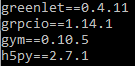

This article is the first of a long serie of articles about reinforcement learning. In this serie, I won't delve to much into the mathematical background needed to understand why what we are doing makes sense. I will focus more on the practical aspect, that is to say that we will directly implement some Reinforcement Learning strategies. Grab your cup of coffee and follow me.

## I. The environment: OpenAI Gym
In machine learning and particularly in deep learning, once we have implemented our model (CNN, RNN, ...) what we need to test its quality is some data. Indeed, we feed our model with our data and it will learn based on the data it is seeing. In reinforcement learning, we don't need data. Instead, we need an environment with a set of rules and a set of functions. For example a chessboard and all the rules of the chess game form the environment (for example the Knight can only move according to a L-shape).

Creating the environment is quite complex and bothersome. If you create the environment for the chess game you won't be able to use it for the Go game, or for some Atari games. This is where **OpenAI Gym** comes into play. OpenAI Gym provides a set of virtual environments that you can use to test the quality of your agent. They provide various environments. In this article we will only focus on one of the most basic environment:  _FrozenLake_ but in the next article of this serie we will deal with more exciting environment!

### I. 1 Installing OpenAI Gym
In this serie we will install OpenAI Gym on Anaconda to be able to code our agent on a jupyter notebook but OpenAI Gym can be installed on any regular python installation.

To install OpenAI Gym:

1. open a __git bash__ and type 'git clone https://github.com/openai/gym'

or

 1. go to: https://github.com/openai/gym and click on `Clone or download` $\rightarrow$ `Download ZIP` then extract the contains of the zip

Then:

2. open an Anaconda prompt and go to the gym folder by typing: `cd path/to/the/gym/folder`
3. type `pip install gym`
4. You're done !

If you type `pip freeze` you should see the gym package:

<div class="centered-img">

<div class="legend">Figure 1: Result of `pip freeze` command. We can see gym==0.10.5</div>
</div>


### I.2 Playing with OpenAI Gym
In this section, I will briefly present how to use an environment from OpenAI Gym. For example let's focus on the `FrozenLake-v0`.

To load an environment just write:

```python
import gym # import the gym
env = gym.make('FrozenLake-v0') # load the env
```
To reset the environment write:
```python
# reset the env and returns the start state
s = env.reset()
```

To render an environment write:
```python
env.render()
```

The result of the previous command is:
```
SFFF
FHFH
FFFH
HFFG
```

Where:
- `F` represents a _Frozen_ tile, that is to say that if the agent is on a frozen tile and if he chooses to go in a certain direction, he won't necessarily go in this direction.
- `H` represents an `Hole`. If the agent goes in an hole, he dies and the game ends here.
- `G` represents the `Goal`. If the agent reaches the goal, you win the game.
- `S` represents the `Start` state. This is where the agent is at the beginning of the game.

Figure 2 is a more friendly visualization of the FrozenLake-v0 board game.

<div class="centered-img">

<div class="legend">Figure 2: FrozenLake-v0 board game</div>
</div>

To see the number of states/actions write:
```python
print(env.action_space) # Discrete(4)
print(env.observation_space) # Discrete(16)
```

That means that the FrozenLake-V0 environment has 4 discrete actions and 16 discrete states.
To actually recover an int instead of a `Discrete(int_value)` you can add `.n` as follow:
```python
print(env.action_space.n) # 4
print(env.observation_space.n) # 16
```

## II. Creating our agent
Now that we know the basics, we will write some code to actually solve this game. There are several ways to solve this tiny game. In this section we will use the __Q-learning__ algorithm. We will then explain the limitations of this model and we will pursue with the use of a neural network to approximate our __Q-table__.

### II.1 Q-Learning
Q-learning is a a reinforcement learning technique that uses a __Q-table__ to tell the agent what
action it should take in each situation. A __Q-table__ is a matrix of size (number of states) $\times$ (number of action). The figure 3 represents an example of __Q-table__.

<div class="centered-img">

<div class="legend">Figure 3: Q-table. The blue case represents the state where the agent is.<br>
							  The case with a <i>G</i> represents the Goal state. The case with an <i>S</i> <br>
							  represents the Start case. The value in each case represent the reward <br>
							  the agent can expect to receive if it executes a particular action in a <br>
							  particular state</div>
</div>

According to the previous figure, for each state, the agent will take the action that maximizes its reward. That is
to say that, once we have trained our agent, our agent will choose: $\forall s \in \mathcal{S}$, $a' \in \mathcal{A}$ s.t  $a' = \arg\max_{a \in \mathcal{A}} Q(s,a)$

The Q-learning algorithm can be broken down into 2 steps:
1. Initialize the Q-table with 0
2. Each time the agent takes an action $a$ in a state $s$, update the $Q(s,a)$ value using:
$Q(s,a) \leftarrow Q(s,a) + \alpha(r + \gamma \max_{a'} Q(s',a') - Q(s,a))$

Where:
+ $s$: current state
+ $s'$: next state
+ $a'$: action in the next state
+ $r$: immediate reward received from taking action $a$
+ $\alpha$: learning rate
+ $\gamma$: dicsount factor ($0 \leq \gamma \leq 1$)

All that is good but how do we choose the action $a$ at each step? Do we choose it randoly among all the set of
actions possibles? Actually no, there is a better way to choose an action at each step. This method is called
_epsilon-greedy_ and can be summarize as follow:

```python
import numpy as np

epsilon = 0.1 # set epsilon to any value between 0 and 1
p = np.random.uniform() # draw a random number in [0,1]

if p < epsilon:
	# draw a random action from the set of actions A
else:
	# draw the best action so far
	# that is to say, a' = argmax_a [Q(s,a)]
```

### II.2 Implementation
We know how to use the FrozenLake-v0 environment. We know how the Q-learning algorithm works. So we just have
to compile all our knowledge so far to come up with the code. The notebook for this article is available [here](https://github.com/Twice22/HandsOnRL/blob/master/rl_part1.ipynb)

We will first load the required libraries:
```python
import gym # useful to load the FrozenLake environment
import numpy as np # useful to use the random.uniform() function
import time # useful to measure the training time
```

We then load the FrozenLake-v0 environment and display some informations about it:
```python
env = gym.make('FrozenLake-v0') # load the environment
state = env.reset() # reset the environment and return the starting state
env.render() # render the environment
print()
print(env.action_space.n) # display the number of actions: 4
print(env.observation_space.n) # display the number of states: 16
```

We know that our matrix will be of size $16 \times 4$. Now, to train our agent
we will actually sample several _episodes_. A _episode_ correspond to a
game play. Hence a _episode_ ends when either:
+ the agent falls in an hole
+ the agent reaches the goal state

Let's write the code to train our agent:
```python
# initialize our Q-table: matrix of size [n_states, n_actions] with zeros
n_states, n_actions = env.observation_space.n, env.action_space.n
Q = np.zeros((n_states, n_actions))

# set the hyperparameters
epsilon = 0.1 # epsilon value for the epsilon greedy strategy
lr = 0.8 # learning rate
gamma = 0.95 # discount factor
episodes = 10000 # number of episode

for episode in range(episodes):
	state = env.reset()
	terminate = False # did the game end ?
	while True:
		# choose an action using the epsilon greedy strategy
		action = epsilon_greedy(Q, state, epsilon)

		# execute the action. The environment provides us
		# 4 values: 
		# - the next_state we ended in after executing our action
		# - the reward we get from executing that action
		# - wether or not the game ended
		# - the probability of executing our action 
		# (we don't use this information here) ** IMPORTANT **
		next_state, reward, terminate, _ = env.step(action)

		if reward == 0: # if we didn't reach the goal state
			if terminate: # if the agent falls in an hole
				r = -10 # then give them a big negative reward

				# the Q-value of the terminal state equals the reward
				Q[next_state] = np.ones(n_actions) * r
			else: # the agent is in a frozen tile
				r = -1 # give the agent a little negative reward to avoid long episode
		if reward == 1: # the agent reach the goal state
			r = 100 # give him a big reward

			# the Q-value of the terminal state equals the reward
			Q[next_state] = np.ones(n_actions) * r

		# Q-learning update
		Q[state,action] = Q[state,action] + lr * (r + gamma * np.max(Q[next_state, :]) - Q[state, action])

		# move the agent to the new state before executing the next iteration
		state = next_state

		# if we reach the goal state or fall in an hole
		# end the current episode
		if terminate:
			break
```

I've tried to detail as much as I could each step of the algorithm. Now we still need to
implement the `epsilon_greedy` function:
```python
def epsilon_greedy(Q, s, epsilon):
	p = np.random.uniform()
	if p < epsilon:
		# the sample() method from the environment allows
		# to randomly sample an action from the set of actions
		return env.action_space.sample()
	else:
		# act greedily by selecting the best action possible in the current state
		return np.argmax(Q[s, :])
```

We can now examine our Q-table after training:
```python
print(Q)
```

and we can also see how much our agent has learned by plotting the
trajectory of our agent in the FrozenLake-v0 environment:
```python
state = env.reset() # reinitialize the environment
while True:
	# once the agent has been trained, it
	# will take the best action in each state
	action = np.argmax(Q[state,:])

	# execute the action and recover a tuple of values
	next_state, reward, terminate, _ = env.step(action)
	print("####################")
	env.render() # display the new state of the game

	# move the agent to the new state before executing the next iteration
	state = next_state

	# if the agent falls in an gole or ends in the goal state
	if terminate:
		break # break out of the loop
```


### II.3 Analyze
When we analyze the trajectory of our agent we see that it often falls... in an hole!

<div class="blue-color-box">
- Are you kidding me? We trained our agent on a very S-I-M-P-L-E
game over $10000$ episodes and our agent is not even able to avoid the
holes??! <br>
<br>
- Yes Sir, that is what I've meant<br>
<br>
- F* off. Your article is sh*t!<br>
<br>
- Wait, wait! Actually I can tell you why it doesn't work!<br>
<br>
- Ok, it's your last chance...<br>
</div>

Actually the problem comes from the __** IMPORTANT **__ comment in the code.
Indeed each time the agent executes an action {Top, Bottom, Right, Left}, the
real action executed is not the one the agent chooses due to the ice on the tile.
I won't enter into too many details, the curious reader can see how the environment is
implemented when the tiles are slippery [here](https://github.com/openai/gym/blob/master/gym/envs/toy_text/frozen_lake.py#L100-L107). So to assess the correctness of our implementation
we can just deactivate the slippery option by using:
```python
from gym.envs.registration import register
register(
	id='Deterministic-4x4-FrozenLake-v0', # name given to this environment
	entry_point='gym.envs.toy_text.frozen_lake:FrozenLakeEnv', # env entry point
	kwargs={'map_name': '4x4', 'is_slippery': False} # argument passed to the environment
)
```

and then we just have to load our new `Deterministic-4x4-FrozenLake-v0` environment
instead of the usual `FrozenLake-v0` environment simply by doing:
```python
env = gym.make('Deterministic-4x4-FrozenLake-v0') # load the environment
```

If, we do so, we can see that after $10000$ episodes of training, our agent always ends up
in the goal state with the less steps possibles.

___

to come... In the next part we will talk about the shortcoming of the __Q-table__ and we will 
use a neural network to approximate our __Q-table__. We will also tune the hyperparameters and
use a decaying epsilon-greedy approach to build a more robust agent.