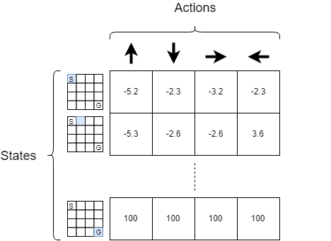

This article is the first of a long serie of articles about reinforcement learning. In this serie, I won't delve too much into the mathematical background needed to understand why what we are doing makes sense. I will focus more on the practical aspect, that is to say that we will directly implement some Reinforcement Learning strategies. Grab your cup of coffee and follow me.

## OpenAI Gym
In machine learning and particularly in deep learning, once we have implemented our model (CNN, RNN, ...) what we need to test its quality is some data. Indeed, we feed our model with our data and it will learn based on the data it is seeing. In **reinforcement learning**, we don't need data. Instead, we need an environment with a set of rules and a set of functions. For example a chessboard and all the rules of the chess game form the environment.

Creating the environment is quite complex and bothersome. If you create the environment for the chess game you won't be able to use it for the Go game, or for some Atari games. This is where **OpenAI Gym** comes into play. OpenAI Gym provides a set of virtual environments that you can use to test the quality of your agent. In this article we will only focus on one of the most basic environment:  **FrozenLake** but in the next article of this serie we will deal with more exciting environments!

## Installing OpenAI Gym
We will install **OpenAI Gym** on Anaconda to be able to code our agent on a **Jupyter notebook** but OpenAI Gym can be installed on any regular python installation.

To install OpenAI Gym:

+ Open a **git bash** and type `git clone https://github.com/openai/gym`

or

+ Go to: [https://github.com/openai/gym](https://github.com/openai/gym) and click on `Clone or download` $\rightarrow$ `Download ZIP`

Then
1. Extract the contains of the zip
2. open an Anaconda prompt and go to the gym folder by typing: `cd path/to/the/gym/folder`
3. type `pip install gym`
4. You're done !

If you type `pip freeze` you should see the gym package.

## Playing with OpenAI Gym
In this section, I will briefly present how to use an environment from OpenAI Gym. Let's focus on the `FrozenLake-v0`.

To load an environment just write:

```python
import gym # import the gym
env = gym.make('FrozenLake-v0') # load the env
```
To reset the environment write:
```python
# reset the env and returns the start state
s = env.reset()
```

To render an environment write:
```python
env.render()
```

The result of the previous command is:
```
SFFF
FHFH
FFFH
HFFG
```

Where:
- `F` represents a `Frozen` tile, that is to say that if the agent is on a frozen tile and if he chooses to go in a certain direction, he won't necessarily go in this direction.
- `H` represents an `Hole`. If the agent goes in an hole, he dies and the game ends here.
- `G` represents the `Goal`. If the agent reaches the goal, you win the game.
- `S` represents the `Start` state. This is where the agent is at the beginning of the game.

Figure 2 represents a more friendly visualization of the `FrozenLake-v0` board game.

<div class="centered-img framed">
    <a name="fig2">   
        
    </a>
<div class="legend">Figure 2: FrozenLake-v0 board game</div>
</div>

To see the number of states/actions write:
```python
print(env.action_space) # Discrete(4)
print(env.observation_space) # Discrete(16)
```

That means that the FrozenLake-V0 environment has 4 discrete actions and 16 discrete states.
To actually recover an `int` instead of a `Discrete(int_value)` you can add `.n` as follow:
```python
print(env.action_space.n) # 4
print(env.observation_space.n) # 16
```

To let our agent executes an action $a$, we can use:
```python
# execute the action `a`. The environment gives us back 4 values: 
# - the next_state we ended in after executing our action
# - the reward we get from executing that action
# - whether or not the game ended
# - the probability of executing our action 
next_state, reward, terminate, _ = env.step(a)
```

To randomly sample an action from the set of actions:
```python
env.action_space.sample()
```

## Creating our agent
Now that we know the basics, we will write some code to actually solve this game. There are several ways to solve this tiny game. In this section we will use the __Q-learning__ algorithm. We will then explain the limitations of that model and we will pursue with the use of a neural network to approximate our __Q-table__.

## Q-Learning
Q-learning is a a **reinforcement learning** technique that uses a __Q-table__ to tell the agent what
action it should take in each situation. A __Q-table__ is a matrix of size `number of states` $\times$ `number of actions`. The figure 3 represents an example of __Q-table__.

<div class="centered-img framed">

<div class="legend">Figure 3: Q-table: The blue cases represent the states where the agent is.
							  The case with a <i>G</i> represents the Goal state. The case with an <i>S</i>
							  represents the Start case. The value in each case represents the reward
							  the agent can expect to receive if it executes a particular action in a
							  particular state</div>
</div>

According to the previous figure, for each state, the agent will take the action that maximizes its reward. If we note $\mathcal{S}$ the set of states and $\mathcal{A}$ the set of actions, once we have trained our agent, our agent will choose: $\forall s \in \mathcal{S}$, $a' \in \mathcal{A}$ s.t  $a' = \arg\max_{a \in \mathcal{A}} \; Q(s,a)$

The Q-learning algorithm can be broken down into 2 steps:
1. Initialize the Q-table with $\mathbf{0}$
2. Each time the agent takes an action $a$ in a state $s$, update the $Q(s,a)$ value using:

$$Q(s,a) \leftarrow Q(s,a) + \alpha \Big[r + \gamma \max_{a'} Q(s',a') - Q(s,a) \Big]$$

Where:
+ $s$: current state
+ $a$: current action
+ $s'$: next state
+ $a'$: actions in the next state
+ $r$: immediate reward received from taking action $a$
+ $\alpha$: learning rate
+ $\gamma$: dicsount factor ($0 \leq \gamma \leq 1$)

All that is good but how do we choose the action $a$ at each step? Do we choose it randomly among all the set of
actions possibles? Actually no, there is a better way to choose an action at each step. This method is called
**epsilon-greedy** and can be summarized as follow:

```python
import numpy as np

epsilon = 0.1 # set epsilon to any value between 0 and 1
p = np.random.uniform() # draw a random number in [0,1]

if p < epsilon:
	# draw a random action from the set of actions A
else:
	# draw the best action so far
	# that is to say, a' = argmax_a [Q(s,a)]
```

The goal of the **epsilon-greedy** strategy is to balance between the **exploitation** and **exploration**. What does that mean?
When your agent is in a particular state and it chooses the best action so far based on the expected reward it could
get from selecting that action, we say that our agent is **exploitating** the knowledge of the environment it already
acquired. On the contrary, when our agent chooses an action uniformly at random we say that it is **exploring** the
environment. We need to find a balance between **exploitation** and **exploration** because if we do not explore enough we might not
find a better path/strategy to win the game (maybe there is a better path that can reach the goal). On the contrary,
if we do not exploit much of the knowledge we have acquired at each game play, then our algorithm won't converge very quickly.

One basic idea is to decay the epsilon parameter after each game play (= episode). Intuitively it means that our
agent will explore its environment more for the few first game plays. It makes sense because originally the agent
didn't have any knowledge about its environment. On the contrary, after a few game plays, the agent have a thorough
understanding of its environment (because he explored a lot in the previous episodes) and so it doesn't need to explore
as much as it used to do.

## Implementation
We know how to use the `FrozenLake-v0` environment. We know how the **Q-learning** algorithm works. So we just have
to compile all our knowledge so far to come up with the code. The notebook for this article is available [here](https://github.com/Twice22/HandsOnRL/blob/master/rl_part1.ipynb)

We will first load the required libraries:
```python
import gym # useful to load the FrozenLake environment
import numpy as np # useful to use the random.uniform() function
import time # useful to measure the training time
```

We then load the FrozenLake-v0 environment and display some informations about it:
```python
env = gym.make('FrozenLake-v0') # load the environment
state = env.reset() # reset the environment and return the starting state
env.render() # render the environment
print()
print(env.action_space.n) # display the number of actions: 4
print(env.observation_space.n) # display the number of states: 16
```

We know that our matrix will be of size $16 \times 4$. Now, to train our agent
we will actually sample several _episodes_. An _episode_ corresponds to a
game play. Hence an _episode_ ends when either of these conditions is met:
+ the agent falls in an hole
+ the agent reaches the goal state

The Q-learning algorithm is solely:
```python
def Q_learning(env, epsilon, lr, gamma, episodes):
    # initialize our Q-table: matrix of size [n_states, n_actions] with zeros
    n_states, n_actions = env.observation_space.n, env.action_space.n
    Q = np.zeros((n_states, n_actions))
    
    for episode in range(episodes):
        state = env.reset()
        terminate = False # did the game end ?
        while True:
            # choose an action using the epsilon greedy strategy
            action = epsilon_greedy(Q, state, epsilon)

            next_state, reward, terminate, _ = env.step(action)

            if reward == 0: # if we didn't reach the goal state
                if terminate: # if the agent falls in an hole
                    r = -5 # then give them a big negative reward

                    # the Q-value of the terminal state equals the reward
                    Q[next_state] = np.ones(n_actions) * r
                else: # the agent is in a frozen tile
                    r = -1 # give the agent a little negative reward to avoid long episode
            if reward == 1: # the agent reach the goal state
                r = 100 # give him a big reward

                # the Q-value of the terminal state equals the reward
                Q[next_state] = np.ones(n_actions) * r

            # Q-learning update
            Q[state,action] = Q[state,action] + lr * (r + gamma * np.max(Q[next_state, :]) - Q[state, action])

            # move the agent to the new state before executing the next iteration
            state = next_state

            # if we reach the goal state or fall in an hole
            # end the current episode
            if terminate:
                break
    return Q
```

I've tried to detail as much as I could each step of the algorithm. Now we still need to
implement the `epsilon_greedy` function:
```python
def epsilon_greedy(Q, s, epsilon):
    p = np.random.uniform()
    if p < epsilon:
    	# sample a random action
        return env.action_space.sample()
    else:
        # act greedily by selecting the best action possible in the current state
        return np.argmax(Q[s, :])
```

Train our agent and examine the table:
```python
# set the hyperparameters
epsilon = 0.1 # epsilon value for the epsilon greedy strategy
lr = 0.8 # learning rate
gamma = 0.95 # discount factor
episodes = 10000 # number of episode

Q = Q_learning(env, epsilon, lr, gamma, episodes)
print(Q)
```

and we can also see how much our agent has learned by plotting the
trajectory of our agent in the FrozenLake-v0 environment:
```python
def Qlearning_trajectory(env, Q, max_steps=100):
    state = env.reset() # reinitialize the environment
    i = 0
    while i < max_steps:
        # once the agent has been trained, it
        # will take the best action in each state
        action = np.argmax(Q[state,:])

        # execute the action and recover a tuple of values
        next_state, reward, terminate, _ = env.step(action)
        print("####################")
        env.render() # display the new state of the game

        # move the agent to the new state before executing the next iteration
        state = next_state

        i += 1
        
        # if the agent falls in an gole or ends in the goal state
        if terminate:
            break # break out of the loop
Qlearning_trajectory(env, Q)
```


## Analyze
When we analyze the trajectory of our agent we see that it often falls... in an hole!

<div class="question-box">
- Are you kidding me? We trained our agent on a very S-I-M-P-L-E
game over $10000$ episodes and our agent is not even able to avoid the
holes??! <br>
<br>
- Yes Sir, that is what I've meant<br>
<br>
- F* off. Your article is sh*t!<br>
<br>
- Wait, wait! Actually I can tell you why it doesn't work!<br>
<br>
- Ok, it's your last chance...<br>
</div>

The problem comes from the fact that each time the agent executes an action {Up, Bottom, Right, Left}, the
real action executed is not the one the agent chooses due to the ice on the tile. In the stochastic environment,
when the agent chooses the **Up** action, the agent will actually go **Up** with probability $1/3$, go **Left**
with probability $1/3$ and go **Right** with probability $1/3$. The curious reader can see how the environment
is implemented when the tiles are slippery (the environment is stochastic) [here](https://github.com/openai/gym/blob/master/gym/envs/toy_text/frozen_lake.py#L100-L107).
So to assess the correctness of our implementation we can just deactivate the slippery option by customizing the
`FrozenLake-v0` environment. To do so we can write, in python:
```python
from gym.envs.registration import register
# Note: to load the 8x8 map you can pass 'map_name': '8x8'
register(
    id='Deterministic-4x4-FrozenLake-v0', # name given to this new environment
    entry_point='gym.envs.toy_text.frozen_lake:FrozenLakeEnv', # env entry point
    kwargs={'map_name': '4x4', 'is_slippery': False} # argument passed to the env
)
```

and then we just have to load our new `Deterministic-4x4-FrozenLake-v0` environment
instead of the usual `FrozenLake-v0` environment simply by doing:
```python
env = gym.make('Deterministic-4x4-FrozenLake-v0') # load the environment
```

If, we do so, we can see that after $10000$ episodes of training, our agent always ends up
in the goal state with the less steps possibles. We are somewhat happy because our agent
can reach the goal in the **deterministic** environment but very often fall in an hole when the
environment is **stochastic**. Before dealing with this issue, I will firstly point out 2 shortcomings
that come from using a _Q-table_:
+ We cannot use a _Q-table_ if the action/state spaces are continuous
+ When we have lot's of states/actions, the _Q-table_ is very large

To avoid these shortcomings, instead of creating a _Q-table_ we can use a function that takes a state
and output the "best action" for that given state. And you know what? Neural network are a universal
approximator of any function<sup>[1](http://cognitivemedium.com/magic_paper/assets/Hornik.pdf)</sup>.
So one natural idea is to use a feedforward neural network to approximate our _Q-table_

## Q-network
The algorithm remains the same, we will just replace the _Q-table_ by a function $f$ that takes a state $s$
and outputs the "best action" $a$. As explained earlier we gonna use a feedforward neural network as our
function $f : s \rightarrow a$. We still have $16$ possible states and $4$ available actions in each state
so we can represent a state by a one-hot vector. For example:

$$s = [0, 0, 0, 0, 0, 0, 1, 0, 0, 0, 0, 0, 0, 0, 0, 0]$$

means that we are in state $7$ (if we suppose a $1$-based list index). That means that our agent is currently
sitting in row=2, column=3 (because $4 \times (2-1) + 3 = 7$). The action can also be represented by a vector $Q_{pred}$
of dimension $4$. $Q_{pred}$ is computed using:

\begin{equation}
Q_{pred} = sW + b
\end{equation}

where ($W$, $b$) are the parameters of our neural-network (a.k.a Weights and biais).<br>
As previously, when the agent acts greedily (exploits) it will choose $a'$ s.t

$$a' = \arg\max(Q_{pred}) = \arg\max(sW + b)$$

<div class="question-box">
- Yes, okay, okay! I understood all that! But how can we approximate the Q-table? <br>
<br>
- Ah excellent question! <br>
<br>
- And the answer is... ?!<br>
</div>

Well actually we want to approximate the previous **Q-table** so we can just define the loss of our neural-network
to be:

\begin{equation}  
loss=\sum\limits_{(s,a) \in (\mathcal{S}, \mathcal{A})} \Big( Q_{target}(s,a) - Q_{pred}(s,a) \Big)^2
\end{equation}  

where $Q_{target}(s,a)$ is the reward one step ahead:

\begin{equation}
Q_{target}(s,a) = r + \gamma \max\limits_{a'} Q(s',a')
\end{equation}


## Implementation
Now that we know how to replace our _Q-table_ by our neural-network we just have to implement our agent. In this
section I assume that you already know the basis of TensorFlow. If not, you can easily find great resources on the
internet. So let's dive into the implementation:

We can then define a very shallow feed-forward neural network to implement the **Qnetwork**:
```python
def Qnetwork(env, epsilon, lr, gamma, episodes):
    # reset graph. Usefull when one uses a Jupyter notebook and
    # has already executed the cell that creates the TensorFlow graph.
    tf.reset_default_graph() 
    n_states, n_actions = env.observation_space.n, env.action_space.n

    # input states
    inputs = tf.placeholder(dtype=tf.float32, shape=[1, n_states])

    # parameter of our neural-network
    W = tf.get_variable(dtype=tf.float32, shape=[n_states, n_actions],
                    initializer=tf.initializers.truncated_normal(stddev=0.01),
                    name='W')
    b = tf.get_variable(dtype=tf.float32, shape=[n_actions], 
                    initializer=tf.zeros_initializer(),
                    name="b")

    Q_pred = tf.matmul(inputs, W) + b
    a_pred = tf.argmax(Q_pred, 1) # predicted action

    # Q_target will be computed according to equation (3)
    Q_target = tf.placeholder(dtype=tf.float32, shape=[1, n_actions])

    # compute the loss according to equation (2)
    loss = tf.reduce_sum(tf.square(Q_target - Q_pred))

    # define the update rule for our network
    update = tf.train.AdamOptimizer(learning_rate=lr).minimize(loss)


    init = tf.global_variables_initializer()

    # initialize the TensorFlow session and train the model
    with tf.Session() as sess:
        sess.run(init) # initialize the variables of our model (a.k.a parameters W and b)
        for episode in range(episodes):
            if episode % 50 == 0:
                print(episode, end=" ")
            state = env.reset() # reset environment and get initial state
            i = 0
            while i < 100: # to avoid too long episode
                # create the onehot vector associate to the state 'state':
                input_state = np.zeros((1,n_states))
                input_state[0, state] = 1

                # recover the value of Q_pred and a_pred from the neural-network
                apred, Qpred = sess.run([a_pred, Q_pred], feed_dict={inputs: input_state})

                # use epsilon-greedy strategy
                if np.random.uniform() < epsilon:
                    # if we explore, overide the action returned by the neural-network
                    # with a random action
                    apred[0] = env.action_space.sample()

                # get next state, reward and if the game ended or not
                next_state, reward, terminate, _ = env.step(apred[0])
                
                # reuse the same code as in Q-learning to negate reward
                if reward == 0:
                    if terminate:
                        reward = -5
                    else:
                        reward = -1

                if reward == 1:
                    reward = 5

                # obtain the Q(s', a') from equation (3) value by feeding the new state in our neural-network
                input_next_state = np.zeros((1,n_states))
                input_next_state[0, next_state] = 1
                Qpred_next = sess.run(Q_pred, feed_dict={inputs: input_next_state})

                # the max of Qpred_next = Q(s', a') over a'
                Qmax = np.max(Qpred_next)

                # update Q(s,a)_target from equation (3)
                Qtarget = Qpred
                Qtarget[0, apred[0]] = reward + gamma * Qmax

                # Train the neural-network using the Qtarget and Qpred and the update rule
                loss = sess.run(update, feed_dict={inputs: input_state, Q_target: Qtarget})

                # move to next_state before next iteration
                state = next_state
                if terminate: # end episode if agent falls in hole or goal state has been reached
                    break
                
                i += 1
            
        # once the training is done recover the parameter
        # W and b of the neural-network
        W_train, b_train = sess.run([W, b])
        return W_train, b_train
```

Were we return the parameters ($W$, $b$) of our neural-network because our agent will actually,
this time, takes the best action based on the equation:

\begin{equation}
a' = \arg\max(Q_{pred}) = \arg\max(sW + b)
\end{equation}

where $s$ is the input state represented as a one-hot vector of dimension $16$.

Now, always inside the `tf.Session() as sess` scope we can print
one trajectory of our agent using:
```python
# print a trajectory of our agent
def Qnetwork_test(env, W, b, max_steps=100):
    s = env.reset()
    n_states = env.observation_space.n
    i = 0
    while i < max_steps:
        input_state = np.zeros((1,n_states))
        input_state[0, s] = 1
        a = np.argmax(input_state.dot(W) + b) # equation (4)
        print()

        next_s, r, terminate, _ = env.step(a)
        print("###################")
        env.render()
        s = next_s
        i += 1
        if terminate:
            break
```

both of our models (Q-learning and Q-network) actually works on the Deterministic environment
(obviously the Q-network need more time to be trained). Now, how can we make it also works on
the *Stocastic* environment (recall that on this environment when the agent takes an action
$a$ it will actually takes this action with probability $1/3$ and it will take the actions that
are perpendicular to the action it chooses with probability $1/3$ too).

So let's go back to [Figure 2](#fig2). Actually, intuitively, the action that our agent should
take in each state should be:

<div class="centered-img framed">

<div class="legend">Figure 4: FrozenLake-v0 strategy</div>
</div>

To understand why. Let's focus on an example. Let's consider the red arrow. Why do the red arrow
points to the left while we want to go to the `Goal` state that is on the right side? Well, if
our arrow points to the **Left** our agent will fall in an hole with probability $1/3$. If instead
our agent choose to go **Down**, then with probability $1/3$ it will go **Right** or **Left**, so
with probability $1/3$ it will fall in an hole (by going **Right**). If our agent goes **Up** instead
then with probability $1/3$ it will go **Left** or **Right** and so with probability $1/3$ it will
fall in the same hole. Finally, if the agent chooses to go **Left** then it will go **Left** with
probability $1/3$, go **Up** with probability $1/3$ and go **Down** with probability $1/3$. In 
either cases, the agent won't fall in an hole. The same reasoning could be applied to all the
others states

So, how can our agent learn such policy (i.e. which action it should take in each state ?). As you
could imagine in this stochastic environment, our agent might go "round and round" before reaching
the call, so it will reach the goal after a number of actions that is greater than the number of
actions it chose on the deterministic environment. Moreover, during the first few game plays, our
agent won't totally understand that going **Down** can actually make him going **Left** and fall in
an hole. So in order for our agent to avoid falling in an hole we will negate the reward of falling
in an hole even more than in the **deterministic environment**. Furthermore as our agent can go
round and round during a long period of time we need to ensure that "on average" the total negative
reward our agent obtained before reaching the goal is superior to the total negative reward it obtains
from falling into an hole.

Finally, in order for our agent to understand that the environment is stochastic, it might need to
explore much than in the deterministic environment (that is to say $\epsilon$ should be higher). We
can also decrease $\gamma$. By decreasing $\gamma$ our agent will focus more on the immediate reward.
Hence we can tune the hyperparameters as follow:

+ **Q-learning**: $\gamma = 0.5$, $lr = 0.5$, $episodes = 10000$, $\epsilon = 0.2$
+ **Q-network**: $\gamma = 0.5$, $lr = 0.001$, $episodes = 2000$, $\epsilon = 0.3$


The code is available [here](https://github.com/Twice22/HandsOnRL/blob/master/rl_part1.ipynb).
Using these parameters, our agent seems to reach the **Goal** state `G`. I say "seems" because if we retrained our neural-network
with the same parameters, the agent might not always end up in the **Goal** state. In order to have a
robust agent we need to further tune the hyperparameters. We also need to train our agent on much more
trajectories (=game plays). It is by no mean the purpose of this article.

There is one last thing I want to focus on. In figure 4, I have drawn intuitively the policy that our
agent should be able to determine by itself. Let's check if this is the agent were able to guess it.

## Displaying the policy
Now that our agent had learned our environment, what would be interesting is to play the policy that
our agent had learned. Displaying such policy is really straightforward. The **Q-learning** algorithm
actually returns a **Q-table**, so to recover the policy we just need to take the best action in each
state. We will have a vector of dimension $16$ that we just need to transform into a matrix. Here is
the code:
```python
# according to
# https://github.com/openai/gym/blob/master/gym/envs/toy_text/frozen_lake.py
# LEFT = 0   DOWN = 1   RIGHT = 2  UP = 3
def policy_matrix(Q):
    table = {0: "←", 1: "↓", 2: "→", 3: "↑"}
    best_actions = np.argmax(Q, axis=1)
    policy = np.resize(best_actions, (4,4))
    
    # transform using the dictionary
    return np.vectorize(table.get)(policy)
```

And `policy_matrix(Q)` give us:
```
[['←', '↑', '↑', '↑'],
['←', '←', '↑', '←'],
['↑', '↓', '←', '←'],
['←', '→', '↓', '←']]
```

We can see that the policy is the same as the one on figure 4 beside 2 exceptions. The first
exception is the '↓' just before the **Goal** state. The other is the '↑' between the 2 holes.
It simply means that our agent hasn't finished learning!

To display the policy learned by the **Q-network** the code is also straightforward:
```python
def policy_matrix2(env, W, b):
    table = {0: "←", 1: "↓", 2: "→", 3: "↑"}
    
    n_states = env.observation_space.n
    S = np.identity(n_states)
    best_actions = np.argmax(S.dot(W) + b, axis=1)
    
    policy = np.resize(best_actions, (4,4))
    return np.vectorize(table.get)(policy)
```

And `policy_matrix2(env, W_train, b_train)` give us:
```python
[['↓', '↑', '↑', '↑'],
['←', '↑', '→', '↑'],
['↑', '↓', '←', '↑'],
['↑', '→', '↑', '↑']]
```

Here again, the policy coincides with the policy of figure 4 beside the '↑'
just before the **Goal** state. It should be a '→'. Here again, there is still
room for our agent to learn!


## Conclusion
In this article I've tried to detail as much as I could how to implement the **Q-learning**
and the **Q-network** algorithms. We learned how to actually code these algorithms using
`Python` and `TensorFlow` and we have plotted the `policy` matrix to assess the quality of
our agent. Yet there is something that should bother you! Our agent actually learned how
to move in the `FrozenLake-V0` environment, but what if the holes and the goal states
were located elsewhere? This is the problem! Our agent actually learned the environment but
if the environment changes, we need to train our agent again! In the next articles we will discuss
and implement some algorithms to let our agent be agnostic to the position of the tiles. Yet,
before that we will study some other algorithms.
