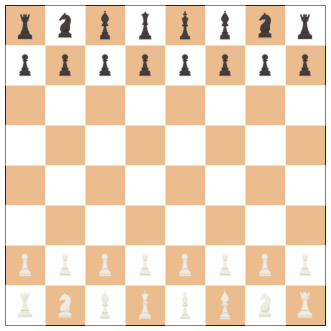
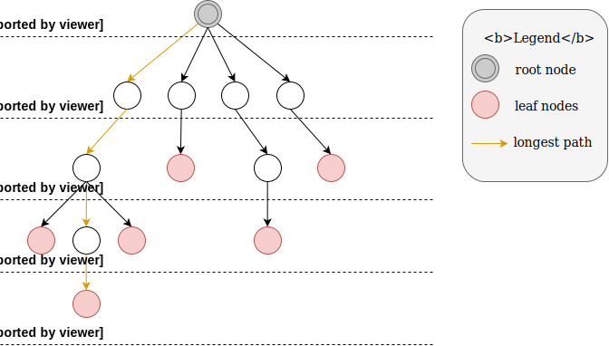
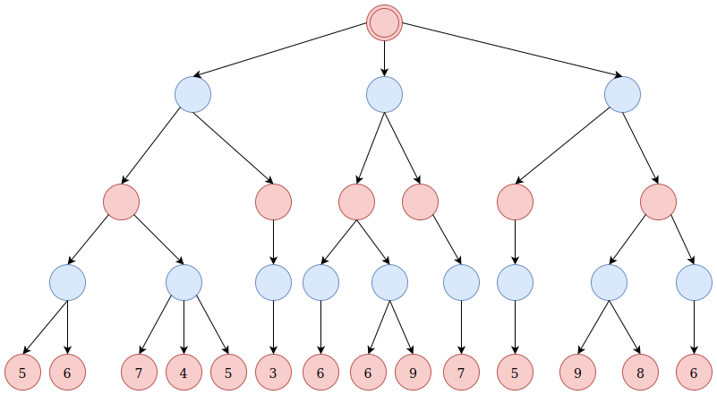
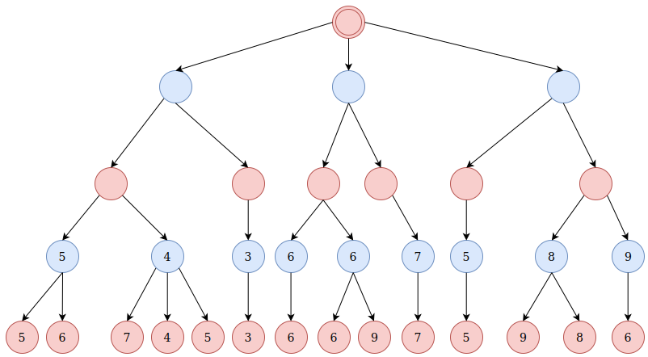
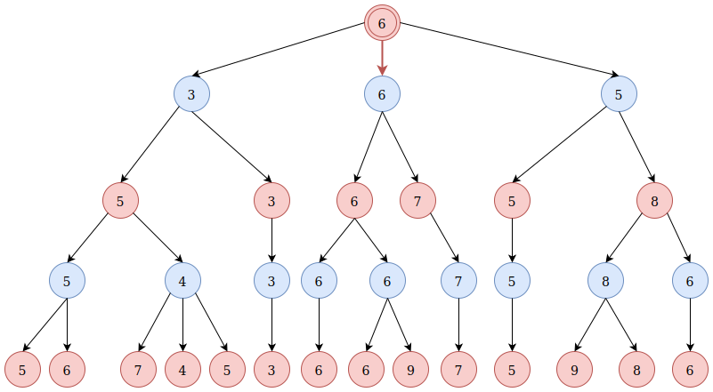
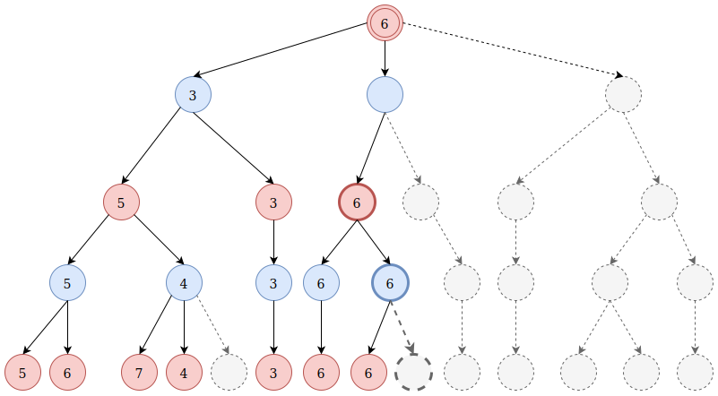
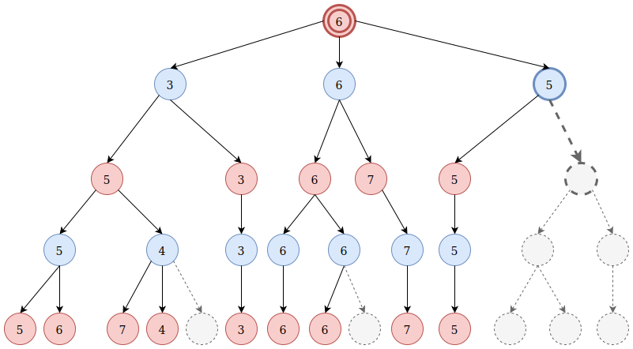
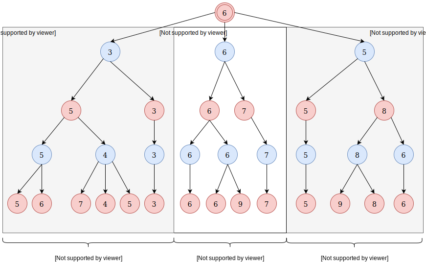

We have already seen how to create an artificial intelligence that is unbeatable for the **Tic Tac Toe** game. Let's now see how to solve a more involved challenge.
How can we build an Artificial Intelligence that has an expert level at the game of Chess. We will actually see and understand what kind of algorithms was used by
__Deep Blue__, the first Artificial Intelligence that defeated the Chess World Champion Kasparov in 1996<a href='#note_1'>1</a>.

# The Chess Game
## 1. Chess Board

So, let's see the game of <a href="#fig11">Chess</a> now.

	
	
Figure 1.1: Chess board game

## 2. Utility function
I have already mentioned, in the previous article, that we cannot use a naive `brute force` approach to solve the Chess game because it supposes we can build a Tree containing at least $10^{40}$ states. With our current
technology it is just impossible. Indeed, a 2019's computer has usually a multicore CPU (let's say 6) and its frequency is around 2 to 3 Ghz. Ideally it means that the processor is able
to execute $3 \times 10^9$ operations per second. With $6$ cores, in a perfect scenario, the processor could execute 6 operations in parallel (even 12 if we have 2 threads per core). So
In the ideal scenario our basic computer could execute $12 \times 3 \times 10^9 = 3.6 \times 10^{10}$ operations per second. Let's round it up to $10^{11}$. So it means that our computer would need to work for:

$\dfrac{10^{40}}{10^{11}} = 10^{29} \;\text{ seconds} = 3.1 \times 10^{21} \text{ years}$

So it is definitely not possible. Even if you consider the greatest supercomputer in the world. For example **SUMMIT**<a href='#note_2'>2</a> from IBM is expected to be able to reach $3.3$ exaops which means
$3.3 \times^{18}$ operations per second on a specific genomic task. Let's round this number up to $10^{19}$. Even with such a compute power we will still need:

$\dfrac{10^{40}}{10^{19}} = 10^{21} \;\text{ seconds} = 3.1 \times 10^{13} \text{ years}$

So we cannot construct such a Tree and as we need to build the tree up to the end of the game to be able to read the information: "I win", "I lose" or "We tie" (this information is only available at the end of the Tree), we cannot use the
`brute force` strategy with the game of Chess!

We cannot build a tree up to the end of the game but we can certainly build a tree with a certain **height**.

<aside class="note">
	The height of a tree is the <b>longest path you can take from the root node to a leaf node</b>.
	Everything is explained on <a href="#fig21">Figure 2.1</a>
</aside>

	
	
Figure 2.1: All the red circles are the leaf nodes (No arrow are leaving these nodes). The black circle is the <b>unique</b> root node (It is the only node that doesn't has any arrow pointing to it). The height of this tree is <b>4</b> because the <b>longest path from the root node to any of the leaf nodes</b> is <b>4</b>
	

In our case, because we are dealing with a game, the nodes of the tree represent the different states of the board game. Hence, the **height** of the tree corresponds to the number of plies the algorithm will take into account before taking its decision. For example, if we have a tree with a height of $5$ then it means that our algorithm will analyze all the possible next $5$ moves. Let's work out an example. I greatly simplified the Chess game to only retain a $8 \times 2$ board game containing only the **Bishop** and the **Knight** pieces. This dimensionality reduction is called an _abstraction_ and is depicted on <a href="#fig22">Figure 2.2</a>.

	
	
Figure 2.2: Tree of height <b>3</b> on an abstraction of the chess game. We assign a value to the <b>Bishop</b> and <b>Knight</b> pieces based on the <a href="https://en.wikipedia.org/wiki/Chess_piece_relative_value" target="_blank">common chess piece relative values</a>. We also computed the Value $V$ for each step based on <b>Sum(White player's pieces) - Sum(Black player's pieces)</b>
	

Let's explain in details the <a href="#fig22">Figure 2.2</a>.

+ In the **root node** (beginning of the game), the **White player starts**. He can either move his **Bishop** or his **Knight**. Each one of these pieces has only
one possible move due to the space of the board game, Hence the white player can only execute in total $2$ actions. We then associate a **Value** to those 2 next
possible states based on the formula:
	+	**Sum(white player's pieces) - Sum(black player's pieces)**
	+	In both of these next steps we have: white bishop + white knight - (black bishop + black knight) $= 3 + 3 - (3 + 3) = 0$
+ Let's focus on the next state noted **a** on <a href="#fig22">Figure 2.2</a>. Starting from this state the **Black player** has 2 next moves. In the same fashion
as we did for the White player, we want to evaluate anyone of those next states. Using the same formula, we have:
	+	Sum(white player pieces) - Sum(black player pieces) $= (3 + 3) - (3 + 3) = 0$ in both of these next states
+ Now, let's focus on the state noted **a2** on the previous Figure. The next possible steps starting from this state are noted **a2.1**, **a2.2** and **a2.3**. As we can
notice, in state **a2.1** the **Black bishop** has been captured by the **White knight**, Hence the value in state **a2.1** is $V(a2.1) =$ 
white bishop + white knight - black knight $= 3 + 3 - 3 = 3$

<aside class="question">Why do we need to evaluate each state by computing <i>Sum(white player's pieces) - Sum(black player's pieces)</i> ?</aside>

Actually. As we will see later, we only need to **evaluate** the state of **the leaf nodes**.
Also, recall that in the case of the **Tic Tac Toe** game we could have expanded the Tree up to the end of the game. Unfortunately for the **Chess game** this isn't possible. So, instead
we can expand the Tree up to the next $N$ possible moves. For example the <a href="#fig22">Figure 2.2</a> shows a Tree expanded up to the next $3$ possible moves (the height of the Tree is $3$).
The thing is... After these $3$ expansions we still don't know who won the game, so we need to come up with a **metric** to tell us how likely a certain state is better than
another state. Here I have used a simple metric: 

**Sum(white player's pieces) - Sum(black player's pieces)**

Where I have used the <a href="https://en.wikipedia.org/wiki/Chess_piece_relative_value" target="_blank">chess piece relative values</a>. Hence From the **White player** point of view
we want to end-up in a state that has the highest value (state **a2.1**). On the contrary, from the **Black player** point of view, we want to end-up in a state that as the lowest
value possible (negative value) because it means that **Sum(white player pieces) - Sum(black player pieces) < 0**, i.e. **Sum(black player pieces) > Sum(white player pieces)**,
which means that we are in a state where the **Black player** has more valuable pieces on the board than the **White player**

Hence, we call this algorithm the `minimax` algorithm because **we try to maximize the metric while our opponent try to minimize it**.

<aside class="note">The metric "<i>Sum(white player pieces) - Sum(black player pieces)</i>" is actually call an <b>utility function</b>. The utility function I chose is just an
example and you can define any other kind of utility functions</aside>

### 3. Branching Factor
It has been estimated that the depth of the chess game is $80$. This means that on average a game of Chess ends after $80$ moves ($40$ moves from each player). Similarly, it has been estimated that the **branching factor** of the game of Chess is $35$. The branching factor corresponds to the **average** number of moves a player can execute during its turn. Hence the **game-tree complexity** of the board game is $35^{80} \approx 10^{123}$, Yet, if we consider only the sensible moves (non stupid moves), the state-space complexity of the Chess game go down to approximately $10^{40}$.

The **branching factor** allows us computing **the number of states we need to expand** to be able to anticipate the $N$ next moves. The formula is simple: $35^N$. \\
For example:

+ $N = 1 \rightarrow 35^1 = 35$ possible moves
+ $N = 2 \rightarrow 35^2 = 1225$ possibilities if we try to anticipate the moves up to $2$ steps in advance
+ $N = 3 \rightarrow 35^3 = 42875$ possibilities if we try to anticipate the moves up to $3$ steps in advance
+ ...
+ $N = 6 \rightarrow 35^6 = 1.8e9$ possibilities if we try to anticipate the moves up to $6$ steps in advance

Hence, if we use the `minimax` algorithm we could look ahead only about $6$ plies because a common CPU has a
frequency around $1e9$ and $1.8e9/1e9 = 1.8$ seconds. That means that the `minimax` algorithm will take roughly $2$ seconds to determine the best next move to execute by analyzing all the possibilities $6$ plies ahead.

<aside class="note">Actually the minimax algorithm will certainly take <b>a minute</b> to look ahead <b>6</b> plies and not <b>2</b> seconds because a state expansion doesn't correspond to an atomic operation from the processor point of view</aside>

So that means that with our `minimax` algorithm, and if we are using a common computer, our "Artificial Intelligence" takes 1 minute at each step to decide which action to choose by computing all the possible outcomes $6$ plies in advance.

Such a program is not incompetent but it can easily be fooled by an average human chess player that can plan $7$ or
$8$ plies ahead. We will see that, by using the `alpha-beta pruning` technique, we can build an "Artificial Intelligence" capable of seeing $10$ to $11$ steps ahead, which already correspond to an expert level of play. But before We deal with the `Alpha-Beta` pruning technique, let's first explain the `minimax` algorithm in details.

### 4. Minimax algorithm
Let's suppose we are in a certain state of the game and we let the minimax algorithm expands the tree up to an height of $4$. This is represented on figure <a href="#fig41">Figure 4.1</a>.

	
	
Figure 4.1: First step of the Minimax algorithm: expand the states until we reach a certain <b>height</b>. Here the tree's height is $4$
	

Then, the second step of the `minimax` algorithm is to evaluate all the leaf nodes using an **utility function** that we have defined. <a href="#figI35">Figure I.3.5</a> shows the same tree where the leafs have been evaluated by the same utility function.

	
	
Figure 4.2: Second step of the Minimax algorithm: Evaluate all the leaf nodes using an utility function
	

Once we have evaluated the leaf nodes (that is to say we have evaluate the states in which we will eventually be after $4$ steps in this example), we need to let every player to select what is the best action in each state. As explained earlier:

+ our opponent wants to **minimize** the value he will get at the end of the tree
+ we want to **maximize** the value we will get at the end of this tree

In the previous Figure, I have represented the states in which our opponent has to take a decision with **blue circles**, while the **red circles** correspond to the states in which **we** will take a decision.

As we can see on <a href="#fig42">Figure 4.2</a>, it is our opponent decisions (blue circles) that will lead us into the states of the leaf nodes. **As our opponent wants to minimize the value, he will choose the action that lead us to the minimum value**, mathematically, it means that our opponent will take the **minimum** of all the nodes (= the states) he gives birth to. This is represented on <a href="#fig43">Figure 4.3</a>.

	
	
Figure 4.3: Third step of the Minimax algorithm: This is our opponent that takes the actions that will bring us into the leaf states. As our opponent wants to minimize the <b>Value</b> we will end in, he will take the <b>minimum</b> of all the values each one of his node is connected to.
	

In the same fashion, **we** want to maximize the **values** we will get in the end, so we need to choose the actions that lead us to the maximum of the **values** displayed in the **blue circles**. Mathematically it means that we will put, in the **red circles**, the maximum values of the nodes each red circles gives birth to. This is represented on <a href="#fig44">Figure 4.4</a>.

	
	
Figure 4.4: Third step (follow up) of the Minimax algorithm: <b>We</b> take the actions that will bring us into the next state in which our opponent will take the decision. As we want to <b>maximize</b> the value we will end up in, we need to take the maximum of the values of the children nodes of each <b>red node</b>
	

By continuing this process we will finally fill all the nodes of the tree with a **value** (see <a href="#fig45">Figure 4.5</a>) and the **value** at the root node will actually be a value of one of the leaf nodes because all the values were propagated
from the **leaf nodes** up to the **root node**.

	
	
Figure 4.5: Third step (follow up) The Tree at the end of the <b>Minimax</b> algorithm
	

So, now, how to read the Tree presented in <a href="#fig45">Figure 4.5</a>? Well, ... It's simple. **We just need to choose the action represented by the red arrow** because $6$ is the biggest value ($6 > 3$ and $6 > 5$). Obviously, when we look at the whole tree, we see that there are some **leaf nodes** with a greater value than $6$ but we cannot end in these states because our opponent will take decision that will prevent us from reaching them (because we assumed that our opponent played optimally according to the minimax algorithm).

<aside class="note">Actually, when we will use our algorithm against an opponent, we might be able, after $4$ steps, to end up in a state with a value greater than $6$ because our opponent will be an human and won't necessarily use the best decision dicted by the minimax algorithm</aside>

After we have used the `minimax` algorithm, we move our piece on the checkboard. It's then our opponent's turn. Our opponent makes his move and then it is our turn again, At this point we use the `minimax` algorithm again to be able to take the best decision based by looking $N$ plies ahead (in our example $N = 4$) and so on, and so on...

Hence, we will use the `minimax` algorithm each time we need to make a move. Also, you should be aware that the strength of this
algorithm relies essentially on the **utility function**. If you have a bad utility function then your algorithm will perform poorly. Finally, you need to be aware that, in practice, instead of fixing the depth of the search ($N = 4$ in my example), we fix a number of seconds or minutes after which the algorithm should take his decision. Setting a timer after which the algorithm should take an action is better because:
+ In some games you can be disqualified if you don't take any decision within a certain amount of time
+ In some states (start of the game/end of the game) the real **branching factor** will be lower than the average ($35$ for the Chess game), which means that the depth of the search of our `minimax` algorithm can vary depending on the state we are in.

### 5. Alpha-Beta Pruning
So we have seen an algorithm that can be used to create an "Artificial Intelligence" with a moderate level, but we don't want this! We want an AI that can defeat pro chess players! This leads us to the `alpha-beta pruning` technique, which is a technique that allows to avoid expanding useless states during the `minimax` algorithm. Hence, because our algorithm won't expand the useless states, it will actually be able to have a greater depth search. While the minimax algorithm could only look $6$ plies ahead under a reasonable amount of time for the game of Chess, the `alpha-beta pruning` technique will boost our algorithm, and it will be able to look up to $11$ plies ahead. Let's see how the `alpha-beta pruning` method works.

To understand how the `alpha-beta pruning` strategy works, we first need to understand in what order the Tree is expanded when
we implement the algorithm in a computer language. The `alpha-beta pruning` (and the `minimax` algorithm) are `depth-first` search algorithms, which means that they expand the nodes from **top to bottom** and **left to right**. <a href="#videoI31">Video I.3.1</a> shows how the tree is expanded by the `alpha-beta` algorithm.

<aside class="note">If we want to effectively code this algorithm we will need to store extra information in 2 variables usually named <b>alpha</b> and <b>beta</b>. In this video, I didn't displayed the value of these variables to avoid adding too much complexity. Instead I will explain why, at certain steps, the algorithm didn't expand some parts of the tree.</aside>

<video id="alpha_beta_explained" preload="auto" controls autoplay muted loop volume="0"
	poster="../videos/alpha_beta_back.png">
  <source src="../videos/expansion.mp4" type="video/mp4">
  
You browser cannot read the video. You can download it by clicking
     on <a href="../videos/expansion.mp4">this link</a>.

</video>

As explained in the note, **I simplified the video**, as I didn't show the value of both the $\alpha$ and $\beta$ variables at each step.

So let's explain why, when we use the `alpha-beta pruning` technique we didn't expand $3$ branches of our tree.
Let's firstly focus, at what happened when we where in this state described by the <a href="#fig51">Figure 5.1</a>

	
	
Figure 5.1: The value $4$ from the red leaf node has just been backpropagated to the
		blue bolded node. Now, why does the algorithm avoid to expand the bold dashed gray node?
	

In the State described by <a href="#fig51">Figure 5.1</a>, the algorithm avoids expanding the **bold dashed gray node** because:
+ the **bold blue node** is a minimizing node, it means that, even if we expand the **bold dashed gray node**, the value of the **bold blue node** will always be **lower or equal** to $4$
+ Now, the **bold red node** is a maximizing node, so, it will take the maximum value of its child nodes. The left
child node value is $5$ and the right child node value (the **bold blue node**) is $4$, but, we know, that, according to the first point, the value of this **bold blue node** can only be **equal or lower** to $4$
+ So the value of the **bold red node** will not change and will be $5 = \max(5, \leq 4)$, so we don't need to expand the **bold dashed gray node**.

Another way, to see it, is by using the contrapose:
+ Let suppose we expand the **bold gray node** and we find a value greater than $4$ (the current value of the **bold blue node**). Let's say we find the value $9$. The value of the **bold blue node**
stay inchanged because it is a minimizing node and hence the value of the **bold red node** remains the same,
so we could have avoided to expand the **bold grey node**
+ Let's now suppose we expand the **bold gray node** and we find a value lower than $4$. Let's say we found $2$. In this case the value of the **bold blue node** is changed to be $2 = min(7, 4, 2)$ (minimum of its children). The **bold red node** is a maximizing node, so it will take the maximum value of its child nodes, i.e $5=\max(5, 2)$ in this case. So, again, the value of the **bold red node** remains the same, so we could have avoided to expand the **bold grey node**.

Let's work out the second example depicted on <a href="#fig52">Figure 5.2</a>

	
	
Figure 5.2: The value $6$ from the red leaf node has just been backpropagated to the
		blue bolded node. Now, why does the algorithm avoid to expand the bold dashed gray node?
	

We can reuse exactly the same reasoning that we used previously to explain why we don't need to expand the **bold dashed gray node**. Indeed, as the **bold blue node** is a minimizing node, its value will always be lower or equal to $6$ (because it is the minimum value of its child node and $6$ is the value of its first child node). Hence, the value of the **bold red node** will remain the same because it will be $\max(6, \leq 6) = 6$, and so the parent node of the **red bold node** won't be changed either, and so on, up to the root node. As it didn't change the value of the **root node**, it won't change the decision we will take (recall that the decision we take is solely to choose the move, that is to say, the child node, that gives the highest value if the root node is a maximizing node and to choose the move that gives the smallest value if the root node is a minimizing node)

Finally, the same reasoning can also be applied in the third example depicted on <a href="#fig53">Figure 5.3</a>

	
	
Figure 5.3: The value $5$ from the left red node has just been backpropagated to the
		blue bolded node. Now, why does the algorithm avoid to expand the bold dashed gray node?
	

Again, the **bold blue node** is a minimizing node. It already has a value of $5$ because its left child node value is $5$. As it is a minimizing node, it's value can only be $\leq 5$ from now on. Moreover, the **bold red node** (the root node in this case) is a maximizing node and so it's value is the maximum of its child nodes. So the value of the **root node** will be the maximum of $3$, $6$ and a value that cannot be greater than $5$: $\max(3, 6, \leq 5) = 6$. Hence, if we don't expand all the gray nodes, the value of the root node will be unchanged and so the decision we will take will be unchanged!

I hope, that, by now, you understand, how the `alpha-beta pruning` algorithm works. Because this algorithm avoids to expand a lot of nodes (= states of the game) it will allow us to go deeper in our depth search. As I said before, instead of being able to look ahead $6$ plies like the `minimax` algorithm, the `alpha-beta` algorithm will be able to look up to $11$ plies ahead on a normal computer making it an expert level chess player. How can we push this "AI" a little bit further so that it might be able to beat the World Chess Champion?

### 6. Additional Tricks
Having an expert level kind of **AI** is good, how can we make this AI even better?
+ Use a huge database of opening and ending.
	+ Why would it help? Because it will actually trim the tree search early in the game. Hence we won't need to
	expand all the states early in the game and hence our search depth will be deeper. The ending database is
	usefull because, when we only have a few pieces of the board ($6$ to $7$) we can know exactly what are the best
	moves to use. Also, because these moves are saved in a database, they are precomputed and we don't need to try every possible moves to come up with the best one again.
+ Use a better computer and/or use several cores
	+ Why would it help? Well, the better is the CPU, the faster will be the tree expansion and the deeper our algorithm will be able to go when performing the search (`alpha-beta` pruning). On the other hand, if we have
	a multiprocessor CPU (which is the case since 10 years) we can implement the `alpha-beta` algorithm in such a way that the first subtrees are expanded in parallel (See <a href="#fig61">Figure 6.1</a>). It is possible because all subtrees are independent from each other. Hence, if we have a $8$ cores CPU with $2$ threads per core we could theoretically, in the best scenario have a $8 \times 2 = 16$ speed up. In practise we will more likely have a speed-up around $6$ (not $8$ because of some computational overhead due to parallelism).
+ Find the best **value function**.
	+ Why? Because our algorithm strength relies on the **value function**. If the **value function** is not good then our algorithm won't perform well. For example, instead of using the **common chess piece relative values** we could use the <a href="https://en.wikipedia.org/wiki/Chess_piece_relative_value" target="_blank">rectified values</a>
+ Use a probability distribution and meta-reasoning
	+ What is that? Well, I won't explain it, because I will need to write an entirely article to talk about any of these 2 concepts. The point is that there are many ways we can actually improve our `AI` in order to reach a greatmaster level.

	
	
Figure 6.1: Expand the tree using several cores
	

### Conclusion
In this article we have seen how that `minimax` and the `alpha-beta` techniques work. These methods allow building robust artificial intelligence for certain board games. Indeed, with the `alpha-beta` technique
we can already build bots that have an Expert level in chess. All these techniques plus some others where used in **1996** to build `Deep Blue`, the first AI to defeat a World Champion Chess player. This is cool but
so far we cannot really say that these algorithms are `intelligent`. Indeed, these algorithms can be coded with `if/else instructions and recursion`... Moreover these techniques are quite old now. We would like to learn
more recent stuffs. Don't worry. The last 2 articles will deal with the game of **Go**. In the first part we will present and explain the __traditional__ probabilistic method that was used to build the best bots before
the advent of deep learning methods. In the last article, I will dissect the `Alpha Go Zero` AI. This AI was able to defeat the World Champion of Go. I promise you that, even if you're not an expert in machine learning, you will be able to
understand how this AI works, so stay tuned, laymen!

#### Notes
+ 1 <a href='https://en.wikipedia.org/wiki/Deep_Blue_versus_Garry_Kasparov#1996_match' target='_blank'>Kasparov wins 4 - 2 in 1996 but lose 3 - 2 in 1997</a>
+ 2 <a href='https://en.wikipedia.org/wiki/Summit_(supercomputer)' target='_blank'>Summit (supercomputer)</a>