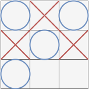
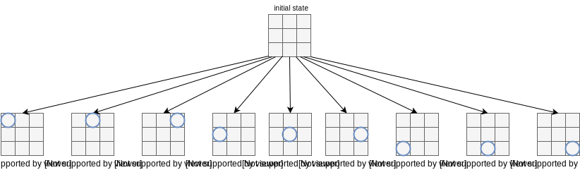
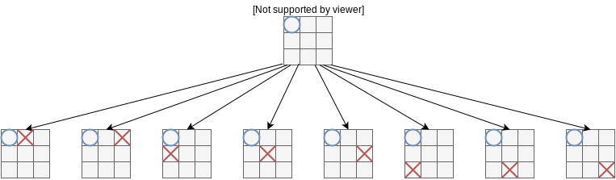
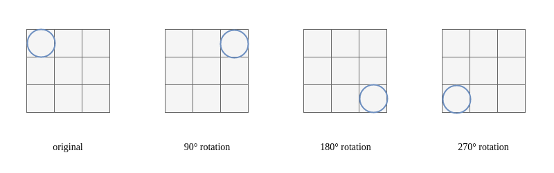
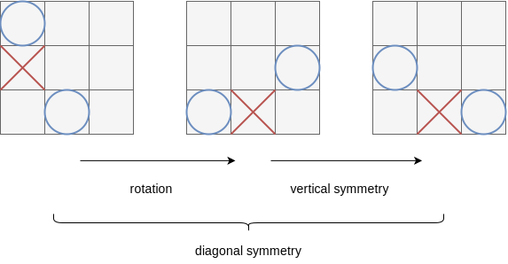
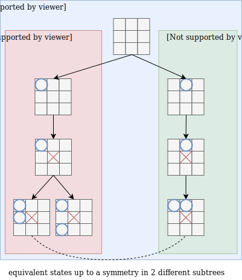
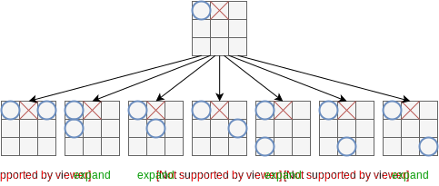
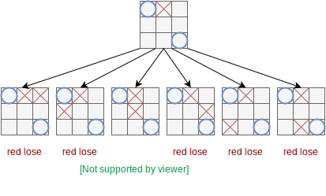
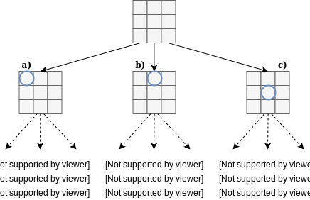
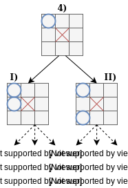

Hey Guys! In this article we will see together how we can build an "Artificial Intelligence" that can play the **Tic Tac Toe** game and be unbeatable. That is to say,
It will also win or draw. For this kind of very easy game, I don't think that we can talk about Artificial Intelligence as the algorithm used, called **Brute Force** is
everything but intelligent. Indeed, This algorithm will just try every possibilities and choose the best one. This algorithm can be used with the Tic Tac Toe game as
the state-space complexity is very low and a normal computer can easily generate all the states. We will later see, that, when the game is more complex, such an algorithm is useless.

# The basics: Tic Tac Toe
So let's understand how one can build an "Artificial Intelligence" to solve the Tic Tac Toe game. I put "Artificial Intelligence" between _quotes_ because we will see that **our program is not Intelligent at all**. It will just try all the possible moves. In computer science, an algorithm that tries every possible combinations is called a **brute force** algorithm.

## 1. What is the Tic Tac Toe game?
Well, I hope you all know about the **Tic Tac Toe** game. This is a 2 players game where each player should put a **cross** or a **circle** on a $3 \times 3$ grid. The first player that has 3 crosses or 3 circles aligned (be it vertically, horizontally or diagonally) wins the game. <a href="#fig11">Figure 1.1</a> shows a game where the blue player won

	
	
Figure 1.1: The blue player won because he aligned 3 blue circles on the diagonal
	

<aside class="note">At the time of writing these lines, If you type "Tic Tac Toe" on <a href="https://www.google.com/search?q=Tic+Tac+Toe&oq=Tic+Tac+Toe" target="_blank">Google</a>, you can play this game in your browser.</aside>

## 2. How to solve it?
Well, to build an "Artificial Intelligence" that is capable of beating (Win or Draw) anybody at this game, what we can do is: enumerate all the possible states $S$ of the game. Here a state of the game is simply a picture of the board game taken at a certain time. For example the <a href="#fig11">Figure 1.1</a> shows a special state of the game in which the blue player won.

How can we enumerate all the possible states of the game?
Well, At the very beginning of the game, a player can choose any of the 9 available empty spaces on the board game. We can represent these 9 available moves using a **Tree** as shown on <a href="#fig21">Figure 2.1</a>. Each arrow link the initial state to a _possible_ next state.

	
	
Figure 2.1: Initial state and his 9 possible next states
	

<aside class="note">In computer science a <b>Tree</b> is a structure that contains nodes (also called vertices) that are linked between each others by edges. The simplest way to understand what is a Tree is to understand that it is exactly this structure that is used when we build a Family Tree. Parent gives birth to children, but not the opposite way. For example the initial state in <a href="#fig21">Figure 2.1</a> gives birth to the states a, b, c, ... and the states a, b, c,... are the children of the initial state.</aside>

Now, **For each** of these 9 _possible_ states we can create $8$ new arrows to a new state. For example, <a href="#fig22">Figure 2.2</a> depicts the $8$ possible new states after state $a)$ from <a href="#fig21">Figure 2.1</a>

	
	
Figure 2.2: 8 possible new states starting from state $a)$ 
	

We can keep on doing this until the end of the game, that is to say, until one of the player wins or until there is no space left in the game. Starting from the very beginning of the game we have $9$ choices, **for each** one of these $9$ choices, we have $8$ possible next states. By iteration, after these $8$ states we will have $7$ possible next states, and so on and so on, until we will only have $1$ possible next state.\\
\\
Hence, we have:
- first action: 9 states (9 possible choices at the very beginning of the game)
- second action: $9 \times 8$ (for each 9 possible first choices we have 8 possible remaining choices)
- third action: $9 \times 8 \times 7$ (for each $9 \times 8 = 72$ previous choices we have 7 possible remaining choices)
- ...
- last action: $9! = 9 \times 8 \times 7 \times \dots \times 1 = 362880$ choices

So, in total we have:

$$
\begin{align*}
9! + (9 \times 8 \times \dots \times 2) + (9 \times 8 \times \dots \times 3) + \dots + (9 \times 8) + 9 &= \\
9! + 9! + 9!/2! + 9!/3! + \dots + 9!/7! + 9!/8! &= 986409
\end{align*}
$$

possible states in this game.\\
\\
Well, actually **it is not true**, we have a lot less **possible states** because:
+ The game can end before there is no more empty space on the board (cf <a href="#fig11">Figure 1.1</a> where the blue player won while there is still $2$ available positions in the game)
+ This game is highly rotation invariant. Which means that lot's of these states are the same up to a $90°$, $180°$, $270°$ rotation (cf <a href="#fig23">Figure 2.3</a>)
+ We can combine a symmetry and a rotation to transform a state $S'$ into its equivalent state $S$ (cf <a href="#fig24">Figure 2.4</a>)

	
	
Figure 2.3: These 4 states are similar up to a $90°, 180°, 270°$ rotation
	

	
	
Figure 2.4: A state $S'$ is equivalent to a state $S$ up to the combinaison of a rotation and a symmetry
	

Using these rotation and symmetry tricks, we can considerably trim the Tree and avoid having to draw $986409$ different states. <a href="#fig25">Figure 2.5</a> depicts a tree to solve the "Tic Tac Toe" game where we used several tricks:
1. We didn't draw the states that are equivalents up to a symmetry when we are expanding the states from a same state
2. We didn't expand the states that are equivalents to a state we already encountered in another part of the Tree
3. We didn't expand the states that **didn't** have 2 blue circles aligned (be it horizontally, vertically or diagonally)
4. When we didn't have the choice, we have expanded the only state that could have saved us from an immediate lose
5. After 4 expansions of the tree (4 turns of the game), I have written the winner of the game if **both players play optimally**

	
	
Figure 2.5: Expanded Tree for the Tic Tac Toe Game
	

Let's explain each one of these steps:

+ We didn't draw the sub-states of a state that are equivalents. This is explained on <a href="#fig26">Figure 2.6</a>

	
	
Figure 2.6: <b>First</b> trick to avoid expanding useless states: Don't expand equivalent states
		(up to a symmetry) from the same parent state
	

+ We didn't expand the states that are equivalents to a state we already encountered in another part of the Tree. This is explained
on <a href="#fig27">Figure 2.7</a>

	
	
Figure 2.7: <b>Second</b> trick to avoid expanding useless states. Don't expand states that we have
		already encountered in another subtree
	

+ We didn't expand the states that didn't have 2 blue circles aligned. This is explained
on <a href="#fig28">Figure 2.8</a>. This rule might appear purely arbitrary but actually if after 3 steps we don't have at least
2 blue circles aligned then our chance of winning is drastically reduced. In other word this rule allows to trim **stupid mvoes**.

	
	
Figure 2.8: <b>Third</b> trick to avoid expanding useless states. Don't expand states that don't have
		2 blue circles aligned
	

+ When we didn't have the choice, we have expanded the only state that could have saved us from an immediate lose. This is explained
on <a href="#fig29">Figure 2.9</a>. Indeed, as it is the blue's player turn. We see immediately that in some configurations he can win immediately

	
	
Figure 2.9: <b>Fourth</b> trick to avoid expanding useless states. Don't expand the states that doesn't
		from the other player from an immediate winning
	

+ After 4 expansions of the tree (4 turns of the game), I have written the winner of the game if we assume that **both players play optimally**. Playing
optimally means that both players play the best move at each step of the game in order to win (or not to lose) the game. This trick can be
called a _endgame database trick_. Indeed, when there is only a few steps left before the game ends, we can build a large database of all the possible
positions (basically just draw a tree from each one of these states) to determine which player will eventually (can be a draw too) win. This trick was
used by **Deep Blue**, the first _Articial Intelligence_ that defeated Kasparov in 1996. They've used a database of the endgame with 7 pieces or less.

So What is the take-off of this demonstration? The message is that, even though the game has theoretically a lot of states, it is possible to decrease the
number of states by using various tricks. For example we went from $986409$ (an upper bound on the number of possible states of the game) down to $63$ meaningful
states (we don't count the root state $=$ empty board) according to <a href="#fig25">Figure 2.5</a>.

So, now, how can we use the <a href="#fig25">Figure 2.5</a> in order to make sure that we will always win (or draw) the game?

### 3. How to win
Let's consider we are the **blue** player. According to <a href="#fig25">Figure 2.5</a>, the blue player can execute 3 possible next moves (the others
being equivalent up to a basic rotation or symmetry). Now, from each one of these possible next moves, we need to know how many times the **blue player** will
win/draw/lose. To do so we can just read all the "Blue Wins", "Draw", "Red Wins" under the subtrees starting from each one of these 3 states (see <a href="#fig31">Figure 3.1</a>).

	
	
Figure 3.1: The Blue player has 3 possible next moves. According to <a href="#fig25">Figure 2.5</a>, we can know how many times the
		Blue player can win/draw/lose starting from these 3 states. We can see that the best option for the Blue player is to choose the action that leads him into
		the state a) because he can win 50 % of the time, can draw 50 % of the time and can never lose (assuming the Blue player plays optimally!!!)
	

So, now, let's assume the Blue player played and ended in the state noted **a)** in <a href="#fig31">Figure 3.1</a> (he played optimally). Now, it is the Red player's turn. He also wants to win (or at least not to lose), So the Red player will also play optimally. To do so, he will use the same reasoning the Blue player used, but this times starting from the state **a)** (see <a href="#fig32">Figure 3.2</a>).

	
	
Figure 3.2: The Red player has 5 possible next moves. According to <a href="#fig25">Figure 2.5</a>, we can know how many times the
		Red player can win/draw/lose starting from these 5 states. We can see that the best option for the Red player is to choose the action that leads him into
		the state 4) because if he chooses any other states then the Blue player can win if the Blue player plays optimally 
	

So, again, the Red player wants to win (or at least not to lose) so he chooses the action that leads the game into the state **4)** of <a href="#fig32">Figure 3.2</a>). Then, now, it
is the Blue player's turn. The Blue player wants to win, so he will apply the same technique and will choose his next action based on how likely he can win knowing that he is in state **4)**. The next possibilities for the Blue player are depicted on <a href="#fig33">Figure 3.3</a>

<aside class="note">Recall that I have only drawn 2 next states of the state <b>4)</b> because, either the other states are equivalents up to a symmetry, or the other
states don't lead to a state in which the blue circles are aligned</aside>

	
	
Figure 3.3: The Blue player has 2 possible next moves. According to <a href="#fig25">Figure 2.5</a>, we can know how many times the
		Blue player can win/draw/lose starting from these 2 states. We can see that, at this point, If the Blue player and the Red player plays optimally (that is to say
		use the technique we've already been using for the 2 previous steps), None of them can win the game.
	

Using this same technique at each step allows each player to play **optimally**. So, in order to be unbeatable at the game of Tic Tac Toe, we need:
+ to create a tree like the one of <a href="#fig25">Figure 2.5</a>
+ To decide, at each step, which move to play based on how likely we can win the game based on the tree we have created

According to the previous explanations we can see that:
+ If I'm the first player to play and if I want to maximize my chances to win the game, then I need to put a cross/circle on any of the 4 corners of the game
+ If I'm the second player to play and If I want to avoid losing (play optimally) then I need to put a cross/circle on the center of grid.
+ If at the first step I put a cross/circle on the corner, but my opponent didn't put a cross/circle at the center (he didn't play optimally), then I am sure to
win the game if I continue to play optimally. To do so I just need to put a cross/circle on another corner which is the farther away from the cross/circle that
my opponent draw on the board. This can easily be seen using <a href="#fig25">Figure 2.5</a>.

The technique we have applied to solve this game can be implemented using any kind of computer language. Such an algorithm has a name. It is called a `brute force` algorithm because he will try every possibilities (actually we discarded similar, up to a symmetry, possibilities to help it a bit).
The problem with such kind of algorithm is that we need to expand all the states of the game until we reach the end of the game. In the case of the **Tic Tac Toe** game it was feasible
because this game doesn't have a lot's of state and we can use some tricks (symmetry, rotation, aligned pieces, ...) to avoid expanding useless states, but such a strategy need to
be a little bit tuned to be succesfully applied to solve more complex game such as `Chess`. Indeed:
+  we cannot use the symmetry or rotation trick as easily for the Chess game because the pieces are already on the board and each piece has its own special move
+  The number of sensible moves (non stupid or repetitive moves) for the Game of Chess is estimated to be around $10^{40}$

While we have shown that, by using numerous tricks, the number of sensible moves for the **Tic Tac Toe** game can be as low as $63$, the number of sensible moves is too high for the
game of chess, so it is impossible, with our current technology, to be able to draw a tree with all those $10^{40}$ steps. So we cannot apply the same technique as the one we used
for the **Tic Tac Toe** game because, in the **Tic Tac Toe** game **we used the Tree at each player's turn to determine what is the next best move**, and building a Tree with $10^{40}$ nodes is just impossible with our current technology!

### 4. Conclusion
We have seen how a `brute force` algorithm works and how it can be helpful to create an unbeatable bot for the **Tic Tac Toe** game. This article is the first of 4 articles on how to
solve board games using Artificial Intelligence. Here we have presented the basics but in the next articles we will present advanced techniques and we will finish by explaining in details
how the AlphaGo Zero algorithm works. And trust me, even if we're not a machine learning engineer you'll be able to understand how such an Artificial Intelligence works at the end of this
mini serie! So stay tuned because the next parts will be released soon.