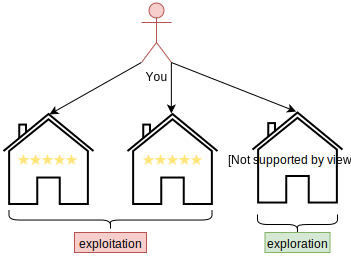
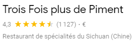
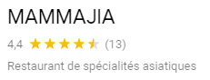
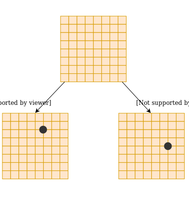
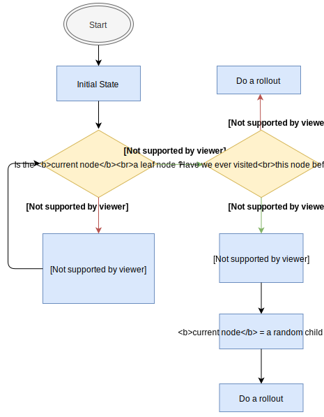

Building an Artificial Intelligence that reaches an expert level in Chess is surely a great achievement, but we are not in the nineties
anymore and things go crazily fast these past years. This is why, in this article we will deal with an even more challenging game: The game of **Go**.
In this article we will only present the `old-fashion` technique. In the next article, I will explain in details how **DeepMind** has managed to solve
this game with their AI named **AlphaGo Zero**.

# The Go Game

## 1. What is the Game of Go
I don't really know how to play **Go**. I mean, I know the rules, but that's it. Here I won't talk about the rules of
the game of Go. I will just explain the basics and I will compare the **state-space complexity** of the game of Go
with the state-space complexity of the game of Chess, to let you understand why it took so many years to be able to
build an **AI** that can beat anybody at this game (Recall that **Deep Blue**, the first AI that wins some matches against Kasparov, the Chess World Champion was created in **1996**). The **Go** game was "solved" in **2015**, that is to say almost **20** years later, when DeepMind released a paper where they presented their first Artificial Intelligence named **AlphaGo**. In **2017** they've published another paper named **AlphaGo Zero** that was even better than **AlphaGo**. Ke Jie, one of the best Go player in the world bragged and said he could lose against `Alpha Go`<a href='#note_1'>1</a>. A 3-matches game where hold in 2017 against `AlphaGo Zero` and Ke Jie lost the game.

Let's go back on track. The **Go** board game is a $19 \times 19$ board game. It is depicted in <a href="#fig11">Figure 1.1</a>. Like chess, it is a turn-based game, where each player puts a stone "wherever" he wants on the board. Like chess there are 2 players. A player that uses the **black stones** and a player that uses the **white stones**. Contrary to the Chess game, the first player to start the game is the **black** player. Also, contrary to the chess game, there are different sets of rules (Chinese, Japanese, ...), but we don't care about that here. Finally, as the **Black** player starts the game, to compensate the advantage of the **black** player, we balance the game by adding extra points to the total points of the **white** player at the end of the game. These extra points are called **Komi** and depend on the size of the board game. For an usual $19 \times 19$ board game the <a href="https://en.wikipedia.org/wiki/Komidashi" target="_blank">Komi</a> is usually $6.5$ or $7.5$, while for a $9 \times 9$ board game the komi is $5.5$.

  
  
Figure 1.1: A $19 \times 19$ go board game with some stones already placed on the board. Note:
    the little black dots are just stitches on the grid
  

<aside class="note"> There are 2 things to notice. Firstly, the stones are placed on each line intersection and not inside each square. Secondly, the letter <b>i</b> is skipped when labelling the grid</aside>

I said that the players can put a stone "wherever" they want. Well, it isn't true. The more stones there are on the
board, the more likely we have what is called _illegal moves_. Hence, beside the _illegal moves_, we can put a
stone wherever we want. Having said that, let's see what is the **Go** game complexity.

As for the game of Chess, some scientists statistically analyzed the game of **Go** and came up with these numbers:
+ branching factor: $235$
+ length of the game: $300$

Which gives us a complexity of $235^{300} \approx 10^{711}$. Recall that we obtained $35^{80} \approx 10^{123}$ for the Chess game. Recall also, that, in practise the real **state-space complexity** of the chess game is estimated to be around $10^{43}$. In the same manner, the real **state-space  complexity** of the game of Go is estimated to be around $10^{170}$. Let's first try to understand where this $10^{170}$ number of possibilities comes from<a href='#note_2'>2</a>.

If we were to place black and white stones in turn, then the number of possibilities for a $19 \times 19$ boardgame would be:

$$361 \times 360 \times 359 \dots \times 2 \times 1 = 361! \approx 10^{768}$$

Since the first player can choose to put a stone in any of the squares of the board game. He can choose among $19 \times 19 = 361$ available spaces on the board. The second player then only has $360$ possibilities ($361$ possibilities minus the possibility taken by the black player), and so on, and so on...

The problem with this formula is that two similar board games that weren't constructed in the same order are considered different. This is depicted on <a href="#fig12">Figure 1.2</a>

  
  
Figure 1.2: The number inside the stones indicate at which step the stones have been placed on the board. As you can seen, even though the stones haven't been placed in the same order on the board, the 2 boardgames are the same
  

Obviously we don't want to count board games that are similar and the previous formula does it. How to come up with a number that is closer to the reality? Well, the easiest way to see it, is to draw an analogy with a padlock. Let's say you have a padlock with **4 digits**.
You know that the number of possibilities you need to try to open this goddamn padlock is $10000$ because you need to try every number from $0$ to $9999$. Another way to see it, is that, for the first digit you can choose any of the $0$ to $9$ digits so you have $10$ possibilities. For the second digit you also can choose any digit between $0$ and $9$, ... and so on and so on. So at the end of the day you have:

$$10 \times 10 \times 10 \times 10 = 10^4 = 10000$$

different combinations to try to be sure to open the padlock.

In the game of **Go**, this is the same thing! The square can either be empty, taken by a black stone or taken by a white stone. So you have $3$ possibilities ($10$ for the padlock). However, contrary to the padlock where you have $4$ digits, here we have $361$ spaces (for a $19 \times 19$ board game). Hence, we will have around:

$$3^{361} \approx 10^{172}$$

number of different board games.

<aside class="note">As I said, this number is an approximation as some of the board games are illegal due to the rules of the game of Go, but it gives you a rough estimate of the complexity of this game!</aside>

For comparison, the complexity of the $9 \times 9$ game of go is around $10^{38}$ which is lower than the estimated complexity of the game of Chess.

Let's understand how complicated this game is with respect to the game of Chess:

$$\dfrac{10^{170}}{10^{43}} = 10^{127}$$

Hence, the game of **Go** is $10^{127}$ times more complicated than the game of Chess! Moreover, while it was quite easy to come-up with a good value function based on the relative chess piece values, it isn't that obvious to come up with a good value function for the game of **Go**. Put it another way, the `minimax` algorithm as well as the `alpha-beta pruning` technique are of no use in the game of **Go**. So we had to come-up with new ideas

## 2. MCTS: rough idea
Before **DeepMind** and **AlphaGo**, lot's of research have been made to try to build an Artificial Intelligence that is able to defeat pro go players but None of the attempts really succeeded<a href='#note_1'>1</a>. At best they were capable of building an Artificial Intelligence that was able to defeat a pro go player on a $19 \times 19$ board game. The problem is that the AI only succeeded because the professional human player was given 4 stones handicap, which means that the AI started with 4 stones already placed on the board.

Even though they weren't able to build an AI that could beat a professional go player under normal circumstances, the results were still remarkable. Moreover the technique that they have used for that Artificial Intelligence is used by `AlphaGo Zero` in conjunction with a Neural Network. This is why, in this section we will study a new algorithm that is used by all the best artificial intelligence to play the game of Go, I named the `Monte-Carlo Tree Search (MCTS)` algorithm.

As I have mentioned previously, the problem with the game of Go is twofold:
1. The **state-space complexity** is too high
2. It isn't easy to find a good **value function** to evaluate the current state of the game

For these 2 main reasons the algorithms like `minimax` and `alpha-beta` are not a good fit to tackle this problem. To avoid these 2 problems, the main idea was to play a game **until the end**.
+ At the end of the game we know who won so we don't need a **value function**.
+ Instead of creating a tree that tries every possible next moves of every possible next moves and so on up to a certain depth $N$ like in  `minimax` or `alpha-beta`, the idea is to generate several games until the end and compute some statistics to
know which state is the best.

An example of **a rough idea** of the MCTS algorithm is depicted below.

  
  
Figure 2.1: Rough Idea of the MCTS algorithm. We select different first moves. In this case we end up in situation labelled a), b), c), d). From these states of the game we play $500$ games until we reach the end of the game. When we reach the end of the game we count the number of times we have won. According to the picture, the most games we won was when we started from the state c), hence the state c) is likely to be the best and our algorithm will choose this move as its next move.
  

<aside class="note"> The previous explanation is not accurate at all. It is just the basic idea behind the MCTS algorithm. We will give a more accurate and detailed explanation in the coming paragraphs. We will also explain the mathematical formulas behind this algorithm. So don't worry, everything will be explained</aside>

To be able to construct a robust algorithm, we need to tackle some issues of the previous idea depicted in <a href="#fig21">Figure 2.1</a>. Let's enumerate some of them:
1. We said that the state labelled **c)** was better because starting from this state, our algorithm won 
$412/500$. Okay, fair enough, but maybe we were lucky. Maybe, if we play another $500$ random games starting from state **c)** we can win, something like $246/500$. Who knows? So the first challenge is to describe how our algorithm will decide what are the moves to choose when it is playing the $500$ games from each labelled state, so that, we are sure that, if our algorithm plays each time $500$ different games starting from any of the states labelled **a)**, **b)**, **c)**, **d)** it will, **on average** always output the same win-loss ratio.
2. Let's imagine that our algorithm starts to play the $500$ games from state **a)**. We also want our algorithm to avoid playing the same $500$ games or avoid playing dumb moves. To do that we need to **save** the knowledge of the previous games our algorithm simulated.
3. Maybe some of the state labelled **a)**, **b)**, **c)** or **d)** are not good at all, and maybe we don't need to always simulate $500$ games exactly. Maybe after $100$ simulated games we don't need to simulate new games from the state **c)** because we already know it is a bad state, and hence we can focus more on the relevant states and simulate more games for these states!

So, now that we know the rough idea of the **MCTS** algorithm and the challenge we need to tackle to make sure that
this algorithm can work properly, we can start to explain more precisely how the `MCTS` algorithm works. But, before that,
we will explain the concept of Exploitation vs Exploration.

### 3. Exploitation vs Exploration
Before dealing with the `MCTS` algorithm, we will need a little bit of background. Let's first explain what is the
**Exploitation vs Exploration** challenge we need to tackle.

Let's say you've already eaten in $4$ restaurants in your city. Amongst these $4$ restaurants, $2$ was very good, $1$ was so-so and the last one was disgusting. Today, you want to go to the restaurant, as you are not a masochist person (you will not choose to go to the so-so or disgusting restaurant) you likely have 2 options:
1. choose one of the **good** restaurants and eat there
2. choose to go to another restaurant you've never gone to before

If you choose **1.** then you will **exploit** your knowledge. You already know these restaurants are delicious and so you don't take risks. On the other hand, if you choose **2.**, you will take some risks because you will try a restaurant you've never tried before. We say that you will **explore**. 

Maybe this new restaurant will be bad, but perhaps it will turn out that this restaurant is even more delicious than the $2$ you already know. So **Exploitation** is good, but if you don't take some risks you might miss something that can be better. This scenario is represented in <a href="#fig31">Figure 3.1</a>

  
  
Figure 3.1: What is better? Go to a restaurant that we know is good or try an unknown restaurant that can potentially be good or even better?
  

Let's go deeper into this **Exploitation vs Exploration** thing. Suppose, now, that you want to go to a restaurant again. You know $2$
good restaurants, but you only ate in these restaurants **once**. You also know a so-so restaurant, but again, you only ate in this restaurant **once**.

Here is a table depicting this new situation:

<table class="tg">
  <tr>
    <th class="tg-fymr">Restaurant</th>
    <th class="tg-fymr">Number of visits</th>
    <th class="tg-fymr">Quality</th>
  </tr>
  <tr>
    <td class="tg-0pky">1</td>
    <td class="tg-0pky">1</td>
    <td class="tg-0pky">+++</td>
  </tr>
  <tr>
    <td class="tg-0pky">2</td>
    <td class="tg-0pky">1</td>
    <td class="tg-0pky">+++</td>
  </tr>
  <tr>
    <td class="tg-0pky">3</td>
    <td class="tg-0pky">1</td>
    <td class="tg-0pky">++</td>
  </tr>
</table>

The question remains the same:

<aside class="question">Which restaurant will you choose?</aside> 

You will tell me:

The good ones of course... I'm still not a masochist dude!

Okay, fair enough, but what if:
+ the one time you went to the best restaurants you got lucky and have good food
+ the cookers of the best restaurants have changed
+ the dishes you ordered was well cooked but the other dishes might perhaps not be as good
+ ...

<aside class="note"><b>To be sure that these restaurants are really good, you need to go there several times, you need to try several foods</b> So that you are
sure that the one time you went there, you weren't lucky.</aside>

In the same fashion, to be sure the other restaurant is so-so, you need to go there several times. Maybe, the day you went there, you were unlucky and had bad food because the chef was sick and the intern was the new Chef? Who knows... In other words, to be sure that a restaurant is **good** or **bad**, you need to multiply the experiences in these restaurants.

By analogy, nowadays, we don't need to try each restaurant $150$ times to have an opinion on it because we can see the reviews of other users on _Google_, _TripAdvisor_, _Yelp_, ... And of course, between this:

  

and this

  

you will most likely try the restaurant named `Trois Fois plus de Piment` with the $1127$ reviews even though the overall grade is lower because **you are more confident that the average number of stars is accurate**.

So, in this situation, as we are pretty confident of the average number of stars of the restaurant with $1127$ reviews, what we would like to do is to **explore** more the `MAMMA JIA` restaurant with $13$ reviews in order to have a higher number of reviews. Once the number of reviews is high enough, we will be pretty confident in the accuracy of the average number of stars of this restaurant too.

This is the idea of the `MCTS`. The `MCTS` algorithm chooses the action (which restaurant to try today) that has the maximum value (average number of stars + penalizing term that depends on the number of times we have visited the restaurant). The more we have visited a restaurant, the more the penalizing term tends to $0$ (because when a restaurant have lot's of reviews we are sure that the average number of stars is accurate). On the contrary, the less we have visited a restaurant, the more important the penalizing term will be.

Let's work out 2 examples:
1. a restaurant with $N_1=856$ reviews and $\bar{R_1}=4.2$ average stars 
2. a restaurant with $N_2=19$ reviews and $\bar{R_2}=3.6$ average stars

let's compute the following quantity for these 2 restaurants (I will explain later what is the meaning of this formula):

$$V_i = \bar{R_i} + 0.2 \times ln(\dfrac{N_1 + N_2}{N_i})$$

for the first restaurant: 

$$V_1 = 4.2 + 0.2 \times ln(875/856) = 4.2$$

For the second restaurant

$$V_2 = 3.6 + 0.2 \times ln(875/19) = 4.36$$

As $V_2 > V_1$, as explained earlier, the `MCTS` algorithm will choose to visit the **2nd** restaurant. Even though the average grade is lower (3.6 < 4.2), we wanted to visit this restaurant because we don't have enough reviews about it to be sure that the average grade might not be higher than $4.2$ one day.

<aside class="note">
The formula given here is an <b>example</b>. What we need to understand is that, in this formula:

$$V_i = \bar{R_i} + 0.2 \times ln(\dfrac{N_1 + N_2}{N_i})$$

there are 2 terms:
  <ul>
    <li>$\bar{R_i}$: this the average number of stars given to the restaurant in our case. This term is the <b>exploitation term</b> because we computed it with all the knowledge we got from all the reviews of all the users that have eaten to this restaurant.</li>
    <li>$ln(\dfrac{N_1 + N_2}{N_i})$: this is a penalizing term, also called the <b>exploitation term</b>. This term adds a <b>positive</b> extra value to the exploitation term. What is the meaning of this term? For example, for the <b>2nd</b> restaurant it means:
      <ul>
        <li>The average number of stars is $3.6$ but I didn't visit the restaurant enough, so I might assume the <b>real average number of stars</b> (the value we will have if we go to this restaurant an infinite amount of time) is within the range $[3.6 - 0.2 \times ln(875/19), 3.6 + 0.2 \times ln(875/19)]$, i.e
        within the range $[2.84, 4.36]$</li>
      </ul>
    </li>
  </ul>
</aside>

In other word, according to our formula, there is still a **non-negligible** chance that this restaurant can have an average grade higher than **4.2**!

the constant $0.2$ is purely arbitrary, it balances the importance of the **exploitation** vs the **exploration**. The higher this constant is, the more likely we will **explore**, (i.e. visit restaurants we haven't visited a lot). On the contrary, the lower this constant is and the more likely we will exploit (i.e. visit the restaurant with the best average number of stars irespectively of the number of reviews).

<aside class="note">
If, instead, the second restaurant has $N_2=11$ reviews and an average grade of $\bar{R_2}=3.3$ than we would have 

$$V_2 = 3.3 + 0.2 \times ln(875/11) =  4.17$$

That is to say that, we are already quite certain that this restaurant can at most reach the grade $4.17$ with a non negligible probability. Hence, in this scenario as $V_1 > V_2$ we prefer to choose the first restaurant.  
 
You need to understand that, if we would have chosen the `c` coefficient to be higher, than we would have chosen the second restaurant instead. Indeed, this coefficient balance between the
exploitation and the exploration. A good rule of thumb is to decrease `c` with the number of visits. Indeed, when we don't have a lot of reviews about a restaurant, we would like to visit it more often (i.e to have a higher `c` coefficient that favour <b>exploration</b>). On the contrary, once the restaurant has a lot of reviews, we are pretty confident about its grade and so we would like to favour more the <b>exploitation</b> that is to say to have a `c` coefficient that is lower.
</aside>

Now that we understand what is the **Exploration vs Exploitation** dilemma, let's go back to the `MCTS` algorithm

## 4. The MCTS algorithm explained
The `MCTS` (a.k.a Monte Carlo Tree Search) is an algorithm that uses a **Tree Structure**. We have already encountered this structure in the previous articles. The novelty will come from
the idea of the algorithm itself. As explained earlier (cf <a href="#fig21">Figure 2.1</a>), the idea of the algorithm is based on the theory of probability. Nevertheless, the <a href="#fig21">Figure 2.1</a>
is not accurate. In this section we will explain in depth how the algorithm works. To do so, as a picture is worth a thousand words, we will work out an example and I will draw you
all the steps of the algorithm. But first, let's write a formula!

The `MCTS` algorithm uses an equation. This equation depends on the version of the MCTS algorithm we use but the idea is always the same. Let's define:
+ $S$: the state of the game (a picture of the boardgame at a certain time)
+ $V$: the value we obtain at the end of the game (for a 2-players board game we can have $V=1$ if we win, $V=-1$ if we lose and $V=0$ if we tie)
+ $c$: an arbitrary constant that balances between the exploitation and the exploration terms
+ $N$: The current number of samples (the current number of simulation played)
+ $n_i$: the current number of visits of the $i^{th}$ state

I know, that can be very abstract to you, but don't worry, once we will work out an example, everything will become clear. For now, let's write our formula:

$$
\begin{equation}
\label{eq:ucb}
UCB(S_i) = \underbrace{\widehat{V_i}}_{exploitation} + c \times \underbrace{\sqrt{\frac{ln N}{n_i}}}_{exploration}
\end{equation}
$$

In this formula, `UCB` stands for `Upper Confidence Bound` and we kind of already know why, according to the example that deals with the restaurants. If we didn't visit a restaurant
a lot of time, then the exploration term will be important. On the contrary, if we visited a restaurant a lot of time, then the exploration term will be very small.

Indeed, if I have a restaurant that has 3 stars and 1000 reviews, then, even if the 10 next reviews give this restaurant 5 stars, the average number of stars will still be $\approx 3$.
On the contrary, If I have a restaurant that has 3 stars and 10 reviews then, if the 10 next reviews give this restaurant 5 stars, then the average number of stars will be $4 \neq 3$

Here, $UCB(S_i)$ can be understood as "the highest **realistic** grade that can obtain my restaurant knowing the current grade and the current number of reviews".
For a restaurant that has a lot of reviews, $UCB(S_i)$ will not vary a lot and we will essentially have  $UCB(S_i) \approx V_i$, while for a restaurant that doesn't have a lot of reviews, $UCB(S_i)$ can vary a lot.

So, now, let's consider the game of **Go**.

<aside class="question">How the heck can I apply this MCTS algorithm on the game of Go?</aside>

The game of Go has a lot of states. To understand the MCTS algorithm we will only consider the initial state (= no stones are on the board), as well as 2 possible next states corresponding to 2 different positions of a stone on the board game). I also chose to draw the $9 \times 9$ version of Go for simplicity. This scenario is depicted in <a href="#fig41">Figure 4.1</a>

  
  
Figure 4.1: Initial state of the MCTS algorithm
  

Now, we will add a little more information to this previous diagram. According to $\eqref{eq:ucb}$, we want to
save in memory: $S_i, N, n_i, V_i$ for each state $i$ of the game.

<aside class="note">We don't need to store the $UCB(S_i)$ value as this one can be computed from the other variables</aside>

 We've already saved $S_i$
($S_0$, $S_1$, $S_2$) on <a href="#fig41">Figure 4.1</a>, Let's now add the other piece of information for each node! The new initial state of the MCTS algorithm is depicted on <a href="#fig42">Figure 4.2</a>.

  
  
Figure 4.2: Initial state of the MCTS algorithm with all the available information. We haven't visited any states so $n_0 = n_1 = n_2 = 0$. We also haven't played a game yet so $V_0 = V_1 = V_2 = 0$
  

The initial state is $S_0$, as we said earlier, we simplified the game of Go and we supposed that only 2 actions that lead to the $2$ states $S_1$ and $S_2$ were available from state $S_0$. So the algorithm works as follows:

1. We are in the initial state ($S_0$)
2. From this state we retrieve all the available (legal) next states ($S_1$ and $S_2$ in our case)
3. None of these states have been visited yet so we pick one at random (Let's say $S_1$)
4. From the state $S_1$ we will play a game until the end by letting the black and white players select random
actions. We say that we do a **rollout**. This step is depicted in <a href="#fig43">Figure 4.3</a>.

  

    
    
Figure 4.3: Rollout from state $S_1$.
    

  

{:start="5"}
5. At the end of the game we know who won. If we won, $V = 1$, if our opponent won, $V = -1$. If it's a draw, $V = 0$. This situation is depicted in <a href="#fig44">Figure 4.4</a>

  

    
    
Figure 4.4: Black player wins. Let's suppose we are the black player, then $V = 1$.
    

  

{:start="6"}
6. We then propagate this value to all the nodes we visited during this simulation. We also update the number
of visits of all the nodes we have encountered during the simulation. See <a href="#fig45">Figure 4.5</a>

  
  
Figure 4.5: We update the values and the number of times we visited each node during this simulation (see red color).
  

<aside class="note">$N$ (the number of simulations) is equal to $n_0$, because each simulation starts from the initial state $S_0$, so we need to update the number of times we visited the state $S_0$ at each iteration.</aside>

Ok, so that was the **first** iteration. As you might have noticed, we didn't use the **UCB** formula during the first iteration. When does this formula kick in? Let's work out the second iteration:

+ We are in the initial state ($S_0$)
+ We have already retrieved all the available actions from this state (first iteration). To choose which one of the 2 next states we will choose, we will actually compute the UCB value for all the states and choose the state whose UCB value is the highest. This is depicted in <a href="#fig46">Figure 4.6</a>.

  
  
Figure 4.6: We compute the UCB values for both $S_1$ and $S_2$. As $S_2$ hasn't been visited, $\sqrt{\dfrac{ln N}{n_2}} \rightarrow +\infty$ because $n_2 = 0$. So $UCB(S_2) = +\infty > 1 = UCB(S_1)$ and the algorithm will choose to expand the state $S_2$
  

<aside class="note">In this example I arbitrarily chose $c = 0.1$</aside>

the general algorithm is as follow:

  
  
MCTS: Tree traversal and node expansion algorithm
  

So, we choose $S_2$. We haven't visited this state yet, so according to the algorithm we will do a rollout from $S_2$. Let's imagine we do a rollout and we got $V = -1$ (the white player wins). We will then update the values of all the nodes we have selected during this simulation. In the same manner, we will increase by 1 the number of visits of all the nodes we've selected during this simulation. <a href="#fig47">Figure 4.7</a> represents the tree at the end of the second simulation.

  
  
Figure 4.7: We update the values and the number of times we visited each node during the second simulation.
  

Let's now consider the third iteration:

+ We start from the initial state $S_0$
+ We have already retrieved all the available actions (1st iteration). We then need to compute the UCB values for all the child nodes.
  + $UCB(S_1) = 1 + 0.1 \times \sqrt{ln 2/1} \approx 1.08$
  + $UCB(S_2) = -1 + 0.1 \times \sqrt(ln 2/1) = -0.91$,
  + as $UCB(S_1) > UCB(S_2)$ we will choose $S_1$.
+ We have already visited $S_1$, so according to the algorithm, we need to generate all the available next states, pick one at random and do a rollout from this new state. Let's say the available next states are $S_3$ and $S_4$. Let's assume that we randomly selected $S_4$ and that after the rollout from $S_4$ we obtained $V=-1$ (white player wins). This is represented on <a href="#fig48">Figure 4.8</a>

  
  
Figure 4.8: We selected $S_1$, we retrieved all the available next states from $S_1$. We then choose randomly a state from $S_3$ and $S_4$. Let's say we choose $S_4$. We do a rollout from $S_4$ and we find that the white player wins ($V = -1$).
  

Once we have done the rollout, we update the values as well as the number of visits of all the states we have selected during this iteration. This is depicted in <a href="#fig49">Figure 4.9</a>

  
  
Figure 4.9: End of the thrid simulation. We have updated the values as well as the number of visits of the states we have selected during this simulation.
  

Let's stop the algorithm here. What is the meaning of this Tree? This tree tells us which is the best action to choose if we start from the initial state $S_0$. In this case, as the **average value** (and not the UCB value) of $S_1$ is greater than the average value of $S_2$ ($0/2 > -1/1$),  the algorithm will choose to play the action that leads him into the state $S_1$.

So, to sum up, at each state of the game, the MCTS algorithm simulates lot's of random games. Yet, to avoid simulating unmeaningfull games, this algorithm chooses its next move based on the highest UCB value. As we have already seen, this UCB value contains 2 terms:

- The average score (in our case, the average number of times I won the game when I chose this action)
- A penalizing term. This term adds to the average score and the less number of times we have chosen this action
the less likely the average score will be accurate and the more important the penalizing term will be.

<aside class="question">But why is this penalizing term so important? Why we couldn't just use the average value?</aside>

Well, that is a good question and I will give you an example so that you understand why the **average value is really a bad idea**!

Let's suppose you're in the initial state ($S_0$). Let's suppose the initial state has only 2 children and that you have visited each child exactly once. Now, let's assume $V(S_1) = -1$ and $V(S_2) = 1$, Which means that when you simulated the game starting from $S_1$, you lost and when you simulated another game starting from $S_2$, you won. Now, according to the `MCTS algorithm`, for the 3rd simulation you will choose the state whose **UCB value** is the highest. Yet, in this example, we have assumed that we will use the **average value** instead. By using the average value, as $S_1$ and $S_2$ have been visited exactly once, we have:
- average value of $S_1$ = -1/1 = -1
- average value of $S_2$ = 1/1 = 1

This situation is depicted in the below picture

  
  
Situation after 2 simulations
  

So, our algorithm will choose $S_2$ instead of $S_1$. Indeed, since at the first iteration the value of $S_2$ was $1$ and the only possible values are $1$, $0$, $-1$, we are sure that the average value of $S_2$ will always be greater than $-1$.
Indeed, by recurrence, in **the worst case scenario** (i.e. we retrieve $-1$ each time), we will have:
+ 3$^{rd}$ simulation: $\tilde{V}(S_2) = \dfrac{V_2}{n_2} = \dfrac{1 -1}{2} > \tilde{V}(S_1) = \dfrac{V_1}{n_1} = \dfrac{-1}{1} = -1$

+ 4$^{th}$ simulation: $\tilde{V}(S_2) = \dfrac{V_2}{n_2} = \dfrac{1 -1 -1}{3} > \tilde{V}(S_1) = \dfrac{V_1}{n_1} = \dfrac{-1}{1} = -1$

+ 5$^{th}$ simulation: $\tilde{V}(S_2) = \dfrac{V_2}{n_2} = \dfrac{1 -1 -1 -1}{4} > \tilde{V}(S_1) = \dfrac{V_1}{n_1} = \dfrac{-1}{1} = -1$

+ ...

+ Nth simulation: $\tilde{V}(S_2) = \dfrac{V_2}{n_2} = \dfrac{1 - 1 \times (N-2)}{N-1} > \tilde{V}(S_1) = \dfrac{V_1}{n_1} = \dfrac{-1}{1} = -1$

Hence, if we simulate a game from the state $S_1$ and retrieve the worst possible value ($-1$ in our example), and if we simulate another game from the state $S_2$ and retrieve the best possible value ($1$ in our case) then we are 100% sure that we will **never** end in the state $S_1$ in the next simulations anymore. This is a terrible situation because maybe if we simulate $500$ games from each state ($S_1$ and $S_2$) then we might see that the state $S_1$ is better than the state $S_2$ because we might have seen something like:

<table class="tg">
  <tr>
    <th class="tg-fymr">State</th>
    <th class="tg-fymr">Wins</th>
    <th class="tg-fymr">Loses</th>
  </tr>
  <tr>
    <td class="tg-0pky">1</td>
    <td class="tg-0pky">388</td>
    <td class="tg-0pky">122</td>
  </tr>
  <tr>
    <td class="tg-0pky">2</td>
    <td class="tg-0pky">86</td>
    <td class="tg-0pky">414</td>
  </tr>
</table>

To avoid this horrible situation, we need to add this penalizing term. Indeed, this penalizing term ensures that we will eventually choose the state $S_1$ in the next simulations even if we were unlucky during the first simulation.

## 5. MCTS algorithm: summing up
Let's sum up how the `MCTS algorithm` works:

+ Initial state ($S_0$) &rarr; simulate 10000 games from $S_0$ &rarr; Algorithm chooses the "best next state" based on the average value of all the immediate next states. &rarr;
We end up into state $S_1$.
+ State $S_1$ &rarr; opponent plays &rarr; We end up into state $S_2$
+ State $S_2$ &rarr; simulate 10000 games from $S_2$ &rarr; Algorithm chooses the "best next state" based on the average value of all the immediate next states
+ And so on, and so on.

Each game simulation used the `MCTS algorithm` that carefully choose, at each step of the game, the best next state based on the `UCB` values of each state as explained previously.

If we go back to our previous **rough idea** of the `MCTS algorithm`, we can now explain each of the 3 previous steps:
1. To force our algorithm to have the same `win\loss` ratio as much as possible, we use the `UCB` value instead of
the average number of wins. This ensures that our algorithm will explore more before converging. According to the `Law of large numbers` We also need to simulate a lot of games before choosing the best next state. Hence, in the previous example, we said that at each step we simulated $10000$ games before taking a decision. It's a lot, but recall that the game of Go has so many states that it is nothing compared to all the possibility this game offers
2. We want our algorithm to avoid playing dumb moves or avoid playing moves it already played as much as possible. To do that we need our algorithm to save the knowledge about all the states it encountered (and update this knowledge at each iteration). This is also done in the `MCTS` algorithm. For each encountered state we save:
  + the number of times we win starting from this state
  + the number of times we visited this state
Also, from these 2 values as well as the total number of simulations we can compute the `UCB` value. Again, this knowledge as well as the `UCB` value ensures as much as possible that we will avoid playing the dumb moves and keep on choosing the best states (or exploring new unknown states).
3. We don't need to simulate $500$ games for each state to know whether or not the state is good or not. Indeed, this might not be a good strategy to always do that because, maybe, after $100$ simulations starting from a certain state, we already know that the state is bad and so instead of simulating $400$ more games starting from this particular state we could have used these $400$ simulations for other states... To avoid that we don't say `simulate 500 games starting from each available next states`, we instead use the `UCB` value that incorporates a `penalizing term` and this is this formula, that will, at each simulation, choose from which state we need to perform a simulation. This is way more intelligent and as we have just seen, the use of the  `penalizing term` in the formula helps us avoid horrible situations where we stop simulating games starting from a certain state because at the first simulation we got the worst possible value.

### Conclusion
In this article we have seen how the `Monte Carlo Tree Search` algorithm works. The idea behind this algorithm is very simple. As the game of Go has too many states, we rely on the theory of probability. We simulate several games from each possible next state and choose the state whose `win/lose` ratio is the highest. Even though the idea is simple, we need to do it in an intelligent manner. I've presented you the mathematical formula **behind the scene** that allows us to build such algorithm. But, as explained in this article, this algorithm is not enough to build a robust Artificial intelligence. Indeed, the **state-space complexity** is too important that we cannot ensure that this algorithm will find a good enough action at each step of the game. To do that we need to add more intelligence, that is to say, we need to make the algorithm understands the state of the game and extrapolates (as an human would) the situation of a state he is in according to other almost similar states he already encountered. You know what? This is the subject of the next article! In the next article I will explain what is a convolutional neural network and we will see how we can use it to build an artificial intelligence that is capable to win against the pro Go players in the world. We will, indeed, dissect together, the `AlphaGo Zero` Artificial intelligence.

#### Notes
+ 1 <a href='http://french.xinhuanet.com/2016-03/12/c_135180238.htm' target='_blank'>AlphaGo ne peut pas me battre - déclare Ke Jie</a>
+ 2 The exact number of possible games have been exactly computed. If you have a good enough level in math, the proof can be found <a href='https://tromp.github.io/go/gostate.pdf' target='_blank'>here</a>
+ 3 See the performance of <i>Crazy Stone</i> and the other programs before AlphaGo was released <a href="https://en.wikipedia.org/wiki/Computer_Go#21st_century" target="_blank">here</a>