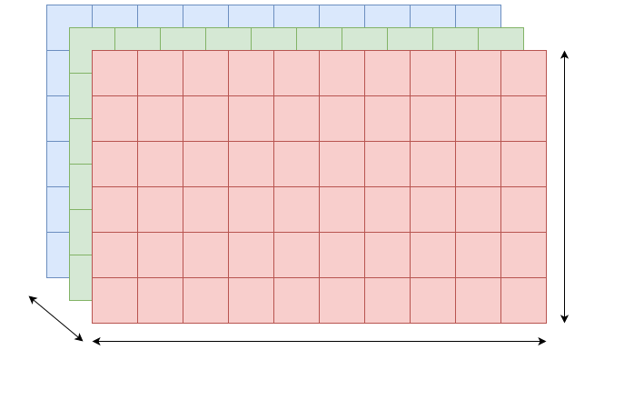
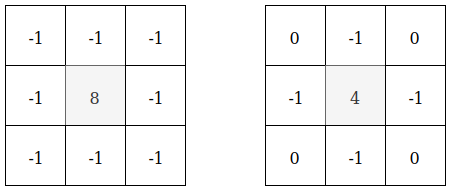
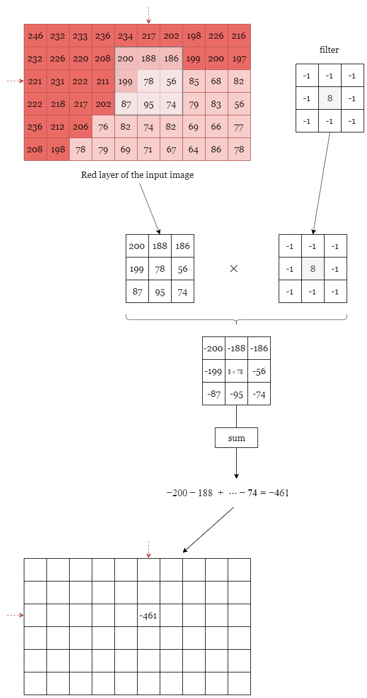
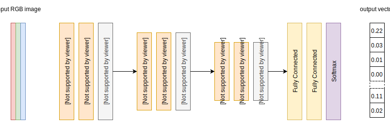
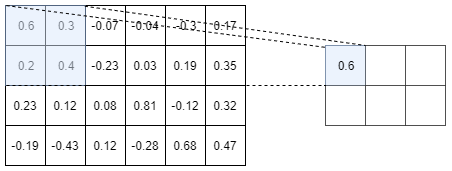
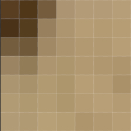
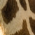
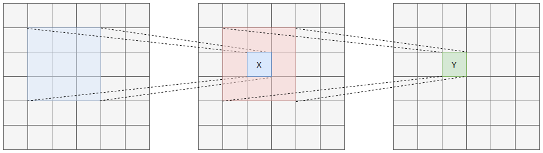
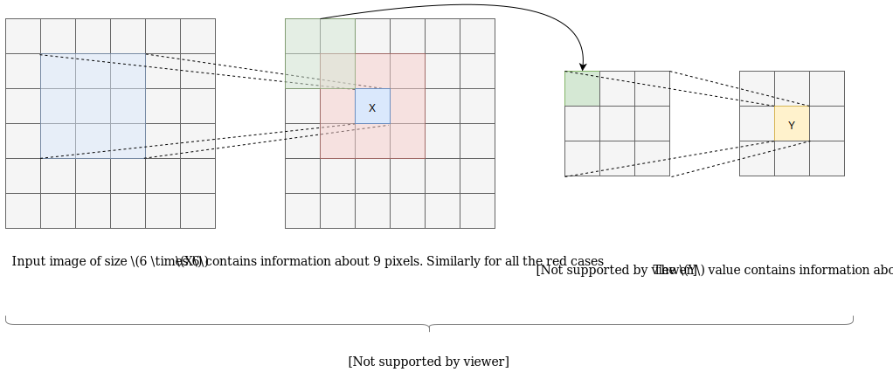
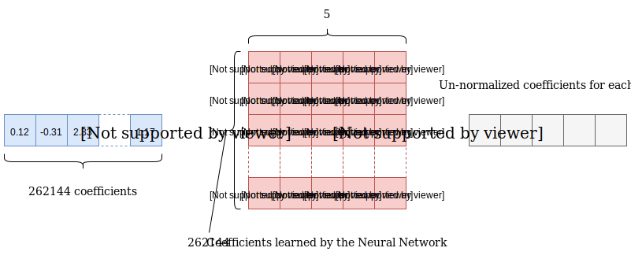

In the previous article we have seen the `MCTS` algorithm. this algorithm and all its variations have been
used to create a lot of AI for the game of Go. Indeed, `AlphaGo Zero`, the first Artificial Intelligence that was able to learn without the need of human supervision still use a variant of this algorithm. In this article, I will explain how a
`Convolutional Neural Network` works. This is a necessary step if you want to understand how the `AlphaGo Zero` AI works! Are you ready? Follow me!


# I. Filter
Before we deal with what we mean by **filter**, we need to explain how, in computer science, an image is formed.
It depends of the colorspace in which we are working but, usually, an image is made of 3 layers: the red, the green and the blue layers. In other words an image of size $600 \times 800$ is actually a `tensor` of size (600, 800, 3).

<aside class="note">In our case, a <b>tensor</b> is just a matrix with <b>N</b> dimensions. Here an image has 3 dimensions. The <b>height</b> of the image, its <b>width</b> and its <b>depth</b> which is usually 3 because each pixel is coded with 3 colors (red, green, blue)</aside>

Each pixel is encoded with 3 values (red, blue, green). Each red, blue, green values are integer values in the range $[0, 255]$. For example:
+ the red color is encoded by: (red$=255$, blue$=0$, green$=0$)
+ the yellow color is encoded by (red$=255$, blue$=255$, green$=0$) because the yellow is a mix between the red and the blue color
+ a `metallic` color can be encoded by (red$=188$, blue$=128$, green$=67$)

a pixel is usually just a mix of 3 colors (Red, Blue, Green). You just need to tell how much of each color you want. As each Red, Blue, Green values are in the range $[0, 255]$, it means that the number of possible colors you can display on a normal screen is actually $256 \times 256 \times 256 = 16777216$.

The <a href="#figI1">Figure I.1</a> shows a tensor representing an image of size $6 \times 10$

<div class="centered-img">
  
  <div class="legend">Figure I.1: An image can be represented as a tensor of $3$ dimension. The first dimension is the height of the image, the second dimension corresponds to the width of the image and the last dimension correspond to the number of layers needed to encode a pixel. In general a pixel is coded with 3 colors (Red, Green, Blue) but it depends of the colorspace in which we are working.
  </div>
</div>

The question is now:

<aside class="question">What is a <b>Filter</b> in image processing?</aside>

A filter is just another tensor of arbitrary width and height and depth. It is a **tensor** but it is not necessarily an image as this tensor might not always be interpreted as an image.

I know... this definition is quite vague, so let's again explain it in more details. The **width**, **height** and **depth** of a filter are arbitrary which mean that **you choose** the size of the filter! For example let's suppose I want a filter of size $3 \times 3 \times 1$. The question is:

<aside class="question">What will contain each cell of my filter?</aside>

This part is, again, completely arbitrary. Which means that **you choose** what to put in each cell of **your filter**. Of course we are in computer science so you cannot put a cauliflower and a carrot in these cells. We will put numbers (be it integer or floating point), but you'll be the one to choose which number to put in each cell!

Before moving on to the next subject where we will explain what a `convolution` is and how a filter can be used, let's first define 2 common $3 \times 3$ filters:

<div class="centered-img">
  
  <div class="legend">Figure I.2: 2 common $3 \times 3$ filters
  </div>
</div>

<aside class="note">the filters <b>usually</b> respect these criterion:
	<ul>
		<li>Their height and their width are the same</li>
		<li>They are symmetric</li>
		<li>Their height and width are odd and usually small: $3$, $5$, $7$</li>
	</ul>
</aside>

Yes, I know! A filter can still be very abstract to you, but don't worry, once we will explain what is a `convolution`, you will understand how a filter can be used and hopefully understand how powerful they are.

# II. Convolutions
Don't worry a `convolution` is nothing too fancy. As always, as an image is worth 1000 words, let's explain to you what a `convolution` is with a Figure. In our case we will say that a `convolution` is an operation between 2 tensors. In our example, the first tensor is the **input image** and the other is **our filter**. The convolution operation is explained on <a href="#figII1">Figure II.1</a>


<div class="centered-img">
  
  <div class="legend">Figure II.1: Convolution explained for one pixel
  </div>
</div>

The idea is that we overlap the filter with a part of the input image. We then multiply all the pixel values with the coefficients of the filter. We finally sum all the values we got, and, in this example it gives us $-461$. We then put this number back in a tensor of the same size as the input image centered on the overlapping zone.

We need to do that with all the pixels. To handle the pixels on the border of the image, we can use different strategies. Use a mirror padding, use a $0$ padding, and so on. This is represented in <a href="#figII2">Figure II.2</a>.

<div class="centered-img">
  
  <div class="legend">Figure II.2: Pad the image before convolving it with the filter
  </div>
</div>

Finally, if we use the `symmetric padding` strategy and if we overlap the filter with all the pixels of the input image, we will (you can do the calculation yourself) retrieve the following result:

<div class="centered-img">
  
  <div class="legend">Figure II.3: result of convolving the red layer (with symmetric padding) and the filter.
  	the blue cells are the cells that contain the biggest absolute value (greater than 250 or lower than -250 in our example).
  </div>
</div>

Why did I highlight the cell with the biggest absolute values? Well it's simple. In the input image there are 2 kind
of red pixels. Pixels with a lot of red (a high value) and pixel with not a lot of red in it (pixel with a low value). You can see that after convolving the filter with the input image, the cells that I have highlighted in blue
correspond roughly to the edges in the original image.


<aside class="note">
	Here I only focused on the red layer of the input image but the same operation should be applied
	on the green and blue layers. Also I have highlighted the pixels that contain a lot of red with a
	brighter red color than the pixels that don't contain a lot of red.
</aside>


Let's see a real case example to confirm our intuition that convolving this filter with an image create a
new image on which the edge are highlighted! Here is what we need to do:
+ open an image
+ transform the image into a grayscale image (we will only have a tensor of size (H, W) where `H` is the height
of the image and `W` is the width of the image)
+ convolve the filter with the input image
+ take the absolute value of each value
+ normalize the result and display the new image


For example, a very quick and dirty way do to it in python would be:
```python
import numpy as np
import cv2
import matplotlib.pyplot as plt
import scipy.misc

from scipy.signal import convolve2d


input_image = cv2.imread("border_collie.jpg")
gray_image = cv2.cvtColor(input_image, cv2.COLOR_BGR2GRAY) / 255

fi = np.array([
    [-1, -1, -1],
    [-1, 8, -1],
    [-1, -1, -1]
])

conv = convolve2d(gray_image, fi, mode='same', boundary='symm')
abs_conv = np.absolute(conv)
clipped_result = np.clip(abs_conv, 0, 1.0)

plt.figure(figsize=(15, 20))
plt.imshow(clipped_result, cmap='gray')

scipy.misc.imsave("result_3x3.jpg", clipped_result)
```

If we apply such algorithm on an input image, here is what we get:

<div class="centered-img">
  
  <div class="legend">Figure II.4: convolve a $3 \times 3$ filter with the dog image
  </div>
</div>

As we can see, our intuition is rather confirmed. We can see for example that the border of the arm
are well delimited, We can see also that the dog is well delimitate with respect to the green background.
Moreover the white and black colors on the dog's head are also quite apparent in the output. nevertheless
the ears of the dog are not quite well distinguished from the background... So our intuition is wrong?

Well, this can easily be explained actually. The upper part of the image contains a focal blur which means
that adjacent pixels to the center pixel have values that are not so dissimilar and hence our convolution fails
to distinguish these edges. 

Indeed, If all the pixels surrounding a central pixel have quite similar values then, if we convolve it with the 2 filters we've introduced,
we will get a number close to $0$. Moreover we have seen that an edge corresponds to an high absolute value. $0$ is certainly not an high absolute value!

One quick idea to fix this issue is to use a bigger filter that accounts for more than
just the immediately adjacent pixels. Indeed, with a focal blur, adjacent pixels have values that are quite similar
but pixels that are $2$ pixels away should have more dissimilar values (it depends on the strength of the blur of course).

If we use a bigger filter, here is what we obtain:

<div class="centered-img">
  
  <div class="legend">Figure II.5: convolve a $5 \times 5$ filter with the dog image
  </div>
</div>

As you can see, we have a better result. We can see the nose of the dog, the ears, the teeth and yet the background remains black, the interior of the arm remain mostly black too as these regions are formed with quite similar pixels.

<aside class="question">So what is the take-off of these 2 prerequisites?</aside>

 Filters and convolutions are inseparable in image processing. Maybe, it is possible to find a filter that will be
 able to separate the nose of the dog from everything else? It would be incredible isn't it? The problem is that,
 as I told you. The filters are arbitrary, which means that we need to find these filters ourself! Building a filter
 to highlight the edges in an image is an easy task but how the heck can I build a filter that will be able to distinguish the nose of the dog from everything else?

 You know what? This is what a `Convolution Neural Network` does! It learns a lot of different filters and it can probably learn a filter to be able to extract the nose of a dog from the input image.
 Having said that, I'm sure I caught your attention. So follow me, I will present you the **very basics** of `Convolution Neural Networks`.

 <aside class="note">Actually the Neural Network might perhaps not be able to learn a filter that will be able to distinguish the nose of the dog from the rest of the picture. It will, indeed, learn very complex filters, but these
 filters might not always be understandable for an human being.</aside>

## III.3 Convolutional Neural Network
Let's see together what is a `Convolutional Neural Network`. **How** it works and **why** it actually works! I won't delve too much into the details as it would be way too long but I
will try to explain to you the basics very easily. 


A `Convolutional Neural Network` is a particular kind of Neural Network architecture. These `Neural Networks` take as input an image and can take as output an image, a vector, a scalar, or whatever...

<aside class="question">Wow dude! I ain't understand sh*t! Can you do it again?</aside>

My bad! For now, just forget the term `Neural Network`. If you'd never worked with `Neural Network`, this term seems so cool and you can think "Omg! Really?! Can we code neurons with a computer?". I'm sorry to upset you but the answer is 100% **NO**. Having said that, let's first draw a simple `Convolutional Neural Network` (a.k.a CNN) architecture.

<div class="centered-img">
  
  <div class="legend">Figure III.1: Example of a basic Convolutional Neural Network Architecture
  </div>
</div>

Yes, I know. There is a lot's of things you don't understand on this picture. What is a `Max-Pooling`, a `Fully-Connected`, a `Softmax`, ...?
Let's explain everything step by step!

A `Neural Network` is a **black box** that takes some data and give back some data.
Let's take an basic example. If you want your `Neural Network` to recognize 5 animals:

> cat, dog, girafe, gorilla, panda

Then, in order for your `Neural Network` to be `intelligent`, you'll need to **train** it. On our basic example where our `Neural Network` is supposed to distinguish 5 different animals, we can train our `Neural Network` by giving it
**a lot's of images of each of the 5 different animals** and by telling it, each time, what type of animal we've just gave it. By a lot's of images, I mean quite a lot! In order for your `Neural Network` to be robust to different sizes of animals,
different colors of cats and dogs as well as different breeds, you'll need to give the `Neural Network` quite a lot of images. For example:

+ 1000 **different** cats in different positions as input and tell him in the output that what you've just given it were images of cats
+ 1000 **different** girafes in different positions as input and tell him in the output that you gave him image of girafes
+ ...

This is during this **training phase** that your `Neural Network` will understand and find features that will allow it to differentiate each animal. For example it will probably learn that a girafe has a **long neck**, some **black spots**, ... while the other animals doesn't have such features.

Once the `Neural Network` is fully trained, you can just give it an image that it has never seen before and it should be able to tell you what animal it thinks is on the input picture.

These $2$ phases are represented on <a href="#figII2">Figure III.2</a>.

<div class="centered-img">
  
  <div class="legend">Figure III.2: A Neural Network is a black-box. During the training phase we give it several pictures and it will output a probability vector (the sum of the components of the vector is $1$).
    In the early phrase, The Neural Neural hasn't learned a lot so it's output is not good at all. For example, here it thinks that the <b>gorilla</b> we passed it is actually a <b>panda</b> with probability $0.42$. Because it
    makes error, In order for the Neural Network to improve, we need to tell him <b>you made a mistake</b>. This information is provided by the other vector that tells him: this is a **gorilla** with probability $1$. Once the
    Neural Network is fully trained, we can test its accuracy. For example, here, we give it a picture of a cat that <b>it never seen during the training phase</b>, and it was able to tell us that this image contains a <b>cat</b> with
    probability $0.88$
  </div>
</div>

Before explaining the different operations (or layers) in a `CNN`:

> Max-pooling, Full-Connected and Softmax

Let's first understand how a `CNN` can be trained to differentiate between 5 animals:
Recall what I've told you before! A CNN can **find** very complexe filters. It can probably find:

+ a filter that will be activated if the input image contains black spots &rarr; **girafe** or **panda**?
+ another filter that will be activated if the image contains yellow colors &rarr; **girafe**?
+ an so on and so on...

So, if the filter for **the black spots** and the filter for **the yellow colors** are activated together, we are almost 100% sure that the image actually contains **a girafe**.
But, the question is:


<aside class="question">How can a CNN find these filters?</aside>

Well, I won't enter into the mathematical details of the `gradient descent` algorithm but, let me give you a coarse explanation.
During the training phase, for example you give the Neural Network an image of a gorilla and in the output you tell him: it's a gorilla.
By telling him that it's a gorilla, you also actually telling him that it is **NOT** a girafe, a cat, a panda nor a dog.
The `Neural Network` will then change some of its internal filters accordingly. Okay, fair enough. But how does it know which filters to
change and what to change in these filters?

Well, it's like the `Plus and Minus` game where a player should guess the random number selected by the computer. Let's say the random number is an integer in the range $[0, 100]$.
Let's assume the computer randomly picked the number $53$.
+ You say $50$
+ The computer tells you **It's higher**
+ You say $60$
+ The computer tells you **It's lower**
+ You then say $55$  (you know the number is between $50$ and $60$)
+ The computer tells you **It's lower**
+ You say $53$ (you know the number is between $50$ and $55$)
+ The computer congrats you because you've just found it!

This is quite the same thing with the `Neural Network`. During the Training phase:
+ You give the Neural Network a cat
+ The (not fully-trained) Neural Network tells you **it's a gorilla**
+ You tell it: **No it's a cat** (The Neural Network will update its internal filters to be more accurate the next time)
+ You give the Neural Network another cat in another position
+ The Neural Network tells you **it's a dog**  (Now it doesn't confuse it with a gorilla, but cat and dog are still quite similar to it)
+ You tell it: **No!! It's a dog** (The Neural Network will then update its internal filters again...)
+ and so on and so on.

After having seen several images of animals in different positions and different scales, the `Neural Network` will have found lot's of different
filters for each of the different animals. The Convolutional Neural Network will then be able to recognized the animal in the input image according
to the filters that this image activate. For example, if the input image activate the filter that recognize the yellows color, the filter that recognize
the long neck and the filter that recognize the black spot then the `Neural Network` will "think" with a high probability that the image contains a girafe.

<aside class="question">How can we tell the Neural Network: "I give you a dog", "I give you a cat", ...?</aside>

Indeed, A `Neural Network` only understands number. So, one naive way to do it, is by associating a number to each animal. For example:


> cat = $0$, &nbsp;&nbsp;&nbsp; dog = $1$, &nbsp;&nbsp;&nbsp; girafe = $2$, &nbsp;&nbsp;&nbsp; gorilla = $3$, &nbsp;&nbsp;&nbsp; panda = $4$


In practise we never do that. We instead associate a vector called a **one-hot encoding vector**.
Let's first understand why it's not a good idea and then we will see what is a **one-hot encoding vector**.

Let's assume we used the previous mapping. So, for example, **dog = $1$**. Now, let's assume I give an image of a **dog** as input to my `Neural Network`. My Neural Network
will output a number in the range [0, 4], but this number is not neccesarily an integer! Let's say it (my Neural Network) is not already well trained and it outputs $3.2$. As $3$ is the closest integer, we can say that my `Neural Network` _thinks_ that the image I gave it is a **gorilla** (actually we could say that it _thinks_ it is **a mix of a gorilla at 80 % and a mix of a panda at 20%** since $3.2$ is inbetween $3$ = gorilla and $4$ = panda).

Do you see the problem, already? According to our mapping, a **dog** (= $1$) is closer to a **girafe** (= $2$) than to a **panda** (= $4$) because the distance between a dog and a girafe is: 

+ $\|dog - girafe\| = \|1 - 2\| = 1$ 

while the distance between a dog and a panda is

+ $\|dog - panda\| = \|1 - 4\| = 3$

Put it differently, it means that, from the `Neural Network` point of view, if we choose to encode the animals with integers, a dog will always be more similar to a girafe than to a panda,
because the distance that separate a dog from a girafe is smaller than the distance that separate a dog from a panda. This is completely arbitrary! If we had chosen **panda = $2$** and **girafe = $4$** we would have gotten the reverse (a dog is most similar to a panda than to a girafe).

What we want is that **each animal should be as far from each others**. That is to say we want to encode the animals in such a way that:

$\begin{align}
\|dog - girafe\| = \|dog - panda\| = \dots
\end{align}$


This is where the **one-hot encoding vector** kicks in. We represent each animal by a vector of the length the vocabulary (here we have $5$ animals so the vocabulary's length is $5$). This vector contains only the number $0$ except at the $i^{th}$ position where it contains a $1$. In our example we have then:

+ cat = $[1, 0, 0, 0, 0]$
+ dog = $[0, 1, 0, 0, 0]$
+ girafe = $[0, 0, 1, 0, 0]$
+ gorilla = $[0, 0, 0, 1, 0]$
+ panda = $[0, 0, 0, 0, 1]$

With this, we can define a distance:


$\begin{align}
\text{distance}(animal_{1},\; animal_{2}) = \sum\limits_{i=0}^K \|{animal_1}_i - {animal_2}_i\|
\end{align}$


For example:

+ $\|dog - girafe\| = \|[0, 1, 0, 0, 0] - [0, 0, 1, 0, 0]\| = \|0-0\| + \|1-0\| + \|0-1\| + \|0-0\| + \|0-0\| = 2$
+ $\|dog - panda\| = \|[0, 1, 0, 0, 0] - [0, 0, 0, 0, 1]\| = \|0-0\| + \|1-0\| + \|0-0\| + \|0-0\| +\|0-1\| = 2$


With this new encoding and the distance we've just defined, every animals are equidistant to each others and so we don't have an **a priori** about which animals look a lot alike. It will
then be the role of the `Neural Network` to learn these similarity or dissimilarity between the animals by finding the best filters.

If we encode the `ground truth` vector with a **one-hot encoding vector** then it means that the Neural Network should output a vector of length $5$ (same lenght as the `ground truth vector`).
Obviously, because the  `Neural Network` do very complex operations, its output is not meant to contain only $0$ and $1$ as the `ground truth vector`. But, we can constraint this vector to only contain
**positive values** that sum to $1$.


here is some examples:

+ [0.88, 0.06, 0.06, 0, 0]  &rarr; $0.88 + 0.06 + 0.06 = 1$ &rarr; ✔️
+ [0.6, -0.2, 0, 0.3, 0.3] &rarr; $-0.2$ &rarr; ❌
+ [0.2, 0.8, 0.1, 0, 0.2] &rarr; $0.2 + 0.8 + 0.1 + 0 + 0.2 = 1.3$ &rarr; ❌


<aside class="question">Why does it makes sense to have a vector with only positive values that sums to one?</aside>

It makes sense because we can interpret the results.

For example the vector $\begin{bmatrix}0.88 & 0.06 & 0.06 & 0 & 0\end{bmatrix}$ means:

> The Neural network thinks that the input image is a cat at 88%, a dog at 6% and a girafe at 6%

On the contrary, the vector $\begin{bmatrix}0.6 & -0.2 & 0.3 & 0.3\end{bmatrix}$ doesn't make sense because

> what is the meaning of saying **I'm sure at -20% that it is a dog**?


In the same fashion the vector $\begin{bmatrix}0.2 & 0.8 & 0.1 & 0 & 0.2\end{bmatrix}$ is not good because it means:

> I'm sure at **20** that it is a cat, at **80%** that it is a dog, at **10%** that it is a girafe, ... (we're already at **110%**)


Actually this last vector makes sense. We just need to **normalize** it. \\
There is different ways of normalizing a vector, the most common one is to
divide it by the sum of all its components. In our case:

$$\dfrac{\begin{bmatrix}0.2 & 0.8 & 0.1 & 0 & 0.2\end{bmatrix}}{0.2 + 0.8 + 0.1 + 0 + 0.2} = \begin{bmatrix}0.15 & 0.62 & 0.08 & 0 & 0.15\end{bmatrix}$$

This last vector, $\begin{bmatrix}0.15 & 0.62 & 0.08 & 0 & 0.15\end{bmatrix}$, makes perfect sense.

Similarily, the second vector $[0.6, -0.2, 0.3, 0.3]$ can also be **normalized** in order to have only **positive values that sum to $1$**.

<aside class="note">The function that ensures that our Neural Network will output only positive values that sum to 1 is actually called a Softmax</aside>

We've just explained what is the purpose of the **Softmax** function. We know what data to give as input to the `Neural Network` (images in the RGB color space) as well as what data to give as output during the training phase (one-hot encoding vector). We just need to explain what are the **Max-pooling** and the **Fully-Connected** layers.

<aside class="question">What is a Max-Pooling layer and why do we need it?</aside>

As a picture is worth 1000 words, an example of a `Max-pooling` operation is depicted in <a href="#figI32">Figure I.3.2</a>


<div class="centered-img">
  
  <div class="legend">Figure I.3.2: $2 \times 2$ Max-pooling over a tensor of size $4 \times 6$
  </div>
</div>

The above picture shows the `Max-pooling` operation over a tensor of size $4 \times 6$. Here we choose to use a $2 \times 2$ Max-pooling but we could
have used a $3 \times 3$ or a $4 \times 2$ or whatever else. We used a $2 \times 2$ Max-Pooling here because it is the most common size used.

As you can see on the above picture, a $2 \times 2$ Max-pooling operation reduces the size of the Input tensor by $2$. We went from a tensor of size
$4 \times 6$ to a tensor of size $2 \times 3$. Moreover, as its name suggests it, the max-pooling operation only keep the **maximum** number in a window
(here a window of size $2 \times 2$ since we are using a $2 \times 2$ max-pooling). So, you see, the max-pooling operation is really not a very fancy operation...


> Okay, Okay... But we still don't understand **why** we need this actually...? And why we need to keep the **maximum** value? Why not the **minimum** or anything else?

As, we've just seen, the $2 \times 2$ **max-pooling** operation allows to divide by 2 the width and the height of an input tensor by keeping the maximum value in a $2 \times 2$ square.
The thing is that, for the CNN to be able to find the right values of each filter, it need to compute a lot's of things. The biggest the input tensor is, the biggest the number of time we will need to convolve each filter with each coefficient of the input tensor and the higher the number of operations the CNN will need to compute to find the right filters. Hence, in order to decrease the number of operations to perform before updating each filter's coefficient, the idea is to work on smaller tensors.

Working on smaller tensor allows the Network to compute less things and hence allow to speed up the training of the Neural Network. Now, why do we keep the **maximum** values? Actually, we **don't need to keep the maximum values**. Before the use of the **max-pooling** operation, another pooling operation, the **average-pooling** operation, was used. The idea behind the **average-pooling** operation is just to take the average of all the values in a window of a certain size. For example if you use a $2 \times 2$ **average-pooling** operation then your output tensor will have its width and height divide by $2$ and each one of its coefficient will be the average of $4$ coefficients from the input tensor.
In practise, however, the research community has seen that the **max-pooling** operation gives better results than the **average-pooling** operation and this is why the **max-pooling** operation is now the most commonly used operation to downsample a tensor.

Let's try to have a bit of an intuition about why using a **max-pooling** make senses. Let's go back to the example with the filter that allowed us to detect the edges in the image. If you scroll up you'll notice that the edges appeared white in the picture while the rest was mostly black. In a grayscale image, the white color corresponds to a value of $255$ and the black to a value of $0$, hence, by keeping only the maximum value we will actually keep the meaningfull information i.e the edge that we have detected!

This argument is a bit biased because when I used the filter 


$$\mathcal{F} = \begin{pmatrix}
-1 & -1 & -1 \\
-1 & 8 & -1 \\
-1 & -1 & -1
\end{pmatrix}$$


The edge were actually represented by the highest positive or the smallest negative values. Indeed, I actually used the absolute value of the convolution between the input tensor and the filter to turn the smallest negative values into some of the highest positive values:

```python
# convolve the gray image with the filter `fi`
conv = convolve2d(gray_image, fi, mode='same', boundary='symm')

# take the absolute values of each coefficient in the output tensor
abs_conv = np.absolute(conv)
```


Even though I "cheated a bit", the biggest positive values still represent the edges (but all the edges are not only represented by the biggest positive values). So, by keeping the **maximum values** we kind of keep the most meaningfull information.

Let's see another way to understand why keeping the **maximum** information makes sense. To do that, I will oversimplified the problem, but it is for the sake of the demonstration.
Let's say you have a picture with a lot's of green in it. a fully green pixel is coded in the `RGB` space with: $[0, 255, 0]$.
Now, let's say I want to identify the green pixels in the input image. Obviously:

> I can only recover the pixels that have a value of $255$ in the second position and small values in the first and last position.

How can I translate the above sentence into a filter. Well, I want to have a lot's of green, so my filter will contain a positive number of the second position. Yet I don't want to
have to much red or blue (otherwise the color will not be green anymore). Since I don't want to have high blue or red colors, I will **penalize** pixels with high blue and red values by putting a small negative number in each of these positions.

For example, I can use this filter:

$$\mathcal{f} = [-0.5, 1, -0.5]$$

Now let's compute different responses for different pixels:
+ quite green $[20, 202, 56]$: $(20 \times -0.5) + (202 \times 1) + (56 \times -0.5) = 164$
+ lot's of blue, green, red $[100, 198, 176]$: $(100 \times -0.5) + (198 \times 1) + (176 \times -0.5) = 60$
+ not lot's of green $[132, 66, 100]$: $(132 \times -0.5) + (66 \times 1) + (100 \times -0.5) = -50$

So, we see that, actually, the responses that have the highest values correspond to the pixels that have a lot's of green. Indeed, the highest the filter is correlated with the input (pixel), the highest the response will be. Hence, it makes sense to only keep the highest responses since these responses are the most correlated to the filters we used to get the response.

<aside class="note">Here, I've tried to give you an educated guess of why keeping the maximum values kind of make sense, but it is difficult to extrapolate these easy examples into more complex filters that relies on much more layers and much more features</aside>

One more thing to add is that a **max-pooling** operation allows to decrease the complexity of our neural network by decreasing the number of calculation it needs to perform before finding the best filters, but we could have used another **convolution** instead of a **max-pooling**.
Indeed, if we use a **convolution** with a stride of $2$ (which means that we will shift the filter(s) 2 cases horizontally and 2 cases vertically similarly to what we did when we perfomed the **max-pooling** operation in <a href="#figI32">Figure I.3.2</a>), we will have a resulting tensor whose height and width will be divided by $2$. hence, if we replace all the $2 \times 2$ max-pooling by a **convolution** with a stride of $2$, our Neural Network will, in theory, be more perfomant.

Indeed, by using a **convolution** with stride $2$ we let the `Neural Network` learns how to combine each features of the input tensor to result into a smaller output tensor, while, if we use a **max-pooling** operation we force our Neural Network to only keep the **maximum values** no matter what. Hence, using a **convolution** with stride $2$ is more powerfull. The drawback is that, **the Neural Network now has to learn more things**... So it will struggle to learn **everything** and its training phase will likely be slower.


We now know what is a **max-pooling** layer and why we need it, but we still don't understand how our `Neural Network` is able to learn complex filters. Indeed, the most commonly used filters are $3 \times 3$ filters and we rarely use filters that are bigger than $7 \times 7$. So the question is:


<aside class="question">How can we learn complex filters like the <b>neck of a Girafe</b> if we only use filters that takes into account the pixel at the center and it's 6 nearest neighbors ($7 \times 7$ filter)?</aside>


I've just realized that, this question might appear obscur to you. So let me first explain the question and then I will tell you why, even if we only use $3 \times 3$ filters, our `Neural Network` will be able to recognize the **neck of a Girafe**.

First thing first. If I show you this $7 \times 7$ portion of an image:

<div class="centered-img">
  
  <div class="legend">Figure I.3.3: $7 \times 7$ portion of a girafe's neck
  </div>
</div>


are you able, honestly, to recognize that this is some part of a girafe's neck? I don't think so, right?

Now, If I give you a little more context (and by context I mean a wider portion of the image):

<div class="centered-img">
  
  <div class="legend">Figure I.3.4: $50 \times 50$ portion of a girafe's neck
  </div>
</div>

Are you, now, able to Identify that this is probably some portion of a girafe neck? Maybe you won't be able to
tell that this is some part of the girafe's **neck** but you've probably recognized that this picture is "girafe-related", right?!

The idea is that, If we only use $7 \times 7$ filters at most, the coefficients that our `Neural Network` will learn will never be meaningful because it will only rely on a $7 \times 7$ context.
If, us, human, we are not able to recognize a girafe's neck if we focus only on a $7 \times 7$ portion of the image, how can a `Neural Network` be able to do it?

Well, the answer is that... The `Neural Network` cannot do it either! As an human being, to be able to recognize complex structure, the `Neural Network` needs to pay attention to the context, that is
to say to the pixels that are surrounding a central pixel. One way to do it, is to rely on bigger filters. For example we can imagine a filter of size $51 \times 51$. With such a filter we are sure that we
are relying on a broader context. The problem is that the `Neural Network` will need to learn $51 \times 51 = 2601$ coefficients... And we don't like this, because the more coefficients need to be learnt,
the more complex is the task and the slower the training phase will be. This is why we rely on smaller filter, like $3 \times 3$ filters. But, if that is the case, how the hell the `Neural Network` can
pay attention to a broader context and hence be able to identify complexe structures in an image?

Well, the idea is very simple! We use a cascade of small filters! As a picture is better than $1000$ words, here is a picture for you:


<div class="centered-img">
  
  <div class="legend">Figure I.3.5: cascade of $3 \times 3$ filters
  </div>
</div>


To get the value $X$, we actually used a $3 \times 3$ filter. Hence, $X$ contains information about the $9$ pixels (blue squares). In the same fashion, the **red cases** in the above image contains
information about $9$ pixels each. Finally the value $Y$  is obtained by overlapping a $3 \times 3$ filter over the values that contain information about a broader context. 

Hence, here, by using $2$, $3 \times 3$ filters, we were able to focus on a context of size $5 \times 5$ with only $3 \times 3 + 3 \times 3 = 18$ coefficients, while, if we would have used a $5 \times 5$ filter, our neural network would have need to find... $5 \times 5 = 25$ coefficients!

This is already a good improvement! But the best is when you mix things with $2 \times 2$ max-pooling! Look at this:


<div class="centered-img">
  
  <div class="legend">Figure I.3.5: $2$ convolutions and one $2 \times 2$ max-pooling
  </div>
</div>

As state previously, the **max-pooling** operation doesn't add any complexity to the model since the `Neural Network` doesn't need to learn new coefficients! Yet, by using a **max-pooling** operation
in between 2 **convolutions**, we were able to focus on a region of size $8 \times 8$ by using only $3 \times 3 + 3 \times 3 = 18$ coefficients (instead of $64$ coefficients!)

This is how, by using small filters in cascade and **max-pooling**, our `Neural Network` is able to focus on broader region while keeping a small number of coefficients to learn!


There is still one part of the `Neural Network` we haven't explained yet. This is the Fully Connected component!

<aside class="question">What is the purpose of the Fully Connected layer?</aside>

the output of the last convolution layer (just before the fully connected layer) is actually a tensor of size $(H', W', C')$ where $H'$, $W'$ and $C'$ are respectively the height, the width and the depth (number of channels)
of the tensor. We recall that, here, if $H$, $W$, $C$, are respectively the height, the width and the depth (3 channels) of the input picture we give to the Neural Network then, $H \neq H'$, $W \neq W'$ and $C \neq C'$ since, has we have seen, the $2 \times 2$ max-pooling operation decreases the height and the weight of the input tensor by $2$ and $C'$ the number of
filters is actually an hyperparameter, that is to say that, **WE** choose the value of it. Hence, if our last convolution layer uses $256$ filters then $C' = 256$

For example if our input picture that we give to our `Neural Network` is of size $(256, 256, 3)$  ($3$ because our image contains $3$ channels: R, G, B). Then, because we have $3$, $2 \times 2$ **max-pooling** operations (and because
the convolution layer use by default a stride of $1$), the height and the width of our output will be divide $3$ times by $2$, that is to say, $H' = W' = 256 / 8 = 32$. For the number of channels, we have said that it depends on the
number of filters used in the last convolution layer. If we want it to be $256$, then our output will be of size $(32, 32, 256)$.

Now, recall that the `Softmax` layer only normalizes the input we give it (The Softmax doesn't change the size of the tensor). Moreover we know that our output should be a **vector** of size $5$ since we want our Neural Network to be able to distinguish between $5$ animales. All in all, it means that the input to the `Softmax` function should
also be a **vector** of size $5$. But, here we have a 3 dimensional **tensor**! \\
In order to convert this **3D** tensor into a vector what we do is that, first, we **flatten** the tensor. That is to say that we go from a tensor of size $(32, 32, 256)$ to
a vector of size $32 \times 32 \times 256 = 262144$. So it's cool! We have a vector. We don't need a `Fully-Connected` layer! Well. Actually we need a `Fully-Connected` layer for at least $2$ reasons:

+ In our example, the output vector should be of size $5$ because we wanted it to be able to differentiate between $5$ animals. We hence cannot have a vector of size $262144$ as output
+ The `Neural Network` has learned several filters but it doesn't yet know how to combine these filters together in order to know what was the animal we just gave him

Here, We want to go from a tensor of size $262144$ to a tensor of size $5$, so the idea is to create a matrix of size $(262144, 5)$ and the `Neural Network` will have to learn each and every one of the coefficients in this matrix. If you recall your algebra 101 class and matrix multiplication, here is a picture that details what happens:


<div class="centered-img">
  
  <div class="legend">Figure I.3.6: The Fully-Connected Layer is just a matrix multiplication operation. The coefficients of this matrix are learned by the Neural Nerwork during the training phase
  </div>
</div>


<aside class="note">In <a href="#figI31">Figure I.3.1</a> there are 2 fully connected layers. <b>You</b> choose how many of them you want. Here, maybe, the idea is, first to go from a vector of size $262144$ to a vector
of size $1000$ with the first fully-connected layer and then to go from this vector of size $1000$ to a vector of size $5$ with the second fully connected layer.</aside>


## Conclusion
We didn't enter too much into the mathematical details and I purposely haven't details everything. This is not the goal of this article and there are a ton of other ressources available online that will teach you how a `Convolutional Neural Network` works. Here, I've just wanted to share with you the meaning of each component of a `Convolutional Neural Network` and why they make sense in order for you to understand how the `AlphaGo Zero` AI works. Indeed, I feel like, at school we are taught lot's of things but we often skipped the important part: **Why ?**. Why a convolution operation, why a max-pooling, why this, why that... With this article, I hope I could have helped you have a better understanding of **why**, and for the newbies, I hope that I could have give you a first intuition and understanding of how a `Convolutional Neural Network` works. It is really nothing fancy! Believe me, we are far from the `SkyNet` scenario from the Terminator movie!


