In one of the previous articles, we have seen the `MCTS` algorithm. this algorithm and all its variations have been
used to create a lot of AI for the game of Go. Indeed, `AlphaGo Zero`, the first Artificial Intelligence that was able to learn without the need of human supervision still uses a variant of this algorithm. In this article, we will
dissect the `AlphaGo Zero` Artificial Intelligence and I hope that, by the end of this article, even if you are not
an expert in machine learning, you will have understood how this AI works.

**Note**: When I was writing this article my goal was to provide an explanation that is understandable to most of the people. I guess that, even though this article might not be suitable for all the laymen out there, it should be accessible for most of the people that are willing to learn. Obviously, I've made some simplifications in my demonstrations, but I think that I've managed to explain everything.

__Side note__: My own implementation of the AlphaGo Zero A.I is available on my [github](https://github.com/Twice22/AlphaGoReplica). This implementation is **largely inspired** from the non official [minigo](https://github.com/tensorflow/minigo) implementation.

# I Deep Learning
The AlphaGo Zero AI relies on 2 main components. The first component is a Neural Network while the second component is the Monte Carlo Tree Search (MCTS)
algorithm. We have already detailed how work these 2 things in the 2 previous articles. In this article, we will focus on the tiny variations in the architecture
of these 2 algorithms and we will explain how we can combine these 2 things to build the greatest AI for most of the deterministic board games.

In the previous article, we have seen together what is a Convolutional Neural Network (a.k.a `CNN`) and how it works. CNN are usually used in computer vision because they
are the **state-of-the-art** when it comes to segmentation, object detection... \\
The **detection** task is the one we've discussed in the previous article. For example, we give the Neural Network an image of a cat and the Neural Network is able to tell us that
it is a cat. The **segmentation** task goes a little bit further. Given an image of a cat, the Neural Network is able to draw the outline of the cat and hence divide the
picture into 2 parts: the foreground (here the cat) and the background. \\
They are a lot's of other tasks that can be accomplished using `Convolutional layers` like:
> inpainting, alpha matting, instance segmentation, super resolution, deblurring, ...

<aside class="question"> What do we want our Neural Network to learn?</aside>

We want our Neural Network to be able to **play** the game of Go. This means that our Neural Network should be able to understand the Go board game. Put it differently, it means
that we should give our Neural Network pictures of different states of the Go board game. As the Go board game is usually of size $19 \times 19$, it means that we're going to give our
Neural Network an image of size $19 \times 19$, where, for example, a $0$ means there is no stone in the case, a $-1$ means there is a **black** stone and a $1$ means there
is a **white** stone occupying the case. <a href="#figI1">Figure I.1</a> depicts this situation

  
  
Figure I.1: How to encode the board game so that the Neural Network understands where are the black/white stones.
  

<aside class="note">We will later see that, <b>DeepMind</b>, the company being the <b>AlphaGo Zero</b> algorithm, actually chooses a different way of encoding the board game. The idea, yet, stay the same:
We need to encode the information on the board game with simple numbers.</aside>

Now, that, we more or less know what we will give our Neural Network, we want to be able to identify what our Neural Network should return. We probably want our Neural Network to
return the best next move to choose at each step of the game. If you recall the example with the animals, where our Neural Network was supposed to distinguish between $5$ animals, the output
of the Neural Network was a vector of size $5$ such that the sum of each component of the vector is equal to $1$.

For example:

$[0.88, 0.06, 0.04, 0.00, 0.2]$

means that our Neural Network "thinks" that the input image contains:

> a cat with 88% of chance, a dog with 6% of chance, a girafe with 4% of chance, a gorilla with 0% of chance and a panda with 4% of chance.

For the game of Go, the idea is the same. At each step we can choose among $19 \times 19 + 1$ different actions ($19 \times 19$ cases on the board game + 1 additional action: `pass`). So our Neural Network should return a vector of size
$362$ that sums to $1$. Hence, the biggest number in this vector corresponds to the best action to
choose according to the Neural Network!

<aside class="note">Obviously, some of these $19 \times 19 + 1$ actions should have a $0$ chance to be chosen since if a case of the board game is already taken by another stone then we cannot put our stone on it.</aside>

So, we have the basic building blocks. Our Neural Network takes as input a "picture" of the game at a certain step and output a probability vector of length $362$ that associates a probability to each **next** action. The higher the probability, the better the next action is. This is what we have so far:

  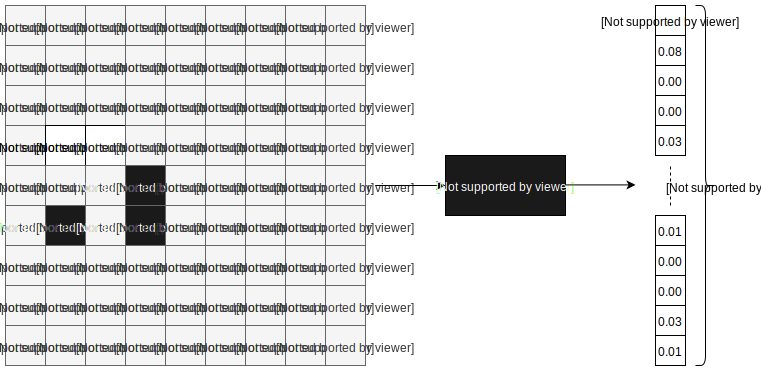
  
Figure I.2: Basic input and output for our Neural Network for a $9 \times 9$ board game.
  

<aside class="note">In the previous picture I've used an input picture of size $9 \times 9$. The usual size of the
game of Go is $19 \times 19$. Yet, for clarity reasons, I will, from now on, only draw the $9 \times 9$
version of the Go board game. Obviously, since the board game is smaller, the size of the output vector should be $9 \times 9 + 1 = 82$</aside>

Even though this way of encoding the board game seems legit, it actually has some huge drawbacks. Indeed, when we encode the state of the board game, we want to make sure that **ALL** the information is present and that we don't miss anything!

<aside class="question">Hmmm... What do you mean? With this way of encoding the board game, I know the black position, the white position and also the places that are empty? What other information do I need?</aside>

Well. If you've never played the game of **Go** and don't know the rules, you cannot guess what are the missing information. Indeed, one rule of the game of Go stipulates that **repetitions are forbidden**! I'm not a Go player myself, but what this rule implies is that, in order to avoid repetitions, we should "keep in memory" the previous states of the game. Hence, instead of giving our Neural Network an image of size $19 \times 19$ we will actually give it a tensor of size $19 \times 19 \times K$ that contains the $K-1$ previous states of the game as well as the current state of the game. **DeepMind** chooses $K = 16$. \\
Now, the other piece of information we are missing from the board game is the **komi**. Recall that the **komi** are
just some extra points that we add to the points of the **white** player at the end of the game to balance the game because, in the game of Go, the black player always starts the game and hence has a certain advantage. \\
If we only pass $1$ input image to the Neural Network, it will not be able to know which player is currently playing the game and, so, because the next best action to choose is different for the black player and for the white player, we need also a way to stipulate what is the color of the player currently playing. \\
To do that, DeepMind chooses to add one extra layer to the input. This extra layer of size $19 \times 19$ contains $1$ everywhere if the black player is to play and $0$ if the white player is to play. The input given to
the Neural Network is thus as follow:

  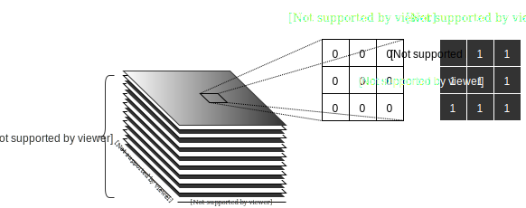
  
Figure I.3: The input given to the Neural Network consists of the $15$ previous states of the game + the current state of the game and the color which encodes which player is to play.
  

So that we now know the real input that we feed to the Neural Network, we should now focus on the real output we want our Neural Network to give us. Indeed, up until now the output of our Neural Network doesn't quite match the output of the AlphaGo Zero Neural Network...

<aside class="question">Lemme think. At each step of the game I want to know what is the next best action to choose (like the minimax algorithm). I cannot really think of anything else that our Neural Network should output dude...</aside>

Don't worry! Let's go through this together. Actually, our output is not that bad. We want our Neural Network to output a vector that associates to each next action a probability representing how likely an action is good to take. However, we would like our Neural Network to, also, output another piece of information! \\
To understand that, we need to think about how a Neural Network works. \\
Before we can use our Neural Network, we first need to train it. During the training phase, if I take the example of the previous article, we had to give our Neural Network both the inputs and the outputs:

- $1000$ pictures of cats and we tell him, using a **one-hot encoding** vector, that these pictures contain cats
- $1000$ pictures of giraffes and we tell him, using a **one-hot encoding** vector, that these pictures show giraffes
- ...

To train our Neural Network to tackle the game of **Go**, we also need to give him data as input and data as output. Well, according to you, what would be the data we can collect to train our Neural Network?

We need to collect lot's of game. Let's say we've collected $1$ **million** games. What are the information I know from these games? Well, I actually know, **for each game**:

- All the actions taken at each step by both players
- Which player won the game in the end

So, because we know who wins the game. We can tell it to our Neural Network! To tell it to our Neural Network, we just need, during the training phase, to feed the output with the information: `the black player wins this game` or
`the white player wins this game`.

If we actually provide this information as output to our Neural Network during the training phase, that means that our Neural Network should try to predict who wins the game. Hence. Not only we want our Neural Network to output a probability vector that tells us how good each next action is, but we also want it to guess who will win the game! \\
<a href="#figI4">Figure I.4</a> shows the real output of the AlphaGo Zero Neural Network.

  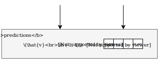
  
Figure I.4: The Neural Network outputs 2 quantities: $\hat{v}$ which encodes whether we win ($= 1$) or we lose ($= -1$) the game and $\hat{p}$ which tells us what are the best next actions to take.
  

<aside class="question">Collecting the input images and creating the ground truth output labels (giraffe, cat, dog, gorilla, panda) for the example of the animal identification is easy... But how do I create the ground truth probability vectors for each step of the game for the game of Go?</aside>

It's a good question and don't worry we will explain **how** we can generate these `ground truth` labels for the probability vector! But, first thing first, let's recap what are the inputs and the outputs of our Neural Network:

  
  
Figure I.5: The Neural Network Architecture and it's Inputs/Outputs
  

<aside class="note">I've used a hat to designate the values <b>predicted</b> by the Neural Network. The values without an hat are the <b>ground truth</b> values. As you can already see in the previous picture, the ground truth value of the probability vector <b>will not be</b> a one-hot encoding vector!</aside>

Let's now dive a bit into the architecture of the Neural Network. According to the <a href="#figI5">Figure I.5</a> the first layer of the Neural Network is a **convolutional layer** while the $40$ next layers are **residual layers**. Finally, there are 2 heads at the end of the model. The policy head is in charge of outputting the probability vector $\hat{p}$ while the value head, $\hat{v}$, is responsible for outputting whether the current player has won the game or not.

Each layer is actually composed of unitary layers, so let's further delve into it. The convolutional layer is actually composed of 3 layers as it is depicted in the below Figure:

  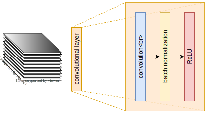
  
Figure I.6: The components of a Convolutional Layer of the AlphaGo Zero Neural Network
  

The first component is actually the **convolution**. We have already explained in the previous article what is a convolution and what is its purpose, so we will not talk about this layer here. The 2 remaining layers are respectively the **batch normalization** and the **ReLU**. To explain each one of these things I would actually need a whole article (but again, there are a lot's of resources on the internet that will explain that to you very well, starting from the research papers in which these techniques were first mentioned). I will just explain, quickly what is the goal of each of these layers:

+ **Batch Normalization**: The goal of this layer is to reduce the covariate shift introduced by the previous layers in order to speedup the training phase. It also improves the performance as well as the stability of the neural network. \\

What does it mean to reduce the covariate shift? For example, as stated in the previous article, the goal of the convolutional layer is to find good filters. Now, if there is a succession of convolutional layers (as it is the case here because a residual layer is actually an upgraded version of a convolutional layer), then it means that the Neural Network needs to update the coefficients of each filter during the training phase in order to have the best filters at the end of the training phase. The problem is that, because the convolutions are successive, it means that a small change in the first filter will introduce a huge change at the end of the chain. A bit like the **butterfly effect**. Hence, during the training phase, the Neural Network will struggle to stabilize and thus its learning pace will be slower. To avoid this undesirable effect, after each convolution we can
normalize the data (see the previous article if you don't know what it means to normalize the data) so that the data that flows through the Neural Network has a mean of $0$ and a variance of $1$.
+ **ReLU**: **ReLU** stands for REctified Linear Unit. A fancy name for a basic function. Indeed, the **ReLU** is just a function and it is defined by: $ReLU(x) \rightarrow max(0, x)$. To be quick, this function allows the Neural Network to be more efficient because it allows the Neural Network to work on a broader space. I **oversimplify** it, but, I will try to draw a basic example. Suppose you are given the following numbers:

$$\begin{align}5\;\; 8\;\; 12\;\; 25\;\; 3\end{align}$$

and you are asked to be the closest possible to the number $436$ by only using the $+$ and the $-$ operators.
Well, the best you can do is to add all the numbers and you'll get $5 + 8 + 12 + 25 + 3 = 53$ which is very far from
the targeted number.

Now, you are asked the same question, but you are allowed to use the $\times$ and the $\div$ operators. Then you can
reach the targeted number: $(5 + 12) \times 25 + (8 + 3) = 436$.

You can think of the `ReLU` as this function that allows you to use the $\times$ and $\div$ operators. Put it differently, the $ReLU$ will allow your Neural Network to be more efficient because it will let him come closer to the thing it is trying to approach.

<aside class="note">In the end, the <b>batch normalization</b> and the <b>ReLu</b> are just techniques to improve the performance of the Neural Network.</aside>

Let's now take a look at what is a `residual layer`. Residual layers were introduced by Microsoft in **2015** when they've released a Neural Network called `Resnet`. At that time, this Neural
Network was the state-of-the-art for object detections. <a href="#figI7">Figure I.7</a> depicts the unitary building blocks of a `residual layer`.

  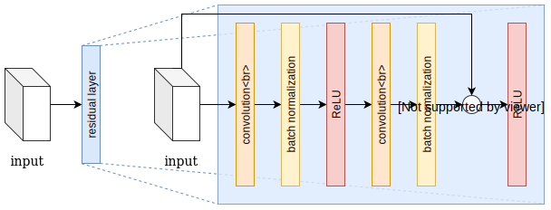
  
Figure I.7: The basic components of a residual layer of the AlphaGo Zero Neural Network
  

As I told you a little bit before, a `residual layer` is just an upgraded version of a `convolutional layer`. Indeed, we can see that it is made of the same units:

+ Convolutional Layer
+ Batch Normalization
+ ReLU

The difference comes from the $\bigoplus$ which means that we add the `input` tensor of size (H, W, C) with the output of the last normalization layer also of size (H, W, C). Indeed, recall (see the previous article) that the input is a tensor of length $3$. For example an RGB image is a tensor because the size of the image is (H, W, 3) where the $H$ is the height of the image, $W$ its width and the number $3$ comes from the red, green and blue layers needed to encode the image. \\
However, the `input` tensor is not necessarily an image because it can be the `output` tensor of some previous transformations (other `convolutional` or `residual` layers for example).

Indeed, the idea of adding the tensors together will greatly improve the strength of our Neural Network!

<aside class="question">Wait?! Are you telling me that a basic operation such as an addition (a thing I've learned when I was 6y old) will greatly improve the performance of the Neural Network?</aside>

Yes, you perfectly understood! I will skip the mathematical foundation behind the **why**, but I will give you an intuition of why this addition makes the difference! We have seen, in the previous article, that, during the training phase, a Neural Network is merely trying to find good filters in order to be able to answer the question we are asking him:

- Identify Animal
- Identify the best next move for the game of Go
- ...

The thing is, that, during the training phase, the Neural Network will update the filters starting from the end and moving upwards. To do that, the Neural Network will browse its own architecture in the opposite direction. Let's imagine that the $\bigoplus$ connection doesn't exist on <a href="#figI7">Figure I.7</a>. It means that the Neural Network will need to go through the layers:

> batch normalization $\rightarrow$ convolution $\rightarrow$ ReLU $\rightarrow$ batch normalization $\rightarrow$ convolution

in this order before entering the previous `residual` layer (recall that in this architecture there are $40$ successive **residual layers**!). \\
For example, to be able to update the filters of the **first** `convolutional` layer of the **first** `residual` layer, the Neural Network would need to go through all the
transformations from the $40^{th}$ `residual` layers down to the $1^{st}$ `residual` layer. It's a long way to go, and because it is a long way to go, the information will likely fade away and hence the first few filters of the Neural Network will not be updated accurately. To avoid that the information fade away, we add these $\bigoplus$ connections (a.k.a `skip connections`). These connections allow the original information to take a parallel path that doesn't undergo any transformation... And thus we can keep track of the unchanged information and so the Neural Network will be able to update the first few filters of its `convolutional` layers more accurately!

Let's now take a look at the units that composed the **value head** and the **policy head**.

The **value head** and the **policy head** architectures are respectively represented on <a href="#figI8">Figure I.8</a> and <a href="#figI9">Figure I.9</a>

  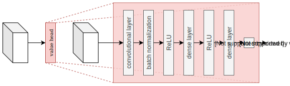
  
Figure I.8: The basic components of the Value Head of the AlphaGo Zero Neural Network
  

  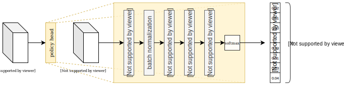
  
Figure I.9: The basic components of the Policy Head of the AlphaGo Zero Neural Network
  

We have already seen all the building blocks of these two architectures, either in the article or in the previous article, so I won't talk about it here. Nevertheless, we can see that,
at the end of the **value head** architecture, we are using the $\tanh$ function. We use this function because it has the property (to be differentiable) to map any real numbers to any numbers in the range (-1, 1). This is cool because, as we have mentioned earlier, we want our Neural Network to output either $-1$ or $1$ to be able to predict if we will lose or if we will win the game... Here, our Neural Network will not necessarily output $-1$ or $1$ because it can output $-0.73$ for example. But this value can be interpretated as:

> I'm sure at $73$ % that I will loose this game.

That's all. So let's briefly recap. The first part of the `AlphaGo Zero` intelligence relies on a **Neural Network** that takes as input $16$ consecutive plays of a same game + an information about what player to play (The black or the white player). This Neural Network is trained to be able to output 2 pieces of information:
+ Whether it thinks we will win or not the game based on the $16$ consecutive plays we give him as input.
+ What it thinks will be the next best action to choose to potentially win the game.

That's it. There is nothing fancy. Here again, as it is a Neural Network, we will need to train it on lot's of data... Like millions and millions of games... One idea would be to use a database that contains the very best games from the best Go players in the world. That has already been done by DeepMind and this Artificial Intelligence was named `AlphaGo` (Without the `Zero`). The problem is that, if we do that, we will quickly be limited by the number of games we have in our database. `AlphaGo` was able to defeat the World Go Champion, but `AlphaGo Zero` is even better than `AlphaGo`...
\\
Also, the other issue, we've already noticed, is that, in order to train our Neural Network, we would need the **ground truth** probability vectors for each state of each game. Having the **ground truth** winner of the game is a piece of cake because this information is naturally given for each game, but how do we know the **ground truth** probability vector for each state of each game. It's a vicious circle!
\\
The **ground truth** probability vectors are actually what we want, to be able to play the game of Go like a God, because, at each step of a game, these vectors will tell us what is the **TRUE** best action to take! So... In order to train our Neural Network to approach the **true probability vectors** for each step of each game... we need the **true probability vectors** (which we don't have... Because to be able to have these vectors we would need to generate and evaluate all the different possible games of Go: roughly $10^{170}$ games, needless to say that, with our current technology it's totally impossible!)

But, what did **DeepMind** do then? If you want to know the answer to this question, you will need to subscribe to a premium membership.

<aside class="question">Wait?! What! You little piece of sh*t! Are you kidding me? I need to pay to...</aside>

Obviously no! Relaxxxx dude! Take a deep breath, digest everything you've just learned and once you feel you're in for more adventure, then follow me!

# II MCTS
I hope, that, before you continue reading, you've already assimilated everything and that you have rested your neurons because the next part might be a bit complicated!

> Don't worry about my mental health dude, my neurons can handle your explanations! 😎

Ok so follow me... Here we go!

## II.1 Recap
Let's first recap a little bit how the traditional `MCTS` algorithm works. Each time I want to make a move, I need to simulate $N$ games (let's say $N = 1600$) to know which of my next moves are the best. The problem is that, in order to know whether my move is good or not, I need to do a **rollout**. That is to say that I need to randomly sample all the next actions (mine and my opponent's actions) until the end of the game. At the end of the game, I will know whether I win or not and I'll propagate that information through all the actions I've taken in order to tell to my algorithm:

> The very first action I've taken is good since It makes me win the game **or** is terrible since it makes me lose the game

for the subsequent simulations. Obviously all the details of this algorithm are available in my <a href="https://twice22.github.io/go-part1/" target="_blank">previous blog post</a>. The thing is that, in order for the `MCTS` algorithm to work, we need to use **rollouts** because these rollouts allow to find the information "I win" or "I loose" that we can only have if we simulate a game till the end!

Using **rollouts** to evaluate the quality of an action is not the best solution and this is why DeepMind had decided to replace the **rollout** evaluations by a Neural Network (The one I've presented you in the first section of this article).

## II.2 Customized MCTS
DeepMind brings lot's of tweaks to the `MCTS` algorithm. Among these tweaks we can list:
+ the use of a different **UCT** value
+ the addition of a Dirichlet noise to the probability of selecting each next actions from the root node
+ The use of a Neural Network to evaluate the nodes of the tree instead of the **rollouts**

Here we will **explain** their choices because they haven't randomly made them! Let's first understand how we can use a Neural Network to evaluate each state of the game of **Go**.

For the first simulation, no stone has been placed on the board game. Since the state of the game is represented by the $16$ previous states as well as a state describing the next player to play (See <a href="#figI3">Figure I.3</a>), and because the **black** player is always the first player to play for the game of **Go**, to choose the next best action we will solely give this information to our Neural Network and it will give use a probability vector for all the possible next states as well as which player is likely to win the game (See <a href="#figI4">Figure I.4</a>). The first simulation of the revisited `MCTS` algorithm is represented on <a href="#figII21">Figure II.2.1</a>

  
  
Figure II.2.1 First simulation of the MCTS algorithm. The board game is empty. We pass the current board game as well as the $15$
    previous states (empty board games) and an extra layer containing $0$ everywhere since the next player to play is the <b>black</b> player. The Neural Network is hence feeded with
    a tensor of size $(9, 9, 17)$ (or $(19, 19, 17)$ if we are using the traditional $19 \times 19$ board game). It will give us back a tensor of size $9 \times 9 + 1$ (or $19 \times 19 + 1$ in the case of the traditional $19 \times 19$ board game) containing a probability for each state that tells us how likely we will want to choose each state knowing the current situation of the game. The Neural Network will also output a float in the range $(-1, 1)$ telling us how likely it thinks we will win or lose the game.
  

The first node of the Tree represented by a double circle with the letter **R** inside depicts the current state of the game. From this state (empty board) we can take $9 \times 9 + 1 = 82$ actions (The extra action is the `pass` action). These are represented by the small circles numbered from $0$ to $81$. Each of these actions will lead to a different state of the game. These new states are depicted by the circle with the letter $S$ inside.

In all of these **action nodes** we will store $4$ values:
+ $P(s, a_i)$: The probability to choose the $i^{th}$ action if we are in state $s$
+ $N(s, a_i)$:  The number of time we choose the $i^{th}$ action when we were in state $s$
+ $W(s, a_i)$: The total value (sum of the $v$ outputed by the Neural Network) we got from choosing the $i^{th}$ action when we were in state $s$
+ $Q(s, a_i)$: This quantity is the mean value we get from selecting the $i^{th}$ action in state $s$: $Q(s, a_i) = \dfrac{W(s, a_i)}{N(s, a_i)}$

After this first simulation, as in the traditional `MCTS` algorithm, we will select the action that maximizes the **UCB** value. Here, and in the rest of this article, the **UCB** value will be written $U(s, a)$ and $U(s, a)$ is given by the following formula:

$$\begin{equation}
U(s, a) = \dfrac{W(s, a)}{N(s, a)} + c_{puct} P(s, a) \dfrac{\sqrt{\sum_b N(s, b)}}{1 + N(s, a)}
\end{equation}
$$

Here, as in the traditional `MCTS` algorithm, $U(s, a)$ is defined by 2 terms:
+ the mean score for the pair $(s, a)$ represented by the quantity $\dfrac{W(s, a)}{N(s, a)}$
+ A penalizing term for the pair $(s, a)$ represented by the quantity $P(s, a) \dfrac{\sqrt{\sum_b N(s, b)}}{1 + N(s, a)}$

<aside class="note">The term $c_{puct}$ is just a constant chooses to balance between the exploitation and the exploration... Nothing new here!</aside>

Let's suppose that the action that maximizes the $U(s, a)$ is the action $13$, We will then put a black stone in the $13^{th}$ position of the board and we will then pass the new state of the game to the Neural Network. The second simulation is depicted on <a href="#figII22">Figure II.2.2</a>

  
  
Figure II.2.2: Second simulation of the MCTS algorithm. The board game contains one black stone in position $13$. We pass the current board game as well as the $15$
    previous states (empty board games) and an extra layer containing $1$ everywhere since the next player to play is the <b>white</b> player. The Neural Network is hence feeded with
    a tensor of size $(9, 9, 17)$ (or $(19, 19, 17)$ if we are using the traditional $19 \times 19$ board game). It will give us back a tensor of size $9 \times 9 + 1$ (or $19 \times 19 + 1$ in the case of the traditional $19 \times 19$ board game) containing a probability for each state that tells us how likely we will want to choose each state knowing the current situation of the game. The Neural Network will also output a float in the range $(-1, 1)$ telling us how likely it thinks we will win or lose the game.
  

Since the action that maximizes $U(s, a)$ is the action $13$, we will expand the nodes from this action. That is to say that the value $P(s, a)$ returned by the neural network will be stored in the child nodes of the node $13$ (colored in black in the above figure).

I didn't represented it on the above picture, but, since we selected the action $13$, we have:
+ $N(s, a_{13}) = N(s, a_{13}) + 1 = 0 + 1 = 1$
+ $W(s, a_{13}) = W(s, a_{13}) + v(s, a_{13}) = 0 + (-1) = -1$
+ $Q(s, a_{13}) = W(s, a_{13})/N(s, a_{13}) = -1/1 = -1$

Since, in the very beginning, $\forall i$,  $N(s, a_i) =  W(s, a_i) = 0$\\
\\
As in the traditional `MCTS` algorithm, these values are backpropagated through all the nodes we have visited before reaching the node $13$. Here the only node before the node $13$ is the **root** node, so we will only backpropagated these values to the **root** node.

Let's now see what happens during the $j^{th}$ iteration of the algorithm. Let's suppose, for example, that before the $j^{th}$ iteration, we run several other simulations and that, in one of these previous iterations we have visited the node $80$ (i.e. we have simulated a player putting a stone in position $80$), then our Tree will have, similarly to the previous iteration, expanded the nodes from the node $80$.

<aside class="note">I'm mentioning that the node $80$ has been expanded by a previous iteration that happened before the $j^{th}$ iteration so that you're not surprised that the node $80$ has been expanded on <a href="#figII23">Figure II.2.3</a></aside>

Having said that, let's now go back to the `MCTS` algorithm. For this $j^{th}$ iteration, we start back from the root node $r$. Starting from the root node, we compute $U(r, a_i)$ for each action $a_i$. Let's suppose that the action that maximizes $U(s, a)$ is again the action $13$, then, since we have already expanded the nodes of the $13^{th}$ action, we will, this time, compute $U(s_{13}, a_i)$ for all actions $a_i$, starting from state $s_{13}$. Let's now assume that the action that maximizes $U(s, a)$ computed from the node $13$ is the action $59$. Let's suppose that this action hadn't been visited in the previous iterations to the current $j^{th}$ iteration, then it means that we need to expand the nodes below the action $59$. To do that, we will pass to the Neural Network the state of the game:

> $14$ empty states, $1$ state with a **black** stone on position $13$, $1$ state with a **white** stone on position $59$ and a state containing $0$ everywhere since the next player to play is the **black** player.

This situation is depicted on <a href="#figII23">Figure II.2.3</a>

  
  
Figure II.2.3: $j^{th}$ simulation of the MCTS algorithm. The board game contains one black stone in position $13$ and one white stone in position $59$. We pass the current board game as well as the $15$ previous states and an extra layer that contains $0$ everywhere since the next player to play is the black player. The Neural Network is hence fed with
    a tensor of size $(9, 9, 17)$. It will give us back a tensor of size $9 \times 9 + 1$ containing a probability for each state that tells us how likely we will want to choose each state knowing the current situation of the game. The Neural Network will also output a float in the range $(-1, 1)$ telling us how likely it thinks we will win or lose the game.
  

Again, as I've mentioned previously, we need to backpropagate these values back to all the nodes we visited before the node expansion. Here, we need to add the value $v(s, a)$ to the quantity $W(s, a)$ stored in the **root** node and in the node $13$. We also need to update the number of visits of the **root** node and the node $13$. Since $W(s, a)$ and $N(s, a)$ are updated, the $Q(s, a)$ values of these nodes are also updated.

We keep on simulating several MCTS expansions until we reach a certain number of simulations that, we beforehand have fixed ourself. Let's say we want to simulate $1600$ MCTS expansions. Then we keep on iterating until we reach the $1600^{th}$ expansion. Once the $1600^{th}$ expansion is finished, similarly to the traditional `MCTS` algorithm we will choose the action to perform based on a certain criterion. While for the [Traditional MCTS algorithm](https://twice22.github.io/go-part1/) I've mentioned that, at the end, we will select the state whose average value is the highest, DeepMind chooses to use a different criterion to choose which action to perform.

Indeed. For the `MCTS` algorithm I've presented in a previous article, let's say I have 3 actions labeled $a_1$, $a_2$ and $a_3$. Let's say that their average values after a certain number of simulations are respectively: $Q(s, a_1) = -0.3$, $Q(s, a_2) = 0.5$ and $Q(s, a_3) = 0.4$, then the algorithm will choose to perform the **second** action since it leads to the best average value (which means that we're likely to win more often if we perform the action $a_2$ then if we perform the other actions).

At the end of a certain number of simulations, **Deepmind**, on the contrary, choose a different criterion to let the Neural Network selects the action that it should perform. Their algorithm will select an action $a$ to perform among all the possible actions according to this formula:

$$\begin{equation}
a \sim \dfrac{N(s, a)^{1/T}}{\sum_b N(s, b)^{1/T}}
\end{equation}$$

<aside class="question">Wow, What is this dude? This is currently what happens to my brain right now &rarr; 💥</aside>

<aside class="note">Don't worry, I will explain this formula! Did I ever let you down? So, come one, chill a bit. Here is the explanation.</aside>

First of all the $T$ is called the temperature parameter. I won't enter into the detail of why it is named like this. What matters is that, **DeepMind** chooses to change this parameter through time. They fix it to be $1$ for the first $30$ moves of the game (Not the first $30$ moves of the simulations of the `MCTS`, the real first $30$ moves taken after $30$ runs of $1600$ simulations of the `MCTS` algorithm) and then they decay it with the number of moves to slowly approach $0$.

Let's quickly understand what is the purpose of this **temperature** parameter. To do that, we will compare the difference between 2 configurations. One where $T=1$ and one where $T=0.1$. We will also assume that we can only choose between $2$ actions, such that:
+ $N(s, a_1) = 40$: We have selected the action $a_1$ $40$ times
+ $N(s, a_2) = 60$: We have selected the action $a_2$ $60$ times

The below table presents the values we got for both of these situations:

  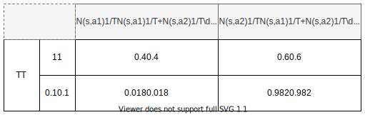

In this table, the numbers that we computed:

$$\dfrac{N(s, a_1)^{1/T}}{N(s, a_1)^{1/T} + N(s, a_2)^{1/T}}\quad\quad\text{and}\quad\quad\dfrac{N(s, a_2)^{1/T}}{N(s, a_1)^{1/T} + N(s, a_2)^{1/T}}$$

represent the probability that we are going to select an action over the others(s) (More on this latter). Hence, if $T=1$ then we will select the action $a_2$ with a probability $= 0.6$, while, if $T=0.1$, we will select it with probability $=0.982 \approx 1$.
So, when $T$ is small (which is the case when we approach the end of the game), we will select **the best action** irrespectively of the probability of the other action(s) (We say that we act **greedily**). On the contrary, at the very beginning of the game, the probability associated with each action matters and we will let the algorithm selects an action according to its probability.

$N(s, a_i)$, as we have highlighted a bit earlier, is the number of times we choose the action $a_i$ when we were in state $s$. If we fix the number of `MCTS` simulations to be $1600$ then naturally $N(s, a_i) \le 1600$ for all actions $a_i$. Indeed, the worst we can do is to always choose the same action $a_i$. In this case $N(s, a_i) = 1600$.

Finally, the symbol $\sim$ is here to say that we are going to choose $a$ according to the probability distribution defined by the right hand side of the formula, that is to say by:

$$\dfrac{N(s, a)^{1/T}}{\sum_b N(s, b)^{1/T}}$$

Let's work on an example to understand this formula. \\
Let's assume we've just started the game (there is still no stone on the board game). Let's further assume that we've just finished our $1600$  `MCTS` simulations. Finally, for the sake of simplicity, let's assume that we can only choose among $3$ actions<a href='#note_1'>1</a>.

Since we have run $1600$ simulations, it means that:

$N(s, a_1) + N(s, a_2) + N(s, a_3) = 1600$

Let's assume that we have:
> $N(s, a_1) = 200 \quad\quad N(s, a_2) = 750 \quad\quad N(s, a_3) = 650$

Since we are working on **the first** movement of the game, we have $T=1$. So, now, let's compute, for **each action**:

$$\dfrac{N(s, a)^{1/T}}{\sum_b N(s, b)^{1/T}} = \dfrac{N(s, a)}{\sum_b N(s, b)}$$

and put the result in a table:

  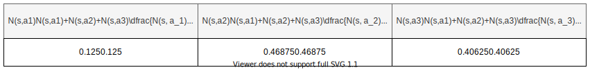

Now, we can finally understand the $\sim$ symbol. This symbol means that, with probability $0.125$ we gonna choose the action $a_1$, with probability $0.46875$ we gonna choose the action $a_2$ and with probability $0.40625$ we gonna choose the action $a_3$

Hence, while in the traditional version of the `MCTS` algorithm that I've presented you, we always chose greedily the best action, here we will allow ourself to choose potentially some less good actions, but with a smaller probability (As I've mentioned earlier, due to the **temperature** parameter, the greedily behavior kicks-in when we are approaching the end of the game).

<aside class='note'>To be able to choose one of the $3$ actions with their respective probability, we just need to create the cumulative table: $[0.125, 0.59375, 1.0]$ and then to generate a random float number in the range $(0, 1.0)$. If the float is less than $0.125$ then we choose the action $a_1$. If the random number generated is in the range $(0.125, 0.59375)$ then we choose the action $a_2$. Finally, if the random number is greater than $0.59375$ then we will choose to perform the action $a_3$.</aside>

Let's now understand why selecting our action $a$ based on this criterion is likely to be a good idea. Indeed, here, we don't select the action $a$ based on our average value $Q(s, a)$ and why this? \\
Well, it isn't explicitly written, but selecting the action $a$ based on the probability distribution:

$$\sim \dfrac{N(s, a)^{1/T}}{\sum_b N(s, b)^{1/T}}$$

actually incorporates all the information about how good our action $a$ is. \\
To understand that it is a good criterion, you need to recall how the `MCTS` algorithm works. The more we have visited a state the more confident we are about the quality of the state (think about the analogy with the restaurants: The more people have reviewed a restaurant on Google the more confident you are about the average grade of the restaurant).
Hence, selecting an action $a$ based on how many times we have selected this action during the simulations makes sense because it means that we are quite confident about the **quality** of this action.

<aside class="question">Ok, I'm quite confident about the <b>quality</b> of the action, but It doesn't mean I'm confident about the fact that the quality is <b>high</b>. For example, if there are $2000$ reviews about a restaurant on Google and the average grade is $1.7$ over $5$, then not only I'm confident about the <b>quality</b> of the restaurant, but also I'm confident about the fact that I shouldn't eat there because the grade is really bad!</aside>

Hey, dude! I see that you're asking yourself the right questions! Before I try to convince you that their criterion is good, I'd like to make you aware that, in real life you would **hardly** see a restaurant that has both $1.7$ average stars and $2000$ reviews because after a few bad reviews, people would have stopped to go to this restaurant and hence this restaurant will never attract people anymore and will never receive as many reviews as $2000$ (Indeed, the restaurant has a great chance to die).
\\
Having said that, let's see why **the criterion they've used, associates the highest probability to the best action**. To do that, we need to go back to the formula they are using as a criterion:

$$\begin{equation}
U(s, a_i) = \underbrace{\dfrac{W(s, a_i)}{N(s, a_i)}}_{\text{mean value}} + c_{puct} \underbrace{P(s, a_i) \dfrac{\sqrt{\sum_{i=0}^{C^2} N(s, a_i)}}{1 + N(s, a_i)}}_{\text{penalizing term}}\label{eq:4}
\end{equation}$$

The penalizing term can be broken down into 2 parts:
+ $P(s, a_i)$ : the probability of selection the action $a_i$ when we are in state $s$
+ $\sqrt{\sum_{i=0}^{C^2} N(s, a_i)}/(1 + N(s, a_i))$: A penalizing term that decreases with the number of times we have selected a particular action $a_i$.

<aside class="note">Here $C$ represents the size of the board game. Usually $C=19$. But some board games with $13$ and $9$ cases also exist. If we assume that we always run $1600$ simulations then $\sum_{i=0}^{C^2} N(s, a_i) = 1600$ since at each simulation we <b>need</b> to select an action. I have already explained this before in the case of $3$ actions.</aside>

Let's understand this formula. To do that we will suppose that we have finished to run the $1600$ `MCTS` simulations. Among all the available actions we will only consider $2$ actions:

1. an action $a_1$ such that $N(s, a_1) = 1200$
2. an action $a_2$ such that $N(s, a_2) = 10$.

Let's compute the **second part** of this penalizing term for these 2 actions:
+ action $a_1$: $\sqrt{1600}/(1 + 1200) = 40 / (1 + 1200) \approx 1/30 \approx 0.033$
+ action $a_2$: $\sqrt{1600}/(1 + 10) = 40 / (1 + 10) = 40/101 \approx 3.63$

<aside class="note">The $+1$ added to the denominator is only here to avoid dividing by $0$ and hence have a <b>DivisionByZero</b> error at RunTime. Indeed, recall that the $U(s, a)$ values are computed for <b>all</b> the actions. Even the actions that haven't been selected (i.e. even the action $a_i$ such that $N(s, a_i) = 0$)</aside>

<aside class="question">Okay, fair enough! But what about the first part of the formula: $W(s, a_i)/N(s, a_i)$. Why there are no $+1$ in the denominator there? Hey hey, I got you and your filthy explanations 😈</aside>

<aside class="note">Good point! I'm sorry for you, but I also have an explanation for that! In the code they've initialized $Q(s, a)$ to $0$ and use $Q(s, a)$ instead of computing $W(s, a)/N(s, a) = 0/0 =$ <i>undefined</i> when no state has been visited.</aside>

Let's go back on track, would you? \\
\\
In equation $\ref{eq:4}$, **the mean value, $W(s, a_i)/N(s, a_i)$ is a number between $-1$ and $1$**. Indeed, as we have explained earlier $W(s, a_i)$ is incremented by the value $v(s, a_i)$ returned by the Neural Network and this value is always in the range $(-1, 1)$. Moreover, each time we increment $W(s, a_i)$, we also need to increment $N(s, a_i)$ by $1$ which means that:

- In the best case scenario, we always got $v(s, a_i) = 1$ from the Neural Network and so $W(s, a_i)/N(s, a_i) = 1$
- In the worst case scenario, we always got $v(s, a_i) = -1$ and so $W(s, a_i)/N(s, a_i) = -1$
- In a **particular** case where we have visited an action $a_i$, $3$ times and received:
  1. $v(s, a_i) = -0.2$ the first time
  2. $v(s, a_i) = 0.3$ the second time
  3. $v(s, a_i) = -0.2$ the third time

Then: $W(s, a_i)/N(s, a_i) = (-0.2 + 0.3 - 0.2)/3 \approx -0.033$

Since an action that has been selected $1200$ times will add approximately $0.033$ to the **mean value** while an action that has been selected $10$ times will add $3.63$, we can generalize and say that the more we have selected an action, the smaller the penalizing term will be. \\
Indeed, adding $3.63$ to a number in the range $(-1, 1)$ is a lot, while adding $0.033$ is negligible. The thing is, we have omitted one part of the **penalizing term**. We are not adding $3.63$ nor $0.033$ to the **mean value**. We are, instead, adding $P(s, a_1) \times 0.033$ and $P(s, a_2) \times 3.63$

Now, We're going to use absurd reasoning. For this, we will assume that something is **true** and that this leads to an impossible situation. This will mean that our initial assumption was **wrong**.

Let's assume that, at the end of the $1600$ `MCTS` simulations, we have $U(s, a_2) \gg U(s, a_1)$<a href='#note_2'>2</a>. This assumption doesn't seem that terrible since, we've just seen that the penalizing term of selecting the action $a_2$ added $P(s, a_2) \times 3.63$ to the **mean value** while the penalizing term of selecting the action $a_1$ added $P(s, a_1) \times 0.033$.

Now, if we assume that, at the end of the $1600$ simulations, $U(s, a_2) \gg U(s, a_1)$, then, because the `MCTS` algorithm selects the action $a_i$ that maximizes the $U(s, a)$ quantity, it would have meant that the `MCTS` algorithm would have selected the action $a_2$ a lot. But we know that it is not the case since the algorithm only selected the action $a_2$, $10$ times (contradiction). So, it means that our initial assumption is **wrong**, that is to say that, $U(s, a_2) \not{\gg} U(s, a_1)$.

The only option for $U(s, a_2) \not{\gg} U(s, a_1)$ is that $P(s, a_2) \ll P(s, a_1)$. \\
For example, $P(s, a_2) = 0.001$. With this probability, we are only adding $0.001 \times 3.63 = 0.00363$ to the **mean value**.

The take-off of this demonstration is that:
+ If an action $a_i$ has a low probability $P(s, a_i)$ then we will not select it a lot since both its **mean value** and its **penalizing term** will be small. Hence $U(s, a_i) = $ **mean value** $+$ **penalizing term** will be small. Because the `MCTS` algorithm selects the action $a_i$ that maximizes $U(s, a_i)$, we will likely not select our action $a_i$ that is associated with a small $U(s, a_i)$ value.
+ If an action has a high probability $P(s, a_i)$ then its **mean value**: $W(s, a_i)/N(s, a_i)$ is likely to be positive and close to $1$. So not only the **mean value** of that action is big but as $P(s, a_i)$ is big we are weighting the small second part of the penalizing term with a large value and hence it's $U(s, a_i)$ will be big. Since the `MCTS` algorithm selects the action $a_i$ that maximizes $U(s, a_i)$ and because, in this case, $U(s, a_i)$ is big, it means that we will likely select this action again in the remaining simulations.

Put it all together:

<aside class="note">The more we have selected an action during the simulations, the more likely the action is good</aside>

Having said that, it makes sense that, at the end of our $1600$ simulations, we select our action based on this criterion:

$$\begin{equation}
a \sim \dfrac{N(s, a)^{1/T}}{\sum_b N(s, b)^{1/T}}
\end{equation}$$

<a href="#figII24">Figure II.2.4</a> depicts an example of a tree at the end of the $1600$ simulations. The black nodes represent the different actions that have been selected during these $1600$ simulations.

  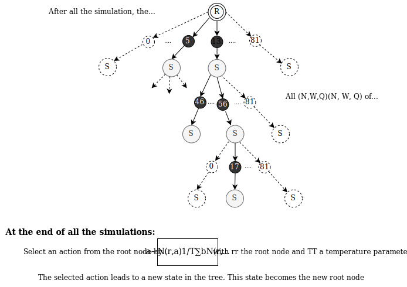
  
Figure II.2.4: Example of a tree we could have after $1600$ simulations. The black nodes represent the actions that were selected.
  

Like in the Traditional `MCTS` algorithm, at the end of our simulations we will select an action and we will build a new tree starting from this new node, or put it differently we will run $1600$ other simulations starting from the new state of the game that now contains one black stone.

Each time we want to put a stone on the board we will use $1600$ runs of the `MCTS` algorithm until we reach the end of the game.

<aside class="question">Ok, Sherlock! You made your point. This criterion is good. However, there is still one thing I cannot get my head around. How can this algorithm work? I mean their algorithm relies on the quality of their Neural Network since it outputs the value $P(s, a)$ and $v(s, a)$<a href='#note_3'>3</a> that are used in the $U(s, a)$ value. If $P(s, a)$ and $v(s, a)$ are not good, $U(s, a)$ will have no meaning and the whole robustness of the algorithm will be jeopardized. So how do they train their Neural Network so that these values are good in order to have a robust algorithm?</aside>

Yes you're right except for one thing! Their algorithm doesn't rely on the quality of their Neural Network. It's rather the opposite. Their Neural Network relies on the `MCTS` algorithm. Indeed, they are using the `MCTS` algorithm to train their Neural Network! Follow me, I will tell you the black magic behind the question. \\

More Formally, I will answer the following question:

<aside class="question">How the hell do they train their Neural Network If they don't have the ground truth $P(s, a)$ and $v(s, a)$ values for each state-action pair?</aside>

# III Self-Play and Training
## III.1 Introducing the problem
To **train** a Neural Network we often need a lot of **labeled** data which means that not only we need a lot of data but we also need to tell the Neural Network what is this data.

For example, to train a Neural Network to recognize any animal you need to pass an image of an animal to the Neural Network but you also need to tell him "This animal I've just given you is a panda" for example.

In the case of the `AlphaGo Zero` algorithm, since my Neural Network should predict 2 things:
+ $P(s, a_i)$: the probability that, taking the action $a_i$ in state $s$ is a good choice
+ $v(s, a_i)$: the estimated reward I will get from taking the action $a_i$ in state $s$. If $v(s, a_i)$ is close to $-1$, I will most likely lose. On the contrary, if $v(s, a_i)$ is close to $1$, I have a great chance to win the game.

To train my Neural Network I need to know the **true** values of these 2 things. Yet, in this case, we don't know these **true** values and we will probably not know them before a long time because, to know these values we would need to evaluate all the possible **states** of the game of Go. If you recall, the number of different states of the game of Go is roughly $10^{170}$. \\
So, the 1 million dollars question is: **How can I train my Neural Network?**

## III.2 Self-Play
**To train our Neural Network we will just make it play against itself**. But how does it work? \\
A Neural Network, as I've explained in my <a href="https://twice22.github.io/cnn-introduction/" target="_blank">previous article</a> only learns **weights** (this is just some numbers). Hence when you're passing an image, a text, or whatsoever to your particular Neural Network, what it will do is just some basic mathematical operations (mostly additions and multiplications) between the data you give it and the **weights** it has learned to output the result you wish.

To train a Neural Network, what we usually do, is that we initialize the **weights** with random values and each time we give a datum to our Neural Network, it will update its internal weights so that it will have a more accurate output next time.

Having said that, at the very beginning, we will initialize the weights of our Neural Network randomly. This means that the outputs ($P(s, a)$ and $v(s, a)$) of our Neural Network will most likely be some random noise. Put it differently, at the very beginning of the training phase, the outputs of our Neural Network will merely be some random values with no real meaning.

Up until now, we are left with our original problem. How can I train my Neural Network if I don't have the **true** values of $P(s, a)$ and $v(s, a)$? Well, if we don't have these values, one idea is to generate approximate values to these **true unknown** values. To generate some data we will let the Neural Network fight against another instance of itself. As a picture is better than $1000$ words, here is what happens:

  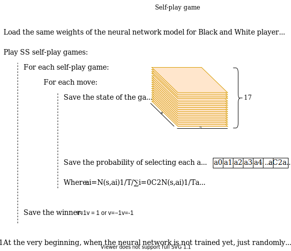
  
Figure III.2.1: The self-play algorithm. We save data at each step of each self-play game
  

As you can see in the above picture, the idea to generate the $P(s, a_i)$ and the $v(s, a_i)$ data is to let 2 instances of the same Neural Network (same weights) to fight each other. For each action taken by one of these 2 Neural Networks, $1600$ `MCTS` simulations are run. Hence our $P(s, a)$ value will just be:

$$P(s, a_i) = N(s, a_i)^{1/T} / \sum_{i=0}^{C^2} N(s, a_i)^{1/T}$$

Where:
+ $C$ is the size of the go board game (either $9$ or $19$) and hence $C^2$ is either $81$ or $361$. As we are summing for all the actions from $0$ to $C^2$ we have $82$ or $362$ actions (accounting for the extra `pass` action).
+ $N(s, a_i)$ is the number of times we have selected the $i^{th}$ action after the $1600$ simulations.
+ $T$ is again the temperature parameter. We can assume it to be $1$ for the sake of simplicity.
+ $v(s, a_i)$ will solely be $1$ or $-1$ depending on whether I win or I lose at the end of the self-play game.

So, you see it wasn't difficult to generate some data? Isn't the world full of magic, candies, and lollipops?

<a href="#figIII22">Figure III.2.2</a> shows you an example of data that is saved at the end of a self-play game.

  
  
Figure III.2.2: Example of data that is saved at the end of a self-play game. The probabilities $p_0, \dots, p_{77}$ are all different. The value $v$ is either $1$ or $-1$ depending on whether the Neural Network thinks we will win or lose in the current state. Each state $S_0, \dots, S_{77}$ contains $17$ layers: the $16$ previous states of the board game as well as $1$ state representing which player is to play next.
  

<aside class="question">Ok, I see how to generate the data, but this generated data is not the <b>true</b> data we need to train our Neural Network! If I train my Neural Network with it, I guess it will not learn anything?!</aside>

Actually, you are right! Nothing really tells us whether or not the data generated is a good approximation of the **true** data. Yet, with this generated data, **DeepMind** was able to beat the best Go players in the World! So how does it work?

The idea is that **the more we will generate self-plays the more this generated data will converge towards the true data**.

During the self-plays game, we generate data using the algorithm from <a href="#figIII21">Figure III.2.1</a>. Latter we will then train our Neural Network with the data we have created. The "problem" comes from the way we generate the data. As I told you, for **each** move of <a href="#figIII21">Figure III.2.1</a> we use $1600$ `MCTS` simulations. As explained earlier, though, each one of these simulations uses the Neural Network itself. So we are generating data to train our Neural Network by using the data returned by this same Neural Network... Isn't it problematic?

Well, first of all, we need to be aware that, even though we generate data by using our Neural Network, the data generated is not the data that is **directly** returned by our Neural Network. Indeed, we have seen that, for all actions $a_i$ taken in a state $s$, we have:

+ $P(s, a_i) = N(s, a_i)^{1/T}/\sum_{i=0}^{C^2} N(s, a_i)^{1/T}$
+ $v(s, a_i)$ is the **true** value we get at the end of the self-play game.

As $v(s, a_i)$ is the **true** value we get at the end of the self-play game, we will only need to explain what $P(s, a_i)$ represents and why, by using such a generated data, our Neural Network will learn something!

**At the very beginning**, we randomly initialize the weights of our Neural Network, hence, as I've already explained earlier, we can assume that the outputs ($P(s, a)$ and $v(s, a)$) of our Neural Network are merely random noise. Put it differently it means that the outputs will be random values. Since the outputs are random, it means that, on average, no action is better than another, or, if it is, then due to how the `MCTS` algorithm works, after $1600$ simulations, the probability distribution will roughly be uniform. That is to say that after $1600$ simulations, we can assume that each action $a_i$ will be associated with a probability of:

$$P(s, a_i) \approx 1/(C^{2} + 1)$$

Where $C$ is the size of the go board game ($C = 9$ or $C = 19$ usually).
Hence, **when the Neural Network is not trained yet** and for **the first move** of the first self-play game, the Neural Network will roughly select any action with equal probability. This argument holds for the next moves beside the last few moves. Put it differently it means that, for all the moves beside the last few moves, the probabilities $P(s, a)$ that we are going to save, to latter train our Neural Network, will mostly be uniform. For example, on a $9 \times 9$ go board games, and for **the first move**, we can choose any action among the $82$ available actions and so all the $P(s, a_i)$ will be:

$$P(s, a_0) \approx P(s, a_1) \approx  \dots \approx P(s, a_{81}) \approx 1/82$$

**For the second move**, as there is already one stone on the board game, the probability will be uniform over all the possible actions and will be $0$ for the forbidden action. For example, let's assume the first stone was placed on the $6^{th}$ state, then, at the end of the $2^{nd}$ move of the first self-play game, the probability of selecting an action will mostly be:

$$P(s, a_0) \approx P(s, a_1) \approx \dots \approx P(s, a_5) \approx P(s, a_7) \dots \approx P(s, a_{81}) = 1/81 \quad\text{and}\quad P(s, a_6) = 0$$

And so on, and so on, until the last moves of the self-plays where things will start to make sense! \\
But first thing first, In the very beginning, when the Neural Network is not trained yet, the probabilities $P(s, a_i)$ **for all the moves beside the very few last moves** will mostly follow a **random uniform distribution**, that is to say, that **we associate to each action an equally likely probability to be selected**. This seems quite reasonable since the `state-space` complexity of the game of Go is very large and, as long as the Neural Network is not fully trained, we **especially don't want to discard any action** at the very beginning of the game.

The magic finally kicks-in in the very last few moves of the self-plays game!

Indeed, let's assume that the game is almost done. When we will run the $1600$ `MCTS` simulations, several of these simulations will reach the end of the game<a href='#note_4'>4</a>. **Whenever one of these `MCTS` simulations reaches the end of the game we will override the random value $v(s, a_i)$ returned by our Neural Network by the real value $v(s, a_i)$**:

$v(s, a_i)=1$ if we win and $v(s, a_i) = -1$ otherwise.

Now, the previous argument doesn't hold anymore since $v(s, a_i)$ is not any random variable output by a untrained Neural Network. $v(s, a_i)$, now, makes sense! Since $v(s, a_i)$ is mostly<a href='#note_5'>5</a> the **true** value for the last few steps, then our Neural Network will start to learn something meaningful!

To see it, let's go back to the formula used by the `MCTS` algorithm to choose which node to expand (which action to choose) in the next simulation:

$$\begin{equation}
U(s, a_i) = \dfrac{W(s, a_i)}{N(s, a_i)} + c_{puct} P(s, a_i) \dfrac{\sqrt{\sum_{i=0}^{C^2} N(s, a_i)}}{1 + N(s, a_i)}\label{eq:6}
\end{equation}
$$

Since $v(s, a_i)$ is mostly the **true** value and since $W(s, a_i)$ contains the sum of the $v(s, a_i)$, the first term of the previous formula: $W(s, a_i)/N(s, a_i)$ now **mostly** represents the **real mean value**. Hence, the only random variable that remains is $P(s, a_i)$.

Let's see what happens when we are approaching the end of the game. To do that, let's suppose that we are in a certain state that is **on average** $2$ steps away from the end of the game. That is to say that, maybe we would need $3$ steps to end the game, maybe $1$, or any other number of steps, but, among all the different possibilities we have to end the game, we are **on average** $2$ steps away to the ending state.
From our state $s$ we will run $1600$ `MCTS` simulations. As, **on average**, we are only $2$ steps away from the end of the game, some of these simulations will reach the end of the game and will return the **true** $v(s, a_i)$ **value**. Let's assume that among all the simulations, only **some of them** reach the end of the game and among all the actions that reach the end, only **one** lets us win. That is to say that this simulation returns $v(s, a_i) = 1$.

Before we deal with this case, let's simplify the equation $\ref{eq:6}$. As we are considering $1600$ simulations, we have that: $\sum_{i=0}^{C^2} N(s, a_i) = 1600$. Moreover, $c_{puct}$ is a constant. let's suppose that $c_{puct} = 1$ to simplify the calculations. Last, but not least, Even though all the values $P(s, a_i)$ returned by the Neural Network are "random" in the sense that the Neural Network is not trained yet, these values, are, nonetheless, totally deterministic! That is to say that if you give the same state as input to your Neural Network, it will always return the same $P(s, a_i)$ value.

Having said that, we can simplify equation $\ref{eq:6}$ to:

$$U(s, a_i) = \dfrac{W(s, a_i)}{N(s, a_i)} + P(s, a_i) \dfrac{40}{1 + N(s, a_i)}$$

According to our case study, the action that reaches the end and gives us back $v(s, a_i) = 1$ will add this quantity to $W(s, a_i)$. On the other hand, since we are selecting the action $a_i$, $N(s, a_i)$ will be incremented by $1$. So in the end we will have $W(s, a_i) / N(s, a_i) = 1$. On the other hand, since we assumed that all the other actions make us lose the game. The **mean value** $W(s, a_i)/N(s, a_i)$ of all the other actions will be $-1$<a href='#note_6'>6</a>
Let's distinguish between 2 values of $U$:
- $U_{best}(s, a_i)$: The value associated with the simulation that makes us win
- $U_{bad}(s, a_i)$: The value associated with all the other simulations that make us lose.

According to the previous arguments, we have:

$$U_{best}(s, a_i) = 1 + P(s, a_i) \dfrac{40}{1 + N(s, a_i)} \quad\text{and}\quad
U_{bad}(s, a_i) = -1 + P(s, a_i) \dfrac{40}{1 + N(s, a_i)}$$

Since the **penalizing term** $P(s, a_i)\dfrac{40}{1 + N(s, a_i)}$, is positive, we are sure that $U_{best}(s, a_i) \ge 1$. On the other hand, since $P(s, a_i)$ is a probability, we know that $P(s, a_i) \le 1$ so that $U_{bad} \le -1 + 40/(1 + N(s, a_i))$.

What I want to show you is that all the worst actions will only be selected a very few times. We know that an action $a_i$ will be selected if it maximizes $U(s, a_i)$. So all the bad actions $a_i$ will be selected as long as $U_{bad}(s, a_i) > U_{best}(s, a_i)$. So, we want to know when $U_{bad}(s, a_i)$ starts to be smaller than $U_{best}(s, a_i)$. According to the previous argument we can just solve:

$$U_{bad}(s, a_i) \le -1 + \dfrac{40}{1 + N(s, a_i)} < 1 \leq U_{best}(s, a_i)$$

that is to say: $N(s, a_i) > 19$.

Hence, once we have selected the bad actions $19$ times each, we are **sure** that we will never select them ever again! The thing is that, when we are close to the end of the game, we cannot choose between a lot of actions.
For example, if we assume that we can only choose between $15$ actions and that only one action is good among these $15$ actions. Then, in the worst-case scenario, we would select each bad action $19$ times. That is to say that the bad actions will use $19 \times 14 = 266$ simulations, while the good action will be selected $1600 - 266 = 1334$ times.

<aside class="note">This demonstration uses a lot of approximations but it hopefully helps you to understand that the best action will be selected a lot of times and the worst actions very few times... If, on the contrary, at the very end of the game we only have bad actions (or good actions) then all of them will likely be selected the same amount of time and hence the meaningful information will be the $v(s, a_i)$ value returned by the Neural Network</aside>

**Let's recap**:
When the Neural Network is not fully trained and during a self-play game, the probability $P(s, a_i)$ associated with all the actions besides the last very few actions will mostly be uniform, which means that the Neural Network will not favor any action. The magic finally kicks-in the very last few moves of a self-play game. Since for these moves the `MCTS` simulations can reach the end of the game, it means that we can replace the non-meaningful value $v(s, a_i)$ returned by the untrained Neural Network with the **real value** $v(s, a_i)$. As demonstrated previously, this will directly impact the number of selection $N(s, a_i)$ of each action. The better the state is, the more likely we will select it (i.e. $N(s, a_i)$ will be big). Moreover, the probabilities that we'll save to later train our Neural Network are defined by:

$$P(s, a_i) = N(s, a_i)^{1/T} / \sum_{i=0}^{C^2} N(s, a_i)^{1/T}$$

Hence, we will associate a higher probability to the actions that have been selected the most during the `MCTS` simulations. But we've just seen that the actions that have been selected the most are the ones that are more likely to lead to a winning state. Hence, it means that we will associate a higher probability to be selected for the best actions!

<aside class="note">It is even better than this! Do you recall the <b>temperature parameter</b> $T$? Deepmind let this parameter to be close to $0$ when we are approaching the end of the game. As we have seen previously, when this parameter is close to $0$, it makes us act <b>greedily</b>, which means that the probability associated with the best action will be $1$.</aside>

> Do you see the recursion coming? 

## III.3 Training
To train our Neural Network we will use the data generated during the self-play games. <a href="#figIII31">Figure III.3.1</a> shows how we train the Neural Network based on the generated data.

  
  
Figure III.3.1: <b>Training phase</b> The inputs to the Neural Network are the states of the self-play games. The "ground truth" labels ($P(s, a)$ and $v(s, a)$) are the values stored from the self-play games. The Neural Network will then learn to minimize the error between what it outputs and the "ground truth" labels by updating its internal weights.
  

Let's say, for the sake of the example that, for a $9 \times 9$ go board game, the game ends, on average, after $50$ moves<a href='#note_7'>7</a>.
Let's assume that the `MCTS` will start returning meaningful values starting from the state $48$, because starting from this state some of the `MCTS` simulations will reach the end of the game and return the true $v(s, a_i)$ value. Then, here is what happens:

+ We generate data by playing several self-play games ($1^{st}$ iteration)
  + The data generated is nondiscriminatory (roughly the same probability to select any available actions) for the states $1, 2, \dots, 47$
  + The data generated is meaningful for the states $48, 49, 50$: The data associates a greater probability to the best actions
+ We train the Neural Network
  + The Neural Network will mostly learn to output the same probability for each action for the states $1, 2, \dots, 47$
  + The Neural Network will learn to associate a greater probability to the best actions for the states $48, 49, 50$

+ We generate data by playing several self-play games ($2^{nd}$ iteration)
  + This time the `MCTS` simulations don't need to reach the end of the game to return the meaningful values since during the `MCTS` simulations we are using the Neural Network which, **now** returns meaningful values for the states $48, 49, 50$. So, while in the first iteration the `MCTS` needed to reach the $50^{th}$ and last state to return a meaningful value, **now** the `MCTS` only needs to reach the $48^{th}$ state to return meaningful values. We might assume that the `MCTS` can reach this state starting from state $46$ since starting from this state, some of the `MCTS` simulations will actually reach the $48^{th}$ state. Hence we will have:
    + The data generated is nondiscriminatory (roughly the same probability to select any available actions) for the states $1, 2, \dots, 45$
    + The data generated is meaningful for the states $45, 46, 47, 48, 49, 50$: The data associates a greater probability to the best actions

And so on, and so on.

To resume, the Neural Network will correctly be trained by starting to learn which of the last moves are the best. When it finally learns the best last moves, the algorithm will learn which moves it needs to perform to end up into the best last moves it has just learned. When it finishes learning the $2$ final moves to win the game it will learn which moves to perform to end in the winning configuration before the $2$ last moves, and so on and so on.

To further ensure that the Neural Network is learning. DeepMind only updates the weights of the Neural Network if the Neural Network with the updated weights is better than the Neural Network with the previous weights. Here is how they proceed:

+ Save the Neural Network with the current weights. Let's called the saved Neural Network **Black**.
+ Use the data generated by the self-play games to train the Neural Network
+ After training, the Neural Network now has different internal weights. Save this new Neural Network. Let's
call the saved Neural Network **White**.
+ Let the 2 Neural Networks, **Black** and **White** play against each other a certain number of games. By default DeepMind let them play $400$ games again each other.
+ If **White** (the Neural Network with the updated weights) is Better than **Black** then Let **Black** &larr; **White**

Let's explain a bit how we can let the $2$ Neural Networks play against each other. One **Naïve** approach would be to only use the Neural Networks. For example:

+ Give the initial state to **Black**. **Black** output $P(s, a)$ and you select the action $a_i$ proportionally to the probability output by the Neural Network. You put your stone on the board game.
+ The **White** Neural Network now takes the new state of the board game with the black stone on it. It outputs $P(s, a)$ and you let **White** selects the action $a_i$ proportionally  to its probability.
+ ...

But this is not how we should let the $2$ Neural Networks play against each other! Indeed, a more robust way would be to use the Neural Networks with the `MCTS` simulations. Indeed, let's say that we are using $1600$ `MCTS` simulations in conjunction  with a Neural Network. Then it means that we will use $1600$ times the Neural Network to evaluate each simulation of the `MCTS` algorithm before taking our decision while with the **Naive strategy** we will only use the Neural Network **once**. It is much more robust to use the Neural Network $1600$ than just $1$.

To let you understand this well, let's see a simple analogy. Imagine you have a biased coin, such that $P[head] = 1/5$ (so P[tail] = 4/5). You can throw it $1$ or $1600$ times and you are asked to determine the probability that the coin outputs **head**. If you throw it only **once** then you cannot **evaluate** the coin and determine $P[head]$. Now, if you throw it $1600$ times then you can, for example, see: $359$ heads and $1241$ tails, so you could estimate that:

$$P[head] \approx \dfrac{\text{number of heads}}{\text{number of tails}} = \dfrac{359}{1600} = 0.22$$

to evaluate the Neural Networks and decide whether or not the **White** Neural Network is better than the **Black** Neural Network, we will do the following:

+ Start from an empty board
+ Simulate $1600$ `MCTS` with the **Black** Neural Network. At the end of these $1600$ simulations, return for all actions $a_i$, $i \in [0, 81]$ (for a $9 \times 9$ board game) the probability $P(s, a_i) = N(s, a_i)^{1/T}/\sum_{i=0}^{81} N(s, a_i)^{1/T}$ of taking an action $a_i$ in state $s$. Finally, select the action $a_i$ proportionally  to its probability
+ The board contains now one black stone. Start simulating $1600$ `MCTS` from this new state by using the **White** Neural Network. At the end of the $1600$ simulations, return the probability $P(s, a_i) = N(s, a_i)^{1/T}/\sum_{i=0}^{81} N(s, a_i)$ of taking an action $a_i$ in state $s$ and select $a_i$ proportionally to its probability.
+ The board contains now one black stone and 1 white stone. Repeat the same process until we reach the end of the game.

<a href="#figIII32">Figure III.3.2</a> depicts this process.

  
  
Figure III.3.2: One full play between <b>Black</b> and <b>White</b>. Each tree represents the exploration made by the `MCTS` algorithm. Each <b>dark</b> node represents the actions selected by the `MCTS` algorithm and on the right, we have the number of times each action has been selected ($N = 200$ for the action $7$ for example). Then we select an action proportionally to the number of times we have selected it during the MCTS simulation. For example, since $68$ has been visited $900$, we will more likely choose to perform the action $68$.
  

At the end of the game we will save the winner. Which means that we will increment a counter for the **Black** Neural Network if it wins at the end. On the contrary we will increment a counter associated to the **White** Neural Network if it wins at the end.

After $400$ simulations we will have something like:

  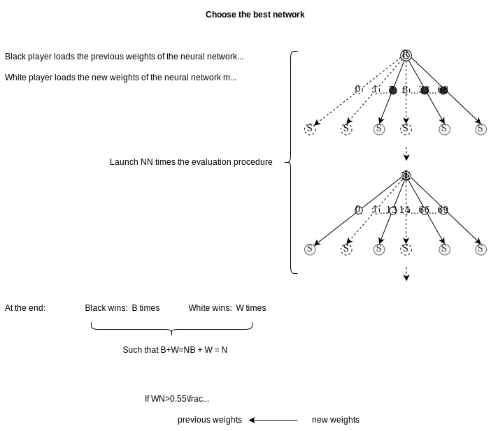
  
Figure III.3.3: We run $N$ evaluations (for example $N=400$). At the end we count how many times the <b>White</b> Neural Network had won compared to the <b>Black</b> Neural Network and if the <b>White</b> Neural Network has won more than $55%$ of the $400$ games then we will replace the <b>Black</b> Neural Network by the <b>White</b> Neural Network.
  

That's it. You know everything you need to know about the AlphaGo Zero algorithm!

Once the Neural Network has been fully trained you can use it in conjonction with the `MCTS` algorithm to play against any human. Indeed, as highlighted during the **evaluation** step, we will not use the Neural Network alone and we will always use it with the `MCTS` algorithm because it will be more robust!

# IV Going further
Some purely **technical aspects** have been omitted in this article. Here are some added pieces of information:

Like most board games, the game of **Go** is highly symmetrical. This is something I've already mentioned in my article about the <a href="https://twice22.github.io/tictactoe/" target="_blank">TicTacToe game</a>. **DeepMind** uses the inherent symmetrical property of the game of Go. Indeed, before feeding the Neural Network with a state, DeepMind randomly applies one of the **8** symmetries to the input state as well as to the output label, $P(s, a)$, that was generated during the self-play games.

As the training goes, this trick ensures that the Neural Network will not be biased towards a particular configuration of the game. It thus makes the Neural Network more robust.

Another trick used by DeepMind is to parallelize the training of the Neural Network. They have used $64$ GPUs for that. To run the program, they also have used **TPU**s instead of **GPU**s. These Tensor Processor Units are <a href="https://en.wikipedia.org/wiki/Application-specific_integrated_circuit" target="_blank">ASICs</a> specifically designed by **Google** to speed-up the calculations performed by the Neural Networks.

They've also used other common tricks. For example, they've decayed the learning rate as the training progressed and they have also used regularization to prevent overfitting.

Finally, their algorithm can be generalized to any deterministic board game. Shortly after they have released their research paper explaining how work their algorithm, they have released another paper called `AlphaZero` that generalizes their algorithm to any deterministic board game (Chess, Shogi, ...). \\
This new A.I, because it is a generalized version, does not use some of the tricks used by `AlphaGo Zero`. Notably, they update the Neural Network continuously instead of updating it only if the new Neural Network beat the previous instance more than $55$% of the times. They also don't augment the data and don't use symmetry since the rules of Chess and Shogi are asymmetric.

# Conclusion
That's it! I know, this article is quite lengthy but I hopefully think that it could help some of you! The goal of this article was to **explain** how the AlphaGo Zero algorithm works in `layman's terms`. You still need to know a little bit of math but I think that the way I've written this article should be tailored for anybody with a little bit of mathematical background. \\
The goal of this article is to truly explain to you how it works and not just rewrite differently what was written in the original article. I've seen on the internet lots of articles about this A.I. but none were truly explaining **how it works**. As a great man once said: "If you can't explain it to a six year old, you don't understand it yourself".

#### Notes
+ 1 Instead of the $82$ or $362$ available actions at the beginning for respectively a $9 \times 9$ and a $19 \times 19$ board game.
+ 2 Where $\gg$ means **much larger than**.
+ 3 That is used to update the value of $W(s, a)$.
+ 4Since we run the $1600$ `MCTS` simulations from a state that is close to the end of the game.
+ 5 I say mostly because some of the MCTS simulations might not reach the end of the game and hence some of the $v(s,a)$ values might still be the values returned by the untrained Neural Network.
+ 6 This is not true because some of the other simulations will not reach the end of the game. Since they won't reach the end of the game, some of the simulations will return the random value $v(s, a_i)$ output by the Neural Network.
+ 7 The game generally ends before all the stones are placed on the board.